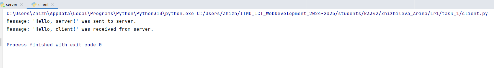
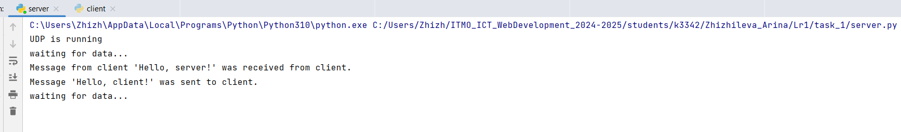

# Задание 1

Реализовать клиентскую и серверную часть приложения. Клиент отправляет серверу сообщение «Hello, server», и оно должно отобразиться на стороне сервера. В ответ сервер отправляет клиенту сообщение «Hello, client», которое должно отобразиться у клиента.

Требования:

Обязательно использовать библиотеку socket.
Реализовать с помощью протокола UDP.

**код из файла client.py:**
```python
from socket import *

client_socket = socket(AF_INET, SOCK_DGRAM)

data_for_server = "Hello, server!"

client_socket.sendto(data_for_server.encode(), ('localhost', 12345))
print(f"Message: '{data_for_server}' was sent to server.")

data_from_server, addr = client_socket.recvfrom(1024)
print(f"Message: '{data_from_server.decode()}' was received from server.")
```

**код из файла server.py:**
```python
from socket import *

server_socket = socket(AF_INET, SOCK_DGRAM)
server_address = ('localhost', 12345)

server_socket.bind(server_address)

print("UDP is running")

while True:
    print("waiting for data...")
    data, client_address = server_socket.recvfrom(1024)
    if not data:
        break
    print(f"Message from client '{data.decode()}' was received from client.", flush=True)

    response = "Hello, client!"
    server_socket.sendto(response.encode(), client_address)
    print(f"Message '{response}' was sent to client.")

server_socket.close()
```


