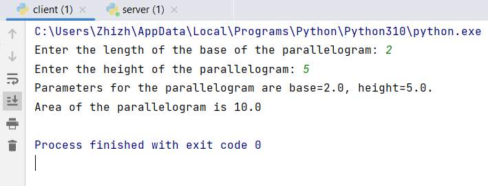
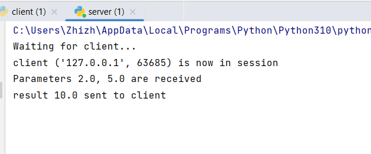

# Задание 2

Реализовать клиентскую и серверную часть приложения. Клиент запрашивает выполнение математической операции, параметры которой вводятся с клавиатуры. Сервер обрабатывает данные и возвращает результат клиенту.

Мой вариант операции:

    Поиск площади параллелограмма.

Требования:

Обязательно использовать библиотеку socket.
Реализовать с помощью протокола TCP.

**код из файла client.py:**
```python
from socket import *

client_socket = socket(AF_INET, SOCK_STREAM)
client_socket.connect(('localhost', 12345))

try:
    base = float(input("Enter the length of the base of the parallelogram: "))
    height = float(input("Enter the height of the parallelogram: "))
    print(f"Parameters for the parallelogram are base={base}, height={height}.")
    message = f"{base} {height}"
    client_socket.sendall(message.encode())

    data = client_socket.recv(1024).decode()
    print(f"Area of the parallelogram is {data}")

finally:
    client_socket.close()
```
**Работа клиента при запуске кода на скриншоте**

**код из файла server.py:**


```python
from socket import *
import time

def parallelogram_area(a, h):
    return a * h


server_socket = socket(AF_INET, SOCK_STREAM)
server_socket.bind(('localhost', 12345))
server_socket.listen(1)

print("Waiting for client...")

while True:
    connection, addr = server_socket.accept()
    try:
        time.sleep(3)
        print(f"client {addr} is now in session")
        data = connection.recv(1024).decode()
        if data:
            base, height = map(float, data.split())
            print(f"Parameters {base}, {height} are received")
            area = parallelogram_area(base, height)

            connection.sendall(str(area).encode())
            print(f"result {area} sent to client")
    finally:
        connection.close()
```
**Работа сервера при запуске кода на скриншоте**


