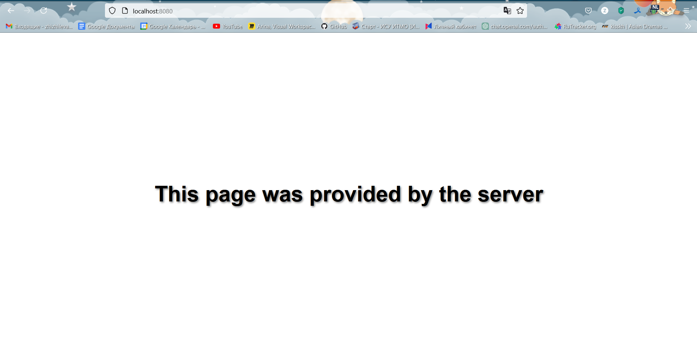

# Задание 3

Реализовать серверную часть приложения. Клиент подключается к серверу, и в ответ получает HTTP-сообщение, содержащее HTML-страницу, которая сервер подгружает из файла index.html.

Требования:

Обязательно использовать библиотеку socket.

**код из файла server.py:**
```python
from socket import *

server_socket = socket(AF_INET, SOCK_STREAM)
server_socket.bind(('localhost', 8080))
server_socket.listen(1)

print("Server is running...")
print("http://localhost:8080")

while True:
    connection, client_address = server_socket.accept()
    try:
        print(f"Client: {client_address} is now in session.")

        request = connection.recv(1024).decode()
        print(f"Client request: \n{request}")

        with open('index.html', 'r') as file:
            html_content = file.read()

        response = f"""HTTP/1.1 200 OK
Content-Type: text/html
Content-Length: {len(html_content)}

{html_content}"""

        connection.sendall(response.encode())
        print("Response is sent to a client.")
    finally:
        connection.close()
        print(f"Сonnection with client {client_address} is closed.")
```
Код из файла index.html
```html
<!DOCTYPE html>
<html lang="en">
<head>
    <meta charset="UTF-8">
    <title><!DOCTYPE html>
<html lang="en">
<head>
    <meta charset="UTF-8">
    <meta name="viewport" content="width=device-width, initial-scale=1.0">
    <title>Server Provided This Page</title>
    <style>
        body {
            margin: 0;
            padding: 0;
            font-family: Arial, sans-serif;
            display: flex;
            justify-content: center;
            align-items: center;
            height: 100vh;
            color: black;
            text-align: center;
        }

        h1 {
            font-size: 3em;
            text-shadow: 2px 2px 4px rgba(0, 0, 0, 0.5);
        }
    </style>
</head>
<body>
    <h1>This page was provided by the server</h1>
</body>
</html>
```

После запуска сервера переходим на http://localhost:8080

**Работа сервера на localhost при запуске кода на скриншоте**


