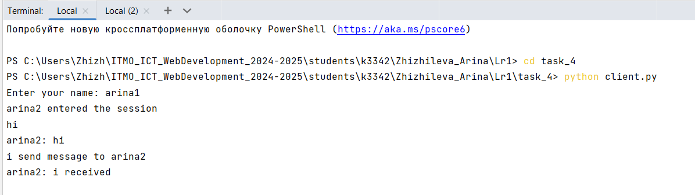
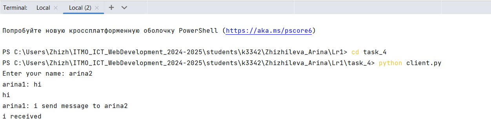

# Задание 4

Реализовать двухпользовательский или многопользовательский чат. Для максимального количества баллов реализуйте многопользовательский чат.

Требования:

Обязательно использовать библиотеку socket.

Для многопользовательского чата необходимо использовать библиотеку threading.


**код из файла client.py:**
```python
from socket import *
import threading

def receive_messages(client_socket):
    while True:
        try:
            message = client_socket.recv(1024).decode()
            if message:
                print(message)
            else:
                break
        except:
            print("unable to send message")
            client_socket.close()
            break

client_socket = socket(AF_INET, SOCK_STREAM)
client_socket.connect(('localhost', 8080))

threading.Thread(target=receive_messages, args=(client_socket,)).start()

username = input("Enter your name: ")
client_socket.send(username.encode())

while True:
    message = input()
    if message.lower() == 'exit':
        break
    client_socket.send(message.encode())

client_socket.close()
```

**код из файла server.py:**


```python
from socket import *
import threading


clients = []
usernames = []

def handle_client(client_socket, address):
    print(f"{address} entered the session.")
    client_socket.send("Enter your name ".encode())
    username = client_socket.recv(1024).decode()
    usernames.append(username)
    clients.append(client_socket)

    broadcast(f"{username} entered the session".encode(), client_socket)

    while True:
        try:
            message = client_socket.recv(1024)
            if message:
                broadcast(f"{username}: {message.decode()}".encode(), client_socket)
            else:
                remove_client(client_socket)
                break
        except:
            continue

def broadcast(message, client_socket):
    for client in clients:
        if client != client_socket:
            try:
                client.send(message)
            except:
                remove_client(client)

def remove_client(client_socket):
    if client_socket in clients:
        index = clients.index(client_socket)
        clients.remove(client_socket)
        username = usernames[index]
        usernames.remove(username)
        broadcast(f"{username} left.".encode(), client_socket)

server_socket = socket(AF_INET, SOCK_STREAM)
server_socket.bind(('localhost', 8080))
server_socket.listen(5)
print("Server is running...")

while True:
    client_socket, address = server_socket.accept()
    threading.Thread(target=handle_client, args=(client_socket, address)).start()
```
**Работа первого клиента при запуске кода на скриншоте**


**Работа первого клиента при запуске кода на скриншоте**


