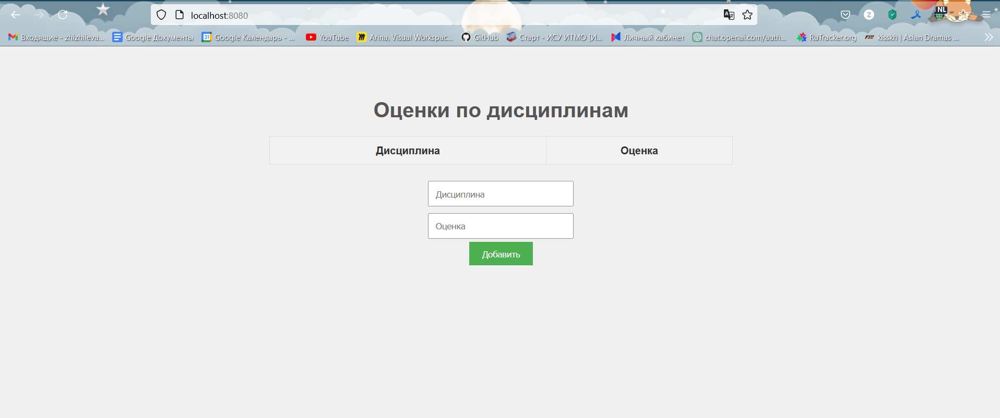
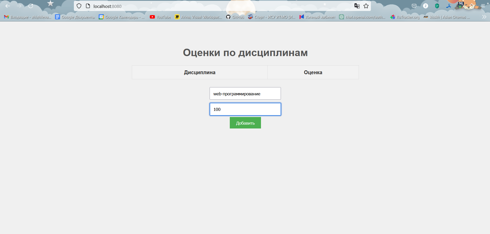
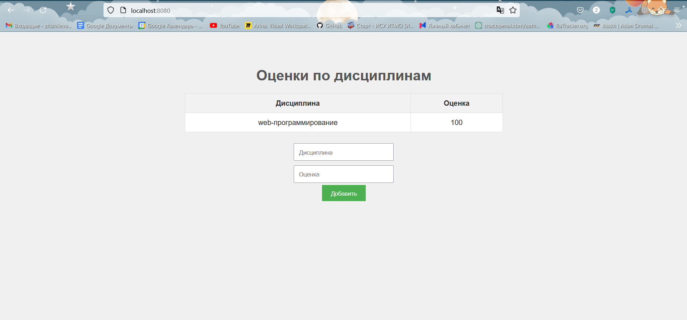

# Задание 5

Написать простой веб-сервер для обработки GET и POST HTTP-запросов с помощью библиотеки socket в Python.

Задание:

    Сервер должен:
        Принять и записать информацию о дисциплине и оценке по дисциплине.
        Отдать информацию обо всех оценках по дисциплинам в виде HTML-страницы.


**код из файла server.py:**
```python
from socket import *
from urllib.parse import unquote

grades = []


def generate_html():
    try:
        with open('index.html', 'r', encoding='utf-8') as f:
            html = f.read()

        table_rows = ''
        for subject, grade in grades:
            table_rows += f"<tr><td>{subject}</td><td>{grade}</td></tr>"

        html = html.replace('<!-- Таблица оценок будет динамически добавляться сервером -->', table_rows)

        return html
    except Exception as e:
        return f"<h1>Ошибка: {e}</h1>"

def parse_post_data(data):
    params = {}
    try:
        body = data.split('\r\n\r\n', 1)[1]
        for param in body.split('&'):
            key, value = param.split('=')
            params[key] = unquote(value)
    except IndexError:
        pass
    return params

server_socket = socket(AF_INET, SOCK_STREAM)
server_socket.bind(('localhost', 8080))
server_socket.listen(1)

print("Сервер запущен на порту 8080...")

while True:
    client_socket, client_address = server_socket.accept()
    try:
        request = client_socket.recv(4096).decode('utf-8') 

        headers = request.split('\n')
        method = headers[0].split()[0]

        if method == 'GET':
            response_body = generate_html()
            response = f"HTTP/1.1 200 OK\r\nContent-Type: text/html; charset=utf-8\r\n\r\n{response_body}"
            client_socket.sendall(response.encode('utf-8'))

        elif method == 'POST':
            params = parse_post_data(request)
            subject = params.get('subject', '')
            grade = params.get('grade', '')

            if subject and grade:
                grades.append((subject, grade))

            response = "HTTP/1.1 303 See Other\r\nLocation: /\r\n\r\n"
            client_socket.sendall(response.encode('utf-8'))

    except Exception as e:
        print(f"Ошибка: {e}")

    finally:
        client_socket.close()
```
Код из файла index.html
```html
<!DOCTYPE html>
<html lang="ru">
<head>
    <meta charset="utf-8">
    <title>Оценки по дисциплинам</title>
    <style>
        body {
            font-family: Arial, sans-serif;
            background-color: #f0f0f0;
            color: #333;
            text-align: center;
            padding: 50px;
        }
        h1 {
            color: #555;
        }
        table {
            margin: 0 auto;
            border-collapse: collapse;
            width: 50%;
            background-color: #fff;
        }
        th, td {
            border: 1px solid #ddd;
            padding: 12px;
            text-align: center;
        }
        th {
            background-color: #f2f2f2;
            font-weight: bold;
        }
        form {
            margin-top: 20px;
        }
        input[type="text"] {
            padding: 10px;
            width: 200px;
            margin: 5px 0;
        }
        input[type="submit"] {
            padding: 10px 20px;
            background-color: #4CAF50;
            color: white;
            border: none;
            cursor: pointer;
        }
        input[type="submit"]:hover {
            background-color: #45a049;
        }
    </style>
</head>
<body>
    <h1>Оценки по дисциплинам</h1>
    <table>
        <tr><th>Дисциплина</th><th>Оценка</th></tr>
    </table>
    <form method="POST">
        <input type="text" name="subject" placeholder="Дисциплина" required><br>
        <input type="text" name="grade" placeholder="Оценка" required><br>
        <input type="submit" value="Добавить">
    </form>
</body>
</html>
```

После запуска сервера переходим на http://localhost:8080

**Работа сервера на localhost при запуске кода на скриншоте**


**Добавляем предмет**


**Предмет добавлен**


