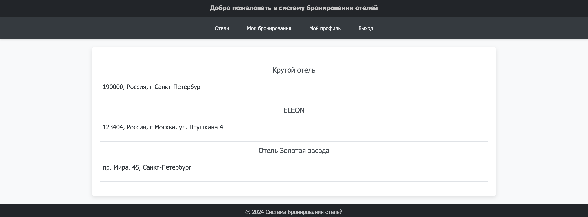
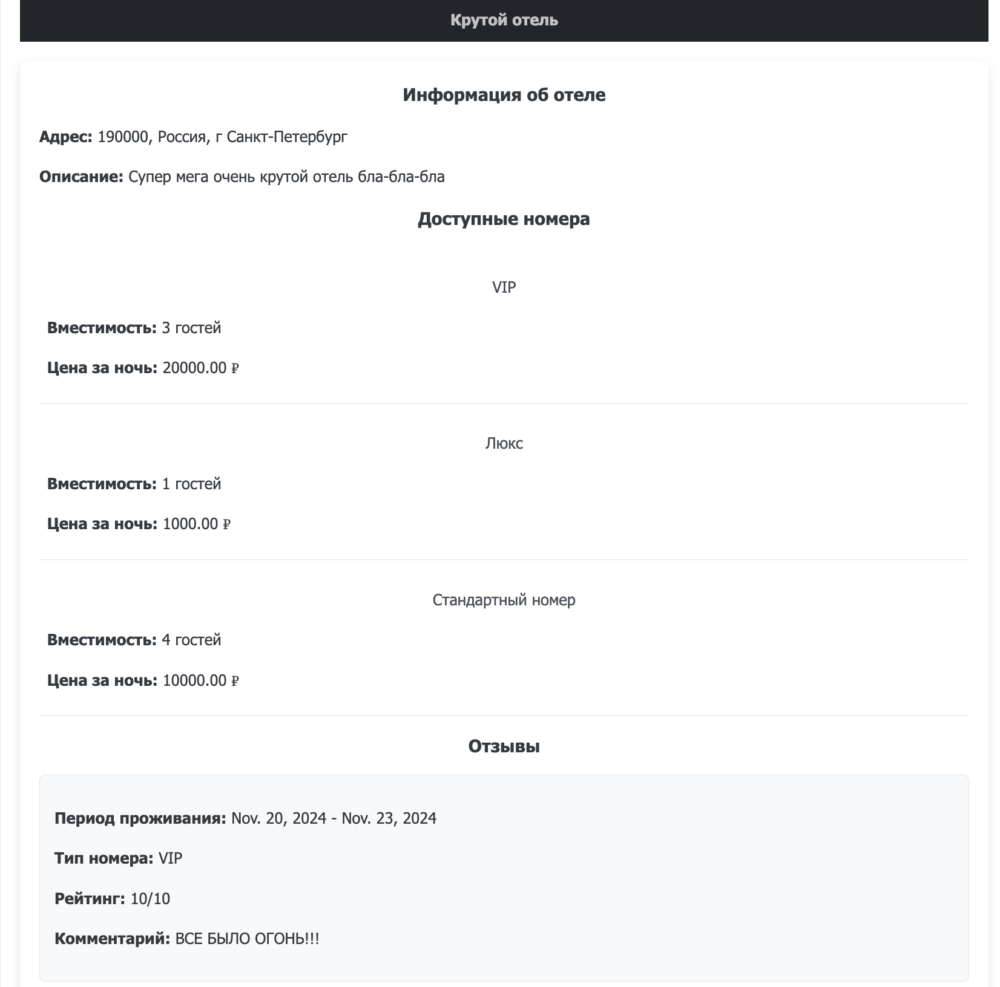
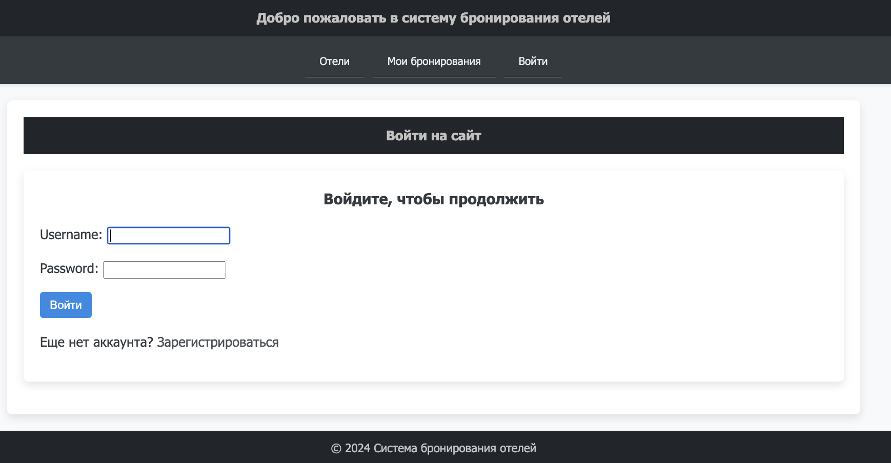
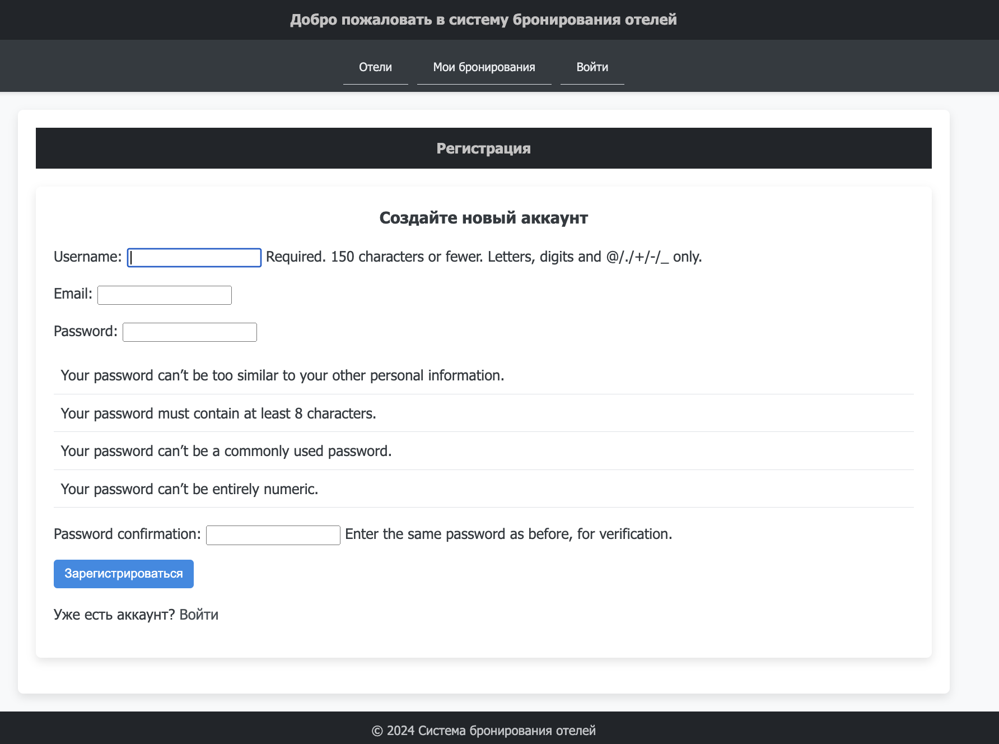
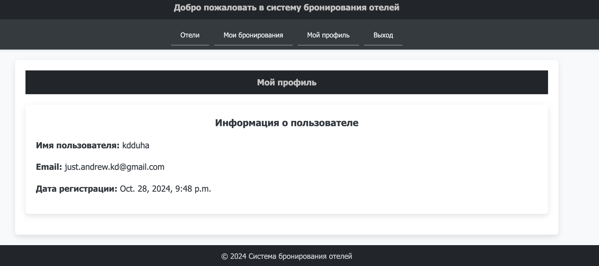
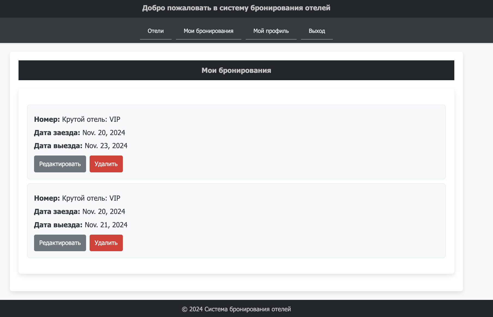
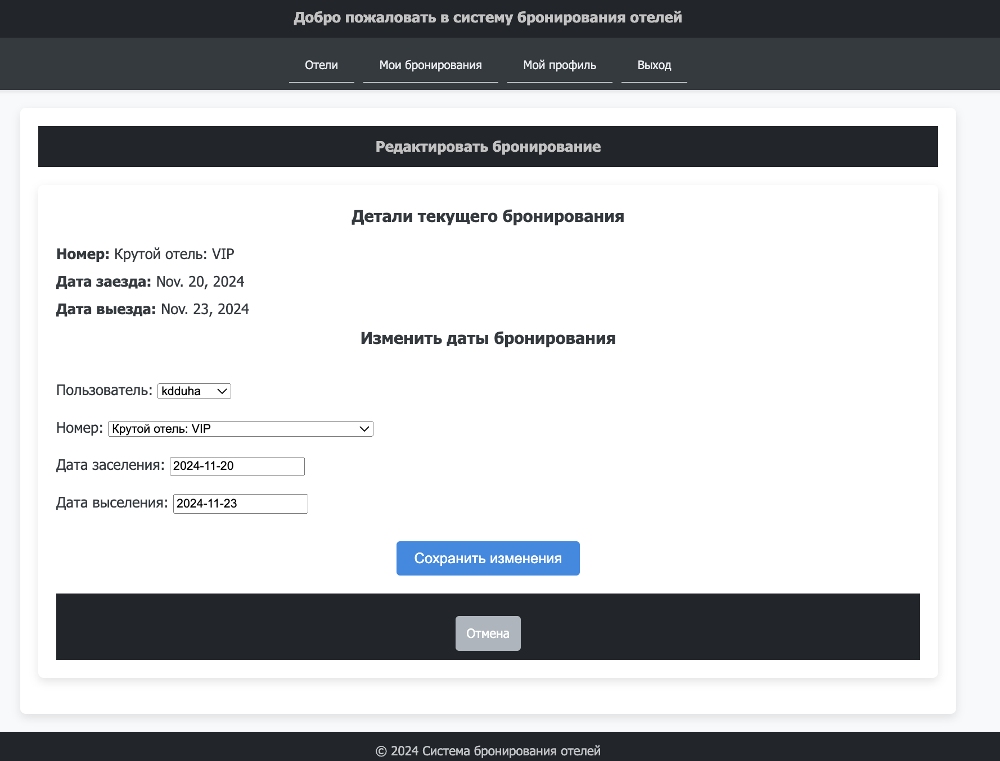
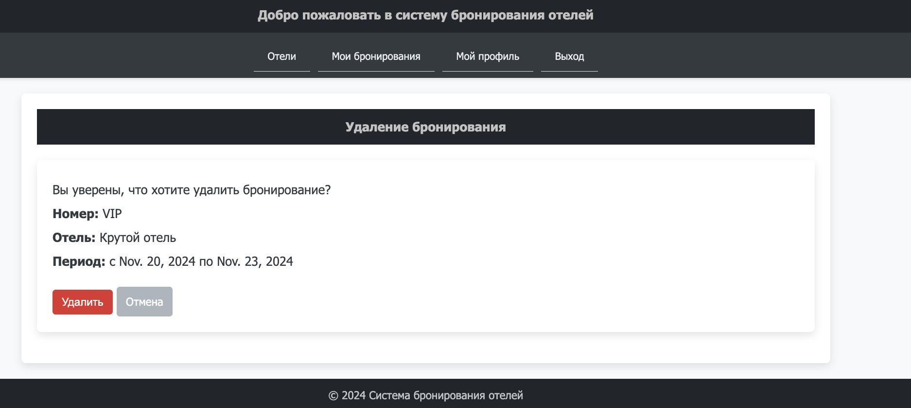
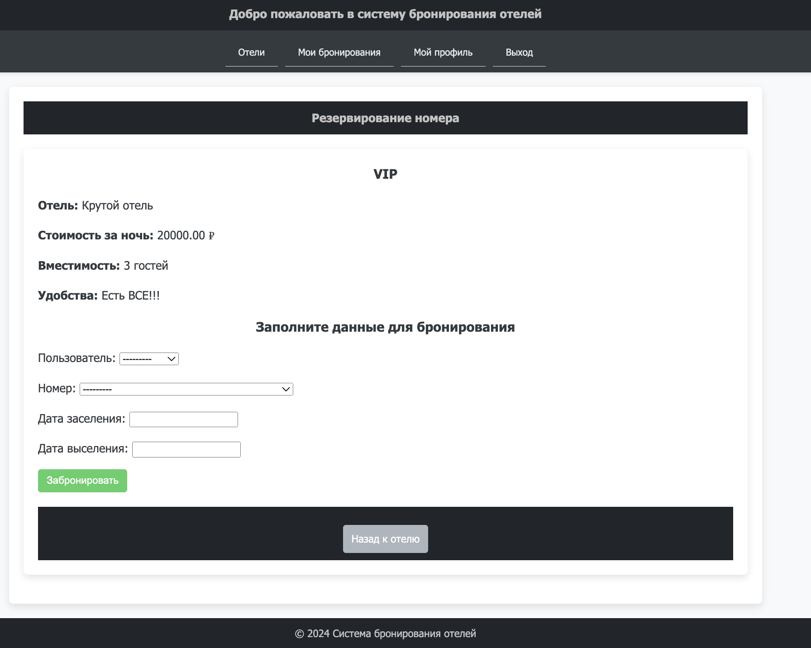
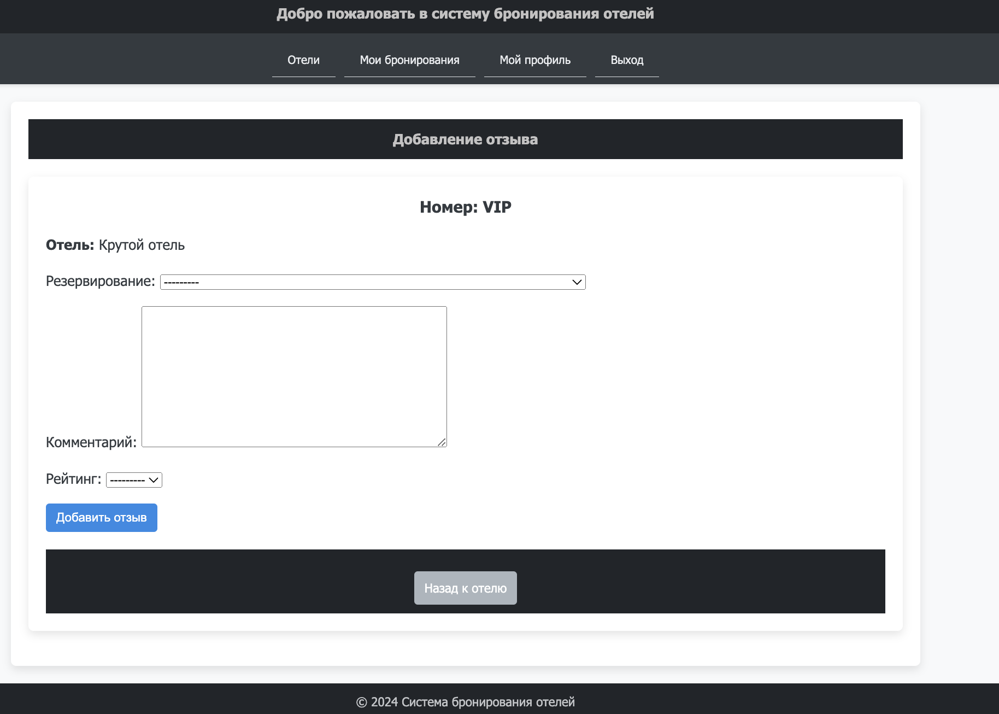

## Условие

**Список отелей**.

Необходимо учитывать название отеля, владельца отеля, адрес, описание, типы
номеров, стоимость, вместимость, удобства.
Необходимо реализовать следующий функционал:

- Регистрация новых пользователей.
- Просмотр и резервирование номеров. Пользователь должен иметь
возможность редактирования и удаления своих резервирований.
- Написание отзывов к номерам. При добавлении комментариев, должны
сохраняться период проживания, текст комментария, рейтинг (1-10),
информация о комментаторе.
- Администратор должен иметь возможность заселить пользователя в отель и
выселить из отеля средствами Django-admin.
- В клиентской части должна формироваться таблица, отображающая
постояльцев отеля за последний месяц.

## Выполнение 

По факту выполнение всей работы состоит из следующих шагов:
- создание и описание модели данных => миграция данных
- создание `views` слоя в MVC (Model-View-Controller) или в случае django MVT (Model-View-Template)
- создание `forms` в случае необходимости
- прописывание `templates` для динамической генерации html страниц
- регистрация всех эндпоинтов в `urls`
- базовое `css` оформление html страниц

## Результат 

Для запуска проекта необходимо прописать в его корне:
```shell
python manage.py runserver
```
Далее пройти по стандартному адресу и порту: `http://127.0.0.1:8000/`

Все существующие пути выглядят следующим образом (но в каждый из них можно попасть через UX интерфейс в клиентской части, плавно переходя между страничками): 
```python
urlpatterns = [
    path('accounts/login/', auth_views.LoginView.as_view(), name='login'),
    path('accounts/logout/', auth_views.LogoutView.as_view(), name='logout'),
    path("login/", views.login_view, name="login"),
    path("logout/", views.logout_view, name="logout"),
    path("profile/", views.profile, name="profile"),
    path("signup/", views.signup_view, name="signup"),
    path("", views.HotelListView.as_view(), name="hotel_list"),
    path("hotel/<int:pk>/", views.HotelDetailView.as_view(), name="hotel_detail"),
    path("room/<int:room_id>/reserve/", views.reserve_room, name="reserve_room"),
    path("reservations/", views.reservation_list, name="reservation_list"),
    path("reservation/<int:reservation_id>/edit/", views.edit_reservation, name="edit_reservation"),
    path("reservation/<int:reservation_id>/delete/", views.delete_reservation, name="delete_reservation"),
    path("room/<int:room_id>/review/", views.add_review, name="add_review"),
    path("recent-guests/", views.recent_guests, name="recent_guests"),
]
```

Сразу встречает список всех отелей. 



Можно просматривать информацию о каждом отеле в отдельности, если просто нажать на него.



Для более детального просмотра страниц необходимо авторизоваться, пройдя в соответсвующий раздел через
навигационное меню. Иначе при попытке "провалиться" куда-нибудь, пользователя насильно выкинет на авторизацию.



Также можно самостоятельно зарегистрироваться.



При авторизации есть возможность просмотреть самую базовую информацию о своем аккаунте.



Далее можно взаимодействовать с сервисом. Например, изучить свои бронирования. 



> существует фильтрация и пагинация у бОльшей части всех листингов!

Вот таким образом, например, выглядит листинг бронирований пользователей.
- фильтрация пробрасывается через GET запросы от html и применяется в случае необходимости
- пагинация же работает через стандартный Paginator

```python
def reservation_list(request):
    reservations = Reservation.objects.filter(client=request.user)

    check_in_date = request.GET.get('check_in_date', None)
    check_out_date = request.GET.get('check_out_date', None)
    room_id = request.GET.get('room_id', None)
    hotel_name = request.GET.get('hotel_name', None)

    if check_in_date:
        reservations = reservations.filter(check_in_date__gte=check_in_date)

    if check_out_date:
        reservations = reservations.filter(check_out_date__lte=check_out_date)

    if room_id:
        reservations = reservations.filter(room_id=room_id)

    if hotel_name:
        reservations = reservations.filter(room__hotel__name__icontains=hotel_name)

    room_types = RoomType.objects.values_list('name', flat=True).distinct()
    hotels = Hotel.objects.values_list('name', flat=True).distinct()

    paginator = Paginator(reservations, 5)
    page_number = request.GET.get('page')
    page_obj = paginator.get_page(page_number)

    return render(request, "reservation_list.html", {
        "reservations": page_obj,
        "check_in_date": check_in_date,
        "check_out_date": check_out_date,
        "room_id": room_id,
        "room_types": room_types,
        "hotels": hotels,
    })
```

И либо их отредактировать:



Либо удалить в случае админа:



И также можно у каждого отеля оформить бронирование:



А на каждое бронирование при необходимости добавить отзыв



При этом каждое ревью в случае удачи (т.е. POST запроса и добавления) редиректит на детали отеля, где можно просмотреть добавленный отзыв

```python
@login_required
def add_review(request, room_id):
    room = get_object_or_404(Room, id=room_id)
    if request.method == "POST":
        form = ReviewForm(request.POST)
        if form.is_valid():
            review = form.save(commit=False)
            review.user = request.user
            review.room = room
            review.save()
            return redirect("hotel_detail", pk=room.hotel.id)
    else:
        form = ReviewForm()
    return render(request, "add_review.html", {"form": form, "room": room})
```