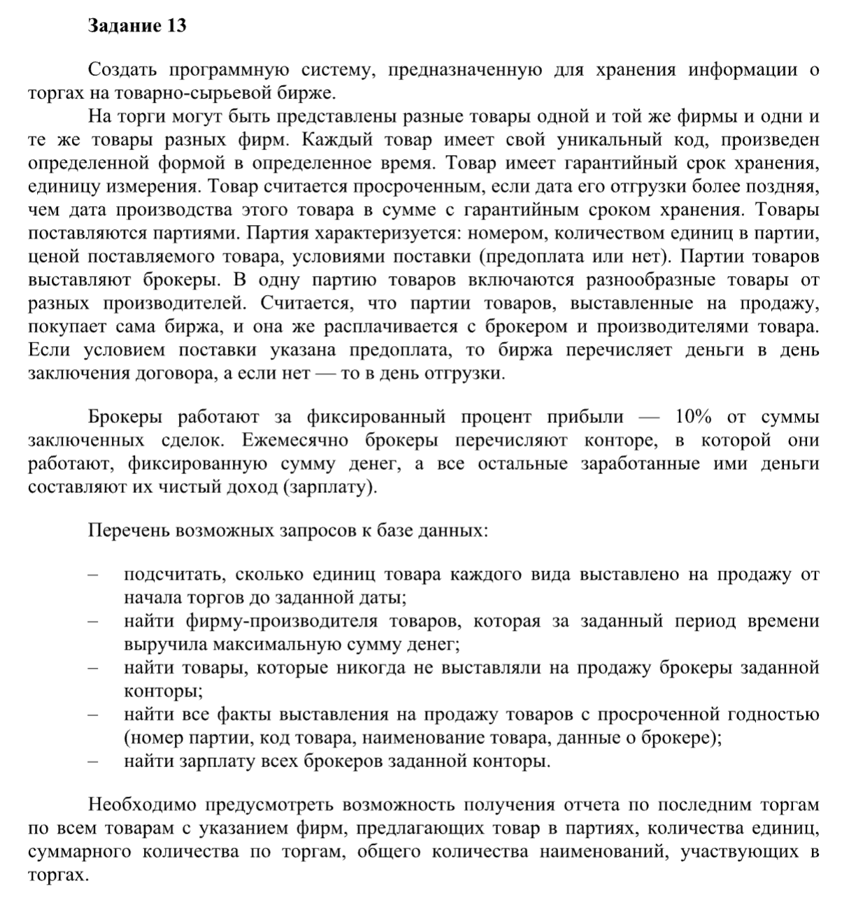
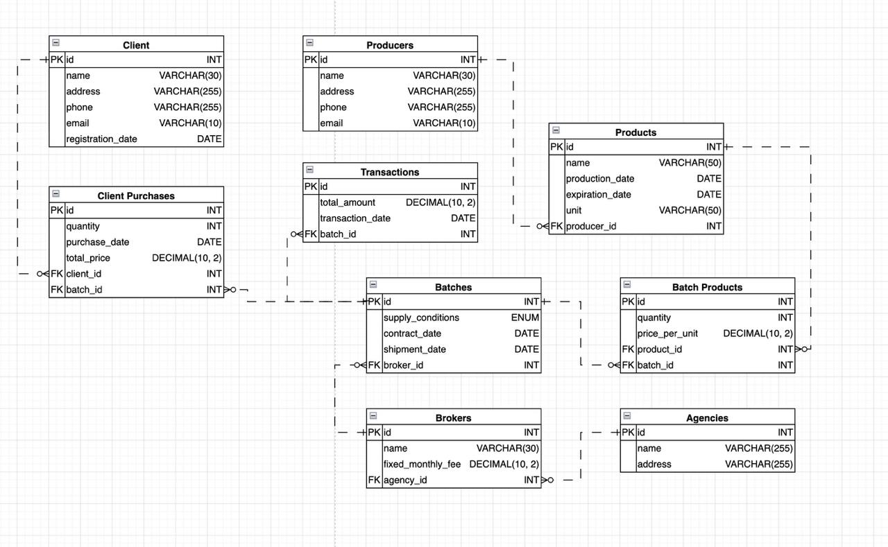
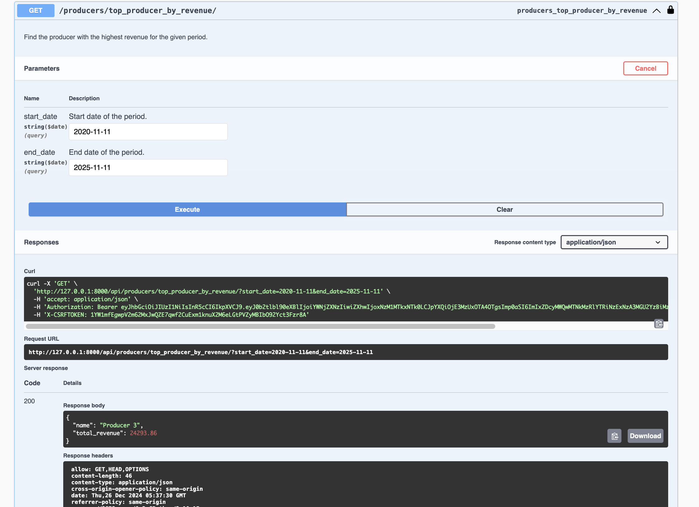
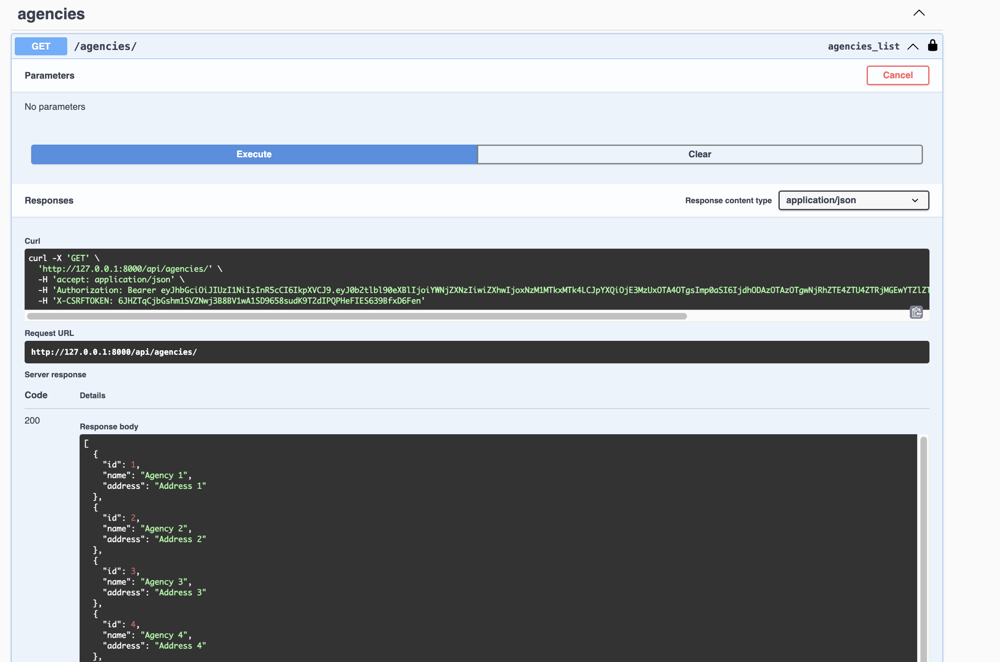

## Условие

Реализовать модель базы данных средствами DjangoORM (согласовать с преподавателем на консультации).

## Выполнение 

Для начала реализуем БД. В качестве доменной области был выбран вариант под номером 13.

 

Итоговый вариант представляет собой систему, предназначенную для управления и хранения информации о торгах на товарно-сырьевой бирже. В БД реализованы следующие сущности:

1. **Продукты (Products)** - товары, с информацией о производителе, дате производства, сроке годности и единице измерения.
2. **Производители (Producers)** - компании, производящие товары.
3. **Партии (Batches)** - группы товаров с характеристиками условий поставки, количества, цен и дат отгрузки.
4. **Брокеры (Brokers)** - посредники, продающие партии товаров, работающие через агентства.
5. **Агентства (Agencies)** - компании, в которых работают брокеры.
6. **Покупатели (Client)** - клиенты, приобретающие товары через биржу.
7. **Покупки клиентов (Client Purchases)** - информация о покупках товаров клиентами.
8. **Транзакции (Transactions)** - данные о финансовых операциях, связанных с партиями товаров.

 

База данных поддерживает такие запросы, как подсчет единиц товаров, анализ доходов производителей, идентификация просроченных товаров и расчет заработной платы брокеров. 
Аналогичные модели реализованы и в DjangoORM. Например, сущность "Партии" выглядит следующим образом:

```python
class BatchProduct(models.Model):
    batch = models.ForeignKey(Batch, on_delete=models.CASCADE, related_name='batch_products')
    product = models.ForeignKey(Product, on_delete=models.CASCADE, related_name='batch_products')
    quantity = models.IntegerField()
    price_per_unit = models.DecimalField(max_digits=10, decimal_places=2)

    def __str__(self):
        return f'{self.product.name} in Batch {self.batch.id}'
```

Далее в стандартном порядке выполняем все этапы миграции. Чтобы в последствие было удобнее экспериментировать, также 
были дописаны команды к manage.py (они добавляются через директорию `management/commands/*.py`) для автозаполнения БД сгенериванными
случайными данными и ее последующим очищением при желании:

```shell
# заполняем БД
python manage.py seed_database

# очищаем БД
python manage.py clear_database
```

Команды достаточно простые и буквально в определенном порядке либо очищают, либо заполняют БД. Например, скрипт `clear_database`
выглядит так:

```python
from django.core.management.base import BaseCommand
from stock_market_app.models import Transaction, ClientPurchase, BatchProduct, Batch, Product, Producer, Client, Broker, Agency


class Command(BaseCommand):
    help = 'Clear all data from the database'

    def handle(self, *args, **kwargs):
        self.clear_data()
        self.stdout.write(self.style.SUCCESS('Successfully cleared all data from the database!'))

    def clear_data(self):
        """Clear all data in reverse order of relationships."""
        Transaction.objects.all().delete()
        ClientPurchase.objects.all().delete()
        BatchProduct.objects.all().delete()
        Batch.objects.all().delete()
        Product.objects.all().delete()
        Producer.objects.all().delete()
        Client.objects.all().delete()
        Broker.objects.all().delete()
        Agency.objects.all().delete()

```


## Условие

Реализовать логику работу API средствами Django REST Framework (используя методы сериализации)

## Выполнение 

Для этого пункта по факту необходимо сделать следующие шаги:

- реализовать сериализаторы для удобного JSON представления данных в repsonse-ах
- добавить views с базовым CRUD циклом операций для всех объектов
  - продумать удаление сущностей со связью parent -> child
  - продумать несколько более сложных интересных запросов
- добавить соответствующие эндпоинты
- подключить SWAGGER

Итоговую реализацию можно увидеть в соответствующем разделе. Для получения JSON представления SWAGGER документации и его дальнейшего использования достаточно прописать `urls.py` подобный эндпоинт:

```python
path('swagger.json', schema_view.without_ui(cache_timeout=0), name='schema-json'),
```

А далее вызвать необходимую команду:

```shell
(python-3-10-pyad) kdduha@MacBook-Pro--kdduha laboratory_work_3 % curl -X GET http://127.0.0.1:8000/api/swagger.json -o openapi.json

  % Total    % Received % Xferd  Average Speed   Time    Time     Time  Current
                                 Dload  Upload   Total   Spent    Left  Speed
100 26902  100 26902    0     0   777k      0 --:--:-- --:--:-- --:--:--  796k
```

Также SWAGGER доступен при локальном поднятии по эндпоинту
`api/swagger`. Для его настройки необходимо просто прокинуть несколько доп.полей в `settings.py` и сформировать шаблон в `urls.py`
следующим образом:

```python
schema_view = get_schema_view(
    openapi.Info(
        title="Your API",
        default_version='v1',
        description="API documentation",
        contact=openapi.Contact(email="contact@yourapi.com"),
    ),
    public=True,
    permission_classes=(permissions.AllowAny,),
    patterns=[path('api/', include(router.urls))],
)


urlpatterns = [
    path('', include(router.urls)),
    path('swagger/', schema_view.with_ui('swagger', cache_timeout=0), name='schema-swagger-ui'),
]
```

Подобных подход включит в SWAGGER только те маршруты, которые были прописаны и зарегистрированы в соответствующем разделе месте кода, 
что позволяет избежать излишней документации. 

CRUD же достигается за счет оперирования достаточно стандартными сериализаторами и представлениями. Например, в самом наивном варианте `views.py`:

```python
class AgencyViewSet(ParentDeleteProtectedMixin, viewsets.ModelViewSet):
    queryset = Agency.objects.all()
    serializer_class = AgencySerializer
```

И аналогично в `serializers.py`:

```python
class AgencySerializer(serializers.ModelSerializer):
    class Meta:
        model = Agency
        fields = '__all__'
```

Ограничение на удаление parent сущностей без children достигается за счет добавления и наследование всех views от одного общего кастомного
`ParentDeleteProtectedMixin`, который маппит сущности и решает, давать возможность удалять, или нет:

```python
class ParentDeleteProtectedMixin:
    """
    Controls parent/children object deletion and bans cascade removing.
    """

    def destroy(self, request, *args, **kwargs):
        instance = self.get_object()

        related_models = []

        if isinstance(instance, Agency):
            related_models = ['brokers']
        elif isinstance(instance, Broker):
            related_models = ['batches']
        elif isinstance(instance, Producer):
            related_models = ['products']
        elif isinstance(instance, Product):
            related_models = ['batch_products']
        elif isinstance(instance, Batch):
            related_models = ['batch_products', 'purchases', 'transactions']
        elif isinstance(instance, Client):
            related_models = ['purchases']

        for related_model in related_models:
            if getattr(instance, related_model).exists():
                return Response(
                    {
                        "error": f"Impossible to delete an object, because it has children elements in {related_model}."},
                    status=status.HTTP_400_BAD_REQUEST
                )

        return super().destroy(request, *args, **kwargs)
```

Иногда требуется усложнение тех же сериализаторов, чтобы в удобном видеть смотреть на вложенные сущности. При этом SWAGGER автоматически генерирует всю документацию
и нотацию к запросам, но для некоторой более сложной логики это можно сделать самостоятельно через декораторы:

```python
@swagger_auto_schema(
        operation_description="Delete the broker by name.",
        responses={200: BrokerSerializer},
        manual_parameters=[
            openapi.Parameter(
                'name', openapi.IN_QUERY,
                description="Broker name.",
                type=openapi.TYPE_STRING,
            ),
        ]
    )
@action(detail=False, methods=['delete'], url_path='delete-by-name')
def delete_by_name(self, request):
    """
    Delete a broker by name.
    """
    name = request.query_params.get('name')

    if not name:
        return Response({'error': 'Please provide the name of the broker to delete.'},
                        status=status.HTTP_400_BAD_REQUEST)

    broker = get_object_or_404(Broker, name=name)
    broker.delete()
    return Response({'message': f'Broker {name} has been deleted.'}, status=status.HTTP_204_NO_CONTENT)
```


## Условие 

Подключить регистрацию / авторизацию по токенам / вывод информации о текущем пользователе средствами Djoser.

## Выполнение

Авторизация с JWT подключается через доп. пакет. Здесь тоже достаточно прописать пару базовым общих настроек и немного доработать
SWAGGER для более приятного интерактивного использования следующим образам: 

```python
SWAGGER_SETTINGS = {
    'SECURITY_DEFINITIONS': {
        'api_key': {
            'type': 'apiKey',
            'in': 'header',
            'name': 'Authorization'
        }
    },
}
```

Это позволить заранее задать хэдер авторизации с токеном ко всем запросам в SWAGGER, чтобы не прописывать его каждый раз. 
Эндпоинты авторизации я решил оставить как внутренние, не вынося их в общую доку, чтобы поэкспериментировать с зонами видимости, 
но для простоты работы добавил парочку `Makefile` команд с циклом получения и обновления токена:

```makefile
login:
	curl -X POST -d "username=$(USERNAME)&password=$(PASSWORD)&email=$(EMAIL)" http://localhost:8000/auth/users/

get-token:
	curl -X POST -d "username=${USERNAME}&password=${PASSWORD}" http://localhost:8000/api/token/

refresh-token:
	curl -X POST -d "refresh=${REFRESH_TOKEN}" http://localhost:8000/api/token/refresh/
```

## Примеры запросов 




