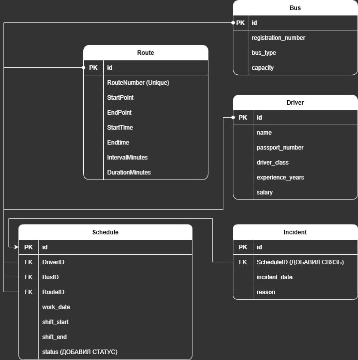

# Лабораторная работа #3. Реализация серверной части на django rest. Документирование API.
## Ход работы
Было решено выполнить работу на основе задания по созданию системы для диспетчера частной автобусной фирмы.



### Запросы
**CRUD-запросы для автобусов**
```python
# Все для модели автобуса
class BusesListAPIView(generics.ListAPIView):
    serializer_class = BusSerializer
    queryset = Bus.objects.all()

class BusesDestroyView(generics.DestroyAPIView):
    serializer_class = BusSerializer
    queryset = Bus.objects.all()
    lookup_field = 'registration_number'

class BusesCreateView(generics.CreateAPIView):
    serializer_class = BusSerializer
    queryset = Bus.objects.all()
```
**CRUD-запросы для маршрутов**
```python
# Все для модели маршрута
class RoutesListAPIView(generics.ListAPIView):
    serializer_class = RouteSerializer
    queryset = Route.objects.all()

class RoutesCreateView(generics.CreateAPIView):
    serializer_class = RouteSerializer
    queryset = Route.objects.all()

class RoutesDestroyView(generics.DestroyAPIView):
    serializer_class = RouteSerializer
    queryset = Route.objects.all()
    lookup_field = 'route_number'
```

**CRUD-запросы для водителей**
```python
# Все для модели водителя
class DriversListAPIView(generics.ListAPIView):
    serializer_class = DriverSerializer
    queryset = Driver.objects.all()

class DriverCreateView(generics.CreateAPIView):
    serializer_class = DriverSerializer
    queryset = Driver.objects.all()

class DriverDetailView(generics.RetrieveAPIView):
    serializer_class = DriverSerializer
    queryset = Driver.objects.all()
    lookup_field = 'passport_number'

class DriverUpdateView(generics.UpdateAPIView):
    serializer_class = DriverSerializer
    queryset = Driver.objects.all()
    lookup_field = 'passport_number'

class DriverDeleteView(generics.DestroyAPIView):
    serializer_class = DriverSerializer
    queryset = Driver.objects.all()
    lookup_field = 'passport_number'
```

**CRUD-запросы для расписания**
```python
# Все для модели расписания
class SchedulesListAPIView(generics.ListAPIView):
    serializer_class = ScheduleSerializer
    queryset = Schedule.objects.all()

class ScheduleCreateView(generics.CreateAPIView):
    serializer_class = ScheduleSerializer
    queryset = Schedule.objects.all()

class ScheduleUpdateView(generics.UpdateAPIView):
    serializer_class = ScheduleSerializer
    queryset = Schedule.objects.all()

class ScheduleDeleteView(generics.DestroyAPIView):
    serializer_class = ScheduleSerializer
    queryset = Schedule.objects.all()
```

### Запросы из задания
**Отображение водителей по маршруту**
```python
class DriversByRouteView(APIView):
    def get(self, request, route_number):
        schedules = Schedule.objects.filter(route__route_number=route_number).select_related('driver', 'route')
        serialized_data = ScheduleSerializer(schedules, many=True).data
        return Response(serialized_data)
```
**Время начала и конца маршрутов**
```python
class RouteTimingView(APIView):
    def get(self, request):
        routes = Route.objects.all()
        data = routes.values('route_number', 'start_time', 'end_time')
        return Response(data)
```

**Суммарная длительнось всех маршрутов**
```python
class TotalRouteDistanceView(APIView):
    def get(self, request):
        total_distance = Route.objects.aggregate(total_distance=Sum('duration_minutes'))
        return Response({'total_distance': total_distance['total_distance']})
```

**Автобусы, которые не выехали на маршрут по конкретной дате**
```python
class AbsentBusesView(APIView):
    def get(self, request, date):
        incidents = Incident.objects.filter(schedule__work_date=date)
        serialized_data = IncidentSerializer(incidents, many=True).data
        return Response(serialized_data)
```

**Количество водителей каждого класса**
```python
class DriverCountByClassView(APIView):
    def get(self, request):
        driver_counts = Driver.objects.values('driver_class').annotate(count=Count('id'))
        return Response(driver_counts)
```

**Полный отчет**
```python
class FleetReportView(APIView):
    def get(self, request):
        bus_types = Bus.objects.values('bus_type').annotate(
            bus_count=Count('id'),
            route_count=Count('schedules__route', distinct=True),
            driver_count=Count('schedules__driver', distinct=True),
        )
        total_distance = Route.objects.aggregate(total_distance=Sum('duration_minutes'))
        driver_stats = Driver.objects.aggregate(
            avg_age=Avg('experience_years'), total_count=Count('id')
        )
        report = {
            'bus_types': list(bus_types),
            'total_route_distance': total_distance['total_distance'],
            'driver_stats': driver_stats,
        }
        return Response(report)

```