# Отчет по заданию 3.1
## Задание 1
Напишите запрос на создание 6-7 новых автовладельцев и 5-6 автомобилей, каждому автовладельцу назначьте удостоверение и от 1 до 3 автомобилей
## Ход работы
Для выполнения задания я решил воспользоваться интерактивным режимом Pycharm'a

### Начало работы
1. Заходим в раздел `python console`
2. Импоритруем модели из файла `models.py` с помощью команды 
`from project_first_app.models import *`

### Автовладельцы
```python from datetime import date
owner1 = CarOwner.objects.create(first_name="Ivan", last_name="Petrov", date_of_birth=date(1985, 5, 15))
owner2 = CarOwner.objects.create(first_name="Anna", last_name="Ivanova", date_of_birth=date(1990, 8, 22))
owner3 = CarOwner.objects.create(first_name="Sergey", last_name="Sidorov", date_of_birth=date(1978, 3, 10))
owner4 = CarOwner.objects.create(first_name="Elena", last_name="Smirnova", date_of_birth=date(1987, 11, 5))
owner5 = CarOwner.objects.create(first_name="Pavel", last_name="Volkov", date_of_birth=date(1992, 6, 18))
owner6 = CarOwner.objects.create(first_name="Maria", last_name="Kuznetsova", date_of_birth=date(1995, 1, 25))
```
**Результат выполнения кода**
С помомощью цикла 
```python 
for owner in CarOwner.objects.all():
    print(owner)
```
выведем созданных автовладельцев
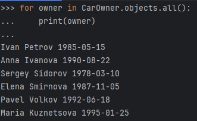
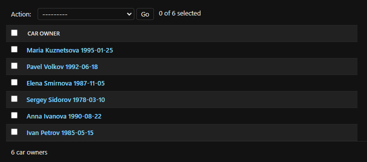
### Автомобили
```python
car1 = Car.objects.create(registration_number="ABC123", manufacturer="Toyota", model="Camry", color="Black")
car2 = Car.objects.create(registration_number="DEF456", manufacturer="Honda", model="Civic", color="White")
car3 = Car.objects.create(registration_number="GHI789", manufacturer="Ford", model="Focus", color="Blue")
car4 = Car.objects.create(registration_number="JKL012", manufacturer="Nissan", model="Altima", color="Red")
car5 = Car.objects.create(registration_number="MNO345", manufacturer="Chevrolet", model="Malibu", color="Grey")
```
**Результат выполнения кода**
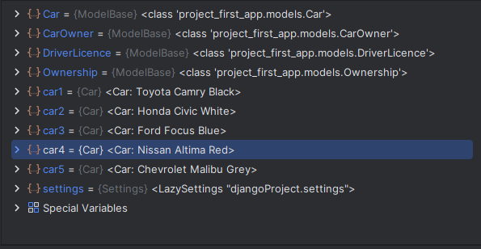
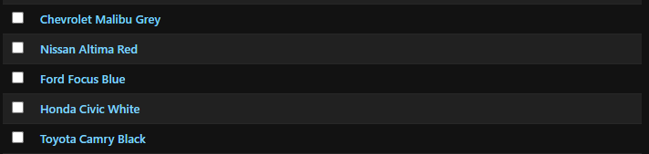

### Удостоверения
```python
license1 = DriverLicence.objects.create(car_owner_id=owner1, license_number="A1234567", license_type="B", date_of_issue=date(2010, 4, 15))
license2 = DriverLicence.objects.create(car_owner_id=owner2, license_number="B7654321", license_type="C", date_of_issue=date(2015, 7, 20))
license3 = DriverLicence.objects.create(car_owner_id=owner3, license_number="C1357924", license_type="B", date_of_issue=date(2005, 3, 5))
license4 = DriverLicence.objects.create(car_owner_id=owner4, license_number="D2468135", license_type="A", date_of_issue=date(2012, 9, 10))
license5 = DriverLicence.objects.create(car_owner_id=owner5, license_number="E9753135", license_type="D", date_of_issue=date(2018, 2, 22))
license6 = DriverLicence.objects.create(car_owner_id=owner6, license_number="F8642097", license_type="B", date_of_issue=date(2021, 12, 15))
```
**Результат выполнения кода**

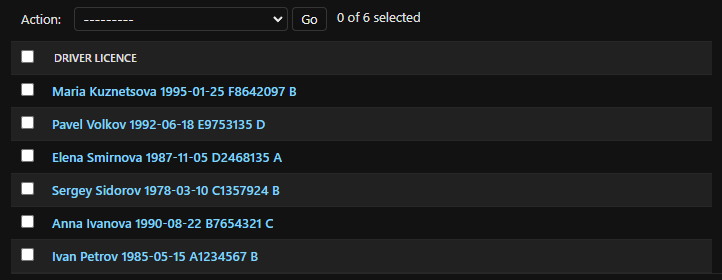

### Владения
Назначим каждому владельцу по одному автомобилю
```python
ownership1 = Ownership.objects.create(car_owner_id=owner1, car_id=car1, start_date=date(2020, 1, 1))
ownership2 = Ownership.objects.create(car_owner_id=owner1, car_id=car2, start_date=date(2021, 6, 1))
ownership3 = Ownership.objects.create(car_owner_id=owner2, car_id=car3, start_date=date(2019, 3, 15))
ownership4 = Ownership.objects.create(car_owner_id=owner3, car_id=car4, start_date=date(2018, 7, 10))
ownership5 = Ownership.objects.create(car_owner_id=owner4, car_id=car5, start_date=date(2022, 5, 5))
ownership6 = Ownership.objects.create(car_owner_id=owner5, car_id=car1, start_date=date(2023, 2, 1))
ownership7 = Ownership.objects.create(car_owner_id=owner6, car_id=car2, start_date=date(2021, 8, 10))
```
**Результат выполнения кода**
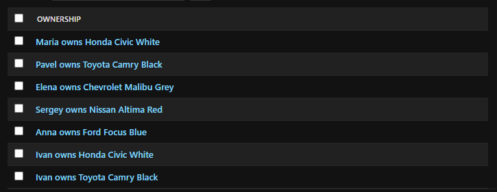

## Задание 2. Создание простых запросов
### Суть задания
По созданным в пр.1 данным написать следующие запросы на фильтрацию:

- Где это необходимо, добавьте related_name к полям модели
- Выведете все машины марки “Toyota” (или любой другой марки, которая у вас есть)
- Найти всех водителей с именем “Олег” (или любым другим именем на ваше усмотрение)
- Взяв любого случайного владельца получить его id, и по этому id получить экземпляр удостоверения в виде объекта модели (можно в 2 запроса)
- Вывести всех владельцев красных машин (или любого другого цвета, который у вас присутствует)
- Найти всех владельцев, чей год владения машиной начинается с 2010 (или любой другой год, который присутствует у вас в базе)

### Ход работы
**Вывод машин марки "Toyota"**
```python
Car.objects.filter(manufacturer="Toyota")
```
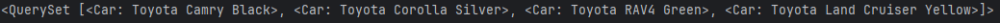

**Вывод водителей, которых зовут "Maria"**
```python
CarOwner.objects.filter(first_name="Maria")
```
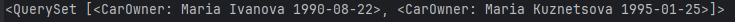

**Экземляр удостоверения случайного владельца в виде объекта модели**
```python
owner_id = CarOwner.objects.first().id
DriverLicence.objects.filter(car_owner_id=owner_id)
```
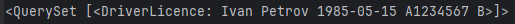

**Вывод владельцев всех красных машин**
```python
black_car_owners = CarOwner.objects.filter(cars__color="Black")
for owner in black_car_owners:
    print(owner)
```
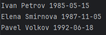

**Вывод владельцев, чей год владения машиной начинается с 2021**
```python
old_car_owners = CarOwner.objects.filter(ownerships__start_date__year__gte="2021")
for owner in old_car_owners:
    print(owner)
```
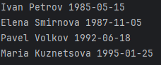

## Задание 3. Агрегация и аннотация запросов
### Суть задания
Необходимо реализовать следующие запросы c применением описанных методов:
- Вывод даты выдачи самого старшего водительского удостоверения
- Укажите самую позднюю дату владения машиной, имеющую какую-то из существующих моделей в вашей базе
- Выведите количество машин для каждого водителя
- Подсчитайте количество машин каждой марки
- Отсортируйте всех автовладельцев по дате выдачи удостоверения (Примечание: чтобы не выводить несколько раз одни и те же таблицы воспользуйтесь методом .distinct()
### Ход работы
**Вывод даты выдачи самого старшего водительсткого удостоверения**
```python
from django.db.models import Min, Max
print(DriverLicence.objects.aggregate(Min("date_of_issue")))
```
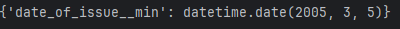

**Самая поздняя дата владения машиной**
```python
print( Ownership.objects.aggregate(latest=Max(Max("start_date"), Max("end_date"))))
```
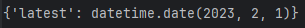

**Вывод количества машин для каждого водителя**
```python
from django.db.models import Count
amount_of_cars= CarOwner.objects.annotate(Count("cars"))
for owner in amount_of_cars:
    print("{}{}: {}".format(owner.first_name, owner.last_name, owner.cars__count))
```
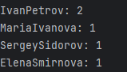

**Вывод количества машин каждой марки**
```python
cars = Car.objects.values("manufacturer").annotate(manufacturer_count=Count("id"))
for car in cars:
    print(car["manufacturer"], car["manufacturer_count"])
```
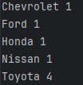

**Соритровка владельцев по дате выдачи удостоверения**
```python
sorted_owners = CarOwner.objects.annotate(
    first_license_date=Min("driverlicence__date_of_issue")  
).order_by("first_license_date")
for owner in sorted_owners:
    print(owner.first_name, owner.last_name, owner.first_license_date)
```
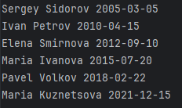
