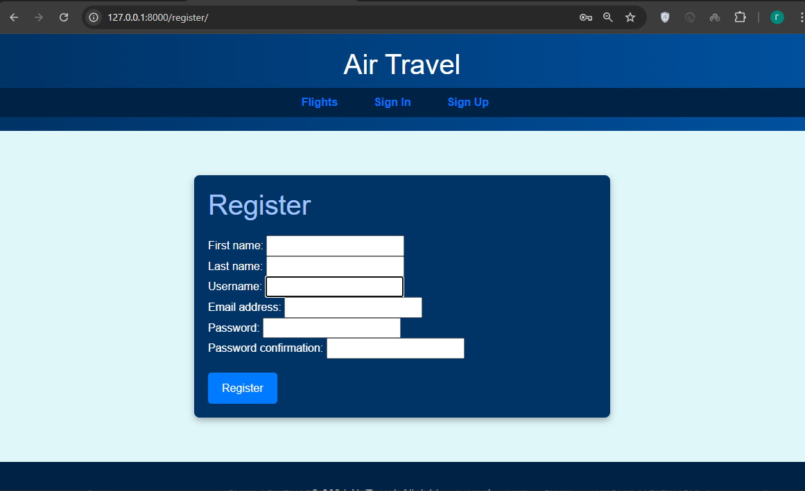
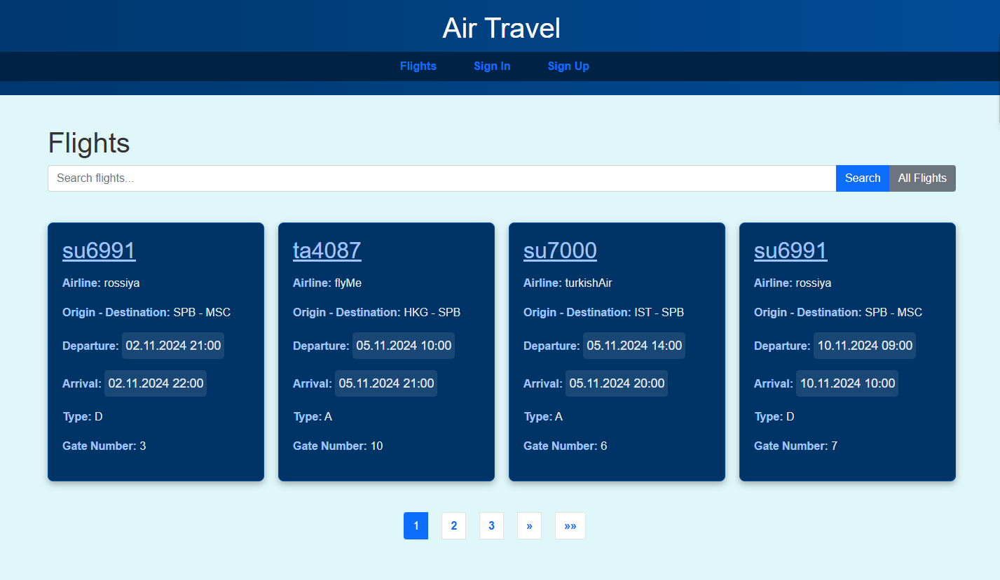
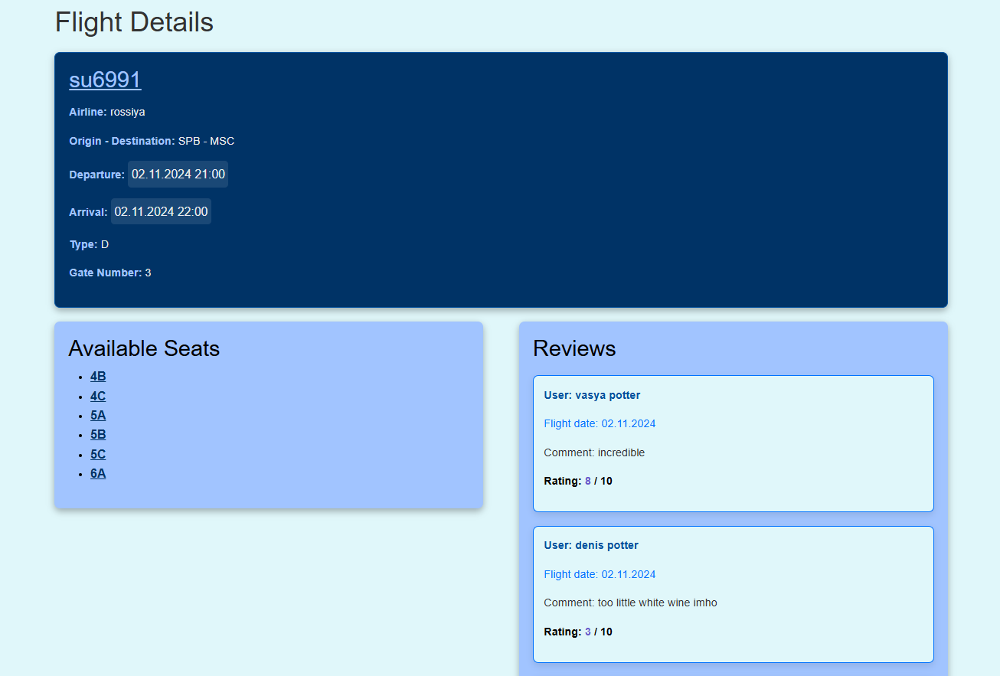
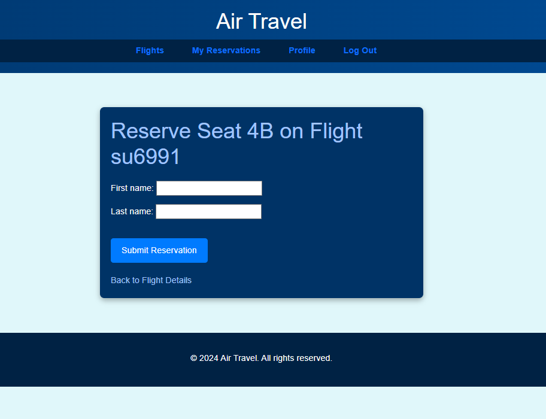
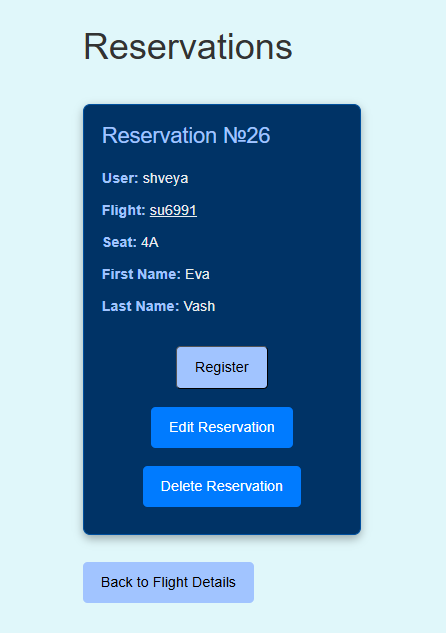
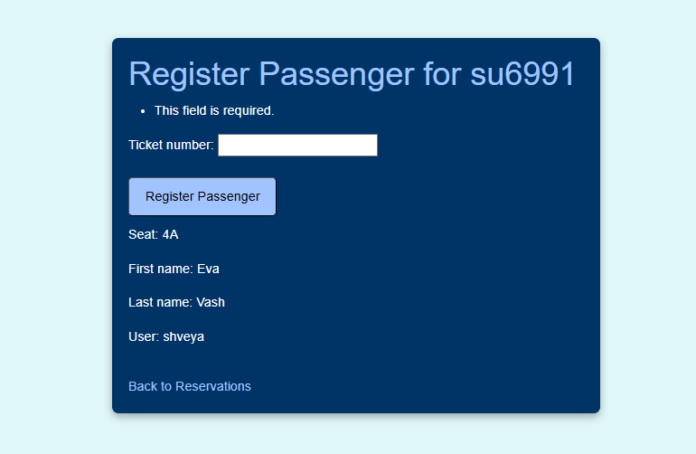

# Сайт Air Travel

## Описание

Сайт Air Travel разработан с помощью **фреймворка Django**. Платформа позволяет пользователю создать свой аккаунт для просмотра доступных авиаперелетов различных авиакомпаний и направлений.
Пользователю доступен функционал просмотра и бронирования посадочных мест, составления отзывов о прелете. Администратор может регистрировать пассажира на рейс, а также просматривать данные о пассажирах и брони.

## Модели

- Flight: flight_number, airline, origin, destination, departure, arrival, type, gate_number
- Seat: seat_number, **fk flight**, is_reserved
- Reservation: **fk user**, **fk flight**, **fk seat**, first_name, last_name
- Review: **fk user**, **fk flight**, comment_text, rating
- Passenger: first_name, last_name, **fk seat**, **fk flight**, ticket_number

```py
class User(AbstractUser):
    pass


class Flight(models.Model):
    flight_number = models.CharField(max_length=10)
    airline = models.CharField(max_length=50)
    origin = models.CharField(max_length=50)
    destination = models.CharField(max_length=50)
    departure = models.DateTimeField()
    arrival = models.DateTimeField()
    TYPE_CHOICES = (
        ('A', 'Arrival'),
        ('D', 'Departure'),
    )
    type = models.CharField(max_length=1, choices=TYPE_CHOICES)
    gate_number = models.CharField(max_length=10)


class Seat(models.Model):
    seat_number = models.CharField(max_length=10)
    flight = models.ForeignKey(Flight, on_delete=models.CASCADE)
    is_reserved = models.BooleanField(default=False)


class Reservation(models.Model):
    user = models.ForeignKey(User, on_delete=models.CASCADE)
    flight = models.ForeignKey(Flight, on_delete=models.CASCADE)
    seat = models.ForeignKey(Seat, on_delete=models.CASCADE)
    first_name = models.CharField(max_length=20)
    last_name = models.CharField(max_length=20)


class Review(models.Model):
    user = models.ForeignKey(User, on_delete=models.CASCADE)
    flight = models.ForeignKey(Flight, on_delete=models.CASCADE)
    comment_text = models.TextField()
    rating = models.IntegerField(choices=list(zip(range(1, 11), range(1, 11))))


class Passenger(models.Model):
    first_name = models.CharField(max_length=20)
    last_name = models.CharField(max_length=20)
    seat = models.ForeignKey(Seat, on_delete=models.CASCADE)
    flight = models.ForeignKey(Flight, on_delete=models.CASCADE)
    ticket_number = models.CharField(max_length=20)
```

## Функции

Пользователь:

1. Регистрация и авторизация пользователя;

```py
def is_administrator(user):
    return user.is_staff


def register(request):
    if request.method == 'POST':
        form = CustomUserCreationForm(request.POST)
        if form.is_valid():
            user = form.save()
            login(request, user)
            return redirect('flights')
    else:
        form = CustomUserCreationForm()
    return render(request, 'user/register.html', {'form': form})


def login_view(request):
    if request.method == 'POST':
        form = CustomAuthenticationForm(request, data=request.POST)
        if form.is_valid():
            username = form.cleaned_data['username']
            password = form.cleaned_data['password']
            user = authenticate(request, username=username, password=password)
            if user is not None:
                login(request, user)
                return redirect('flights')
            else:
                return render(request, 'user/login.html', {'form': form, 'error': 'Invalid credentials'})
    else:
        form = CustomAuthenticationForm()

        return render(request, 'user/login.html', {'form': form})


@login_required
def logout_view(request):
    logout(request)
    return redirect('flights')
```



2. Просмотр списка авиаперелетов;

```py
def flight_list(request):
    query = request.GET.get('q', '')

    flights = Flight.objects.all().order_by('departure')

    if query:
        flights = flights.filter(
            Q(flight_number__icontains=query) |
            Q(airline__icontains=query) |
            Q(origin__icontains=query) |
            Q(destination__icontains=query) |
            Q(departure__icontains=query) |
            Q(arrival__icontains=query) |
            Q(type__icontains=query) |
            Q(gate_number__icontains=query)
        )

    paginator = Paginator(flights, 4)
    page_number = request.GET.get('page')
    page_obj = paginator.get_page(page_number)

    return render(request, 'flights/flights.html', {
        'flights': page_obj,
        'query': query,
    })
```




3. Для каждого перелета просмотр свободных мест;

```py
class FlightDetailView(LoginRequiredMixin, DetailView):
    model = Flight
    template_name = 'flights/flight.html'
    context_object_name = 'flight'

    def get_context_data(self, **kwargs):
        context = super().get_context_data(**kwargs)
        flight = self.get_object()

        available_seats = Seat.objects.filter(flight=flight, is_reserved=False)
        reviews = Review.objects.filter(flight=flight)
        context['reviews'] = reviews
        context['available_seats'] = available_seats

        return context
```



4. Для каждого свободного места возможность посмотреть отзывы и совершить бронирование;

```py
@login_required
def submit_reservation(request, flight_pk, seat_pk):
    flight = get_object_or_404(Flight, pk=flight_pk)
    seat = get_object_or_404(Seat, pk=seat_pk)

    if request.method == 'POST':
        form = ReservationForm(request.POST, user=request.user, flight=flight, seat=seat)
        if form.is_valid():
            reservation = form.save(commit=False)
            reservation.user = request.user
            reservation.flight = flight
            reservation.seat = seat
            seat.is_reserved = True
            seat.save()
            reservation.save()
            return redirect('flight_detail', pk=flight_pk)
    else:
        form = ReservationForm(user=request.user, flight=flight, seat=seat)

    return render(request, 'reservations/submit_reservation.html', {'form': form, 'flight': flight, 'seat': seat})
```


5. Просмотр списка личных бронирований пользователя;
6. Для каждого бронирования можно изменить имя пассажира и написать свой отзыв.

Администратор:

1. Просмотр бронирований и пассажиров для каждого рейса

```py
@login_required
@user_passes_test(is_administrator)
def reservations_list(request, flight_pk):
    flight = get_object_or_404(Flight, pk=flight_pk)

    occupied_seat_ids = Passenger.objects.values('seat')
    reservations = Reservation.objects.filter(flight=flight).exclude(seat__in=Subquery(occupied_seat_ids))

    return render(request, 'reservations/reservations.html', {
        'flight': flight,
        'reservations': reservations,
    })
```


2. Регистрация пассажиров на рейс
```py
@login_required
@user_passes_test(is_administrator)
def register_passenger(request, reservation_pk):
    reservation = get_object_or_404(Reservation, pk=reservation_pk)
    passenger = Passenger(flight=reservation.flight,
                          seat=reservation.seat,
                          first_name=reservation.first_name,
                          last_name=reservation.last_name)
    if request.method == 'POST':
        form = RegisterPassengerForm(request.POST, instance=passenger)
        if form.is_valid():
            passenger.ticket_number = form.instance.ticket_number
            print("Savin passenger" + passenger.last_name)
            passenger.save()
            return redirect('reservations_list', flight_pk=reservation.flight.pk)
    else:
        form = RegisterPassengerForm(instance=passenger)

    return render(request, 'flights/register_passenger.html', {'form': form, 'reservation': reservation})
```


## Начало работы

Для работы приложения воспользоваться командой:
`python manage.py runserver`