# Интерфейсы платформы менеджмента авиалинии


--------------------------------
## Страница “Самолеты”
1. Список всех самолетов авиалинии (номер, модель, вместимость, скорость)
2. Кнопки “Редактировать” и “Удалить" для каждого самолета - открытие модального окна
3. Кнопка “Добавить самолет”  - открытие модального окна
4. Фильтрация по модели и поиск по номеру самолета

```
/planes
```

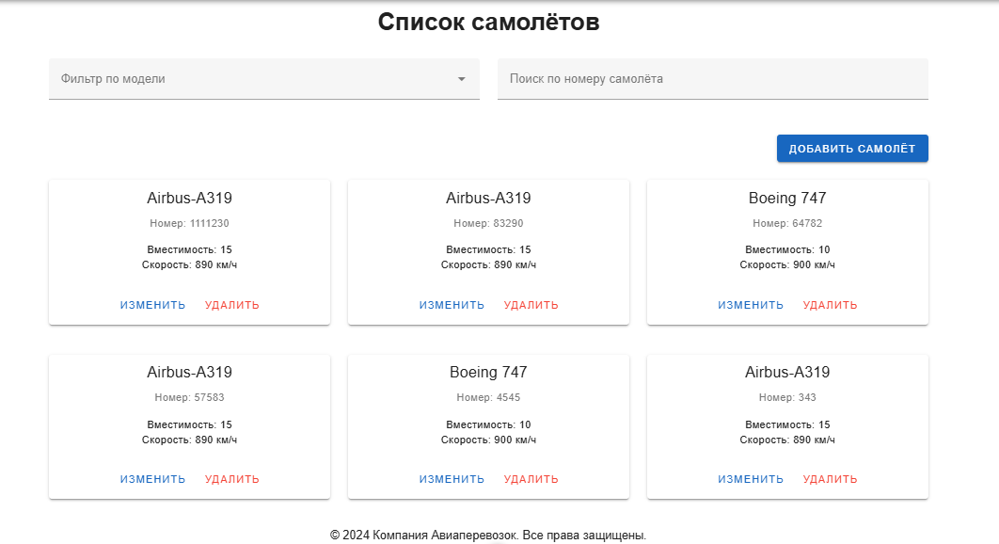
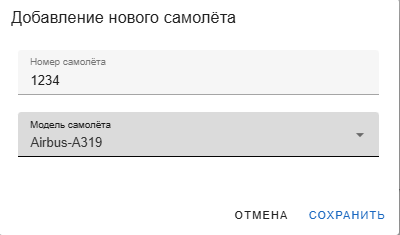
-------------------------------
## Страница “Сотрудники”
1. Список всех сотрудников авиалинии (ФИО, возраст, образование, опыт работы, паспортные данные, роли)
2. Общее количество сотрудников
3. Кнопки "Добавить роль", “Редактировать” и “Удалить” (уволить) для каждого сотрудника - открытие модального окна
4. Кнопка “Добавить сотрудника” - открытие модального окна
5. Фильтрация по должности, опыту работы, поиск по ФИО

```
/employees
```

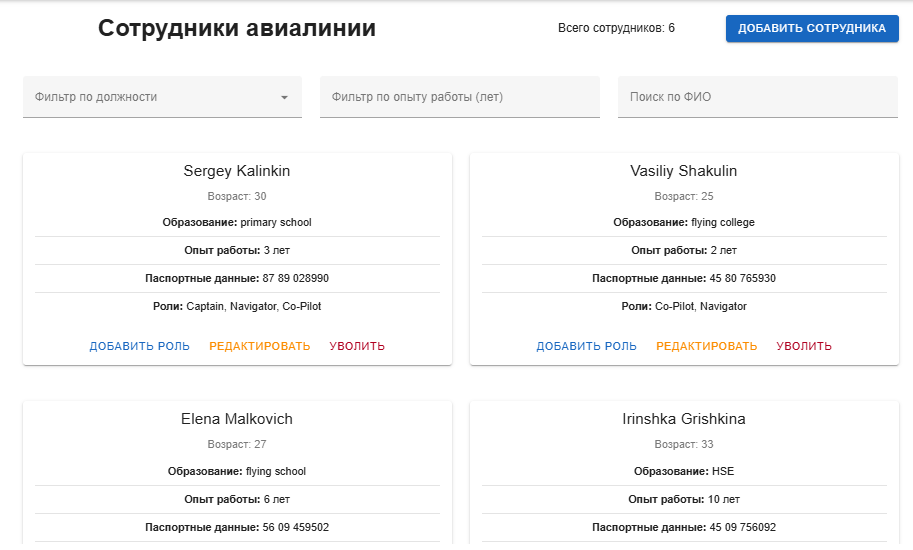
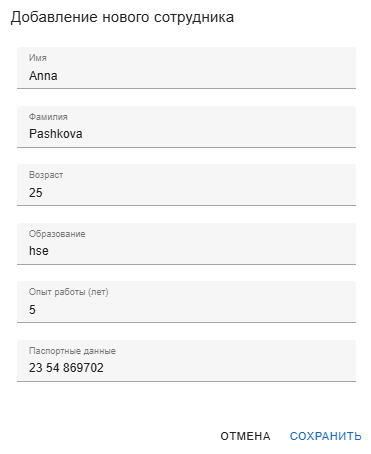
--------------------------------
## Страница “Экипажи”
1. Список всех экипажей авиалинии (командир, второй пилот, штурман, стюарды)
2. Фильтрация по командиру, второму пилоту, штурману, стюардам

```
/crews
```

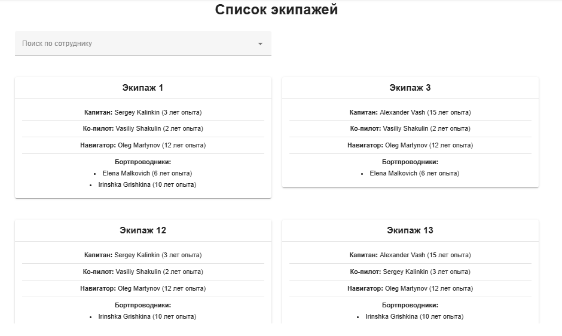
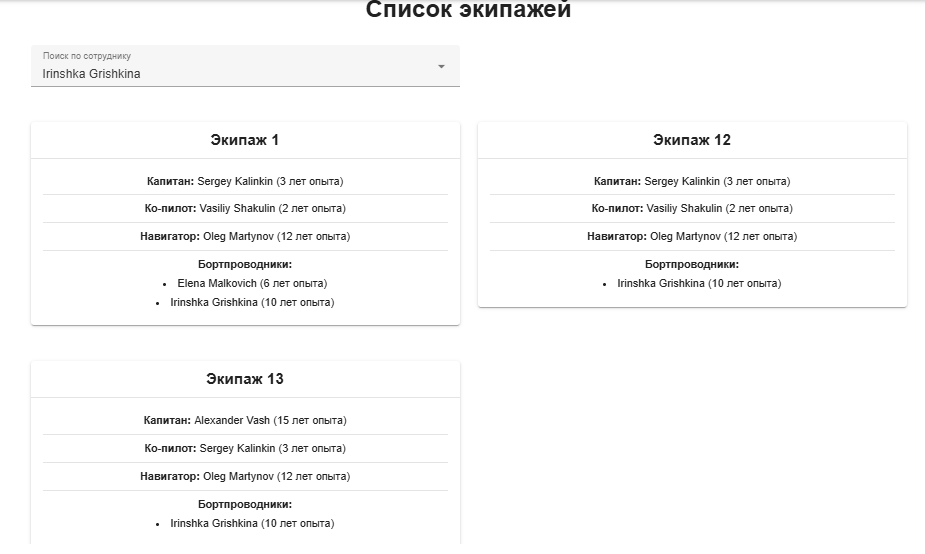
--------------------------------
## Страница “Рейсы”
1. Список всех рейсов (маршрутов) авиалинии (номер, аэропорты вылета/прибытия, время вылета/прибытия, транзитные остановки, расстояние, регулярность)
2. Поиск по номеру, фильтрация по аэропортам, по регулярности

```
/routes
```

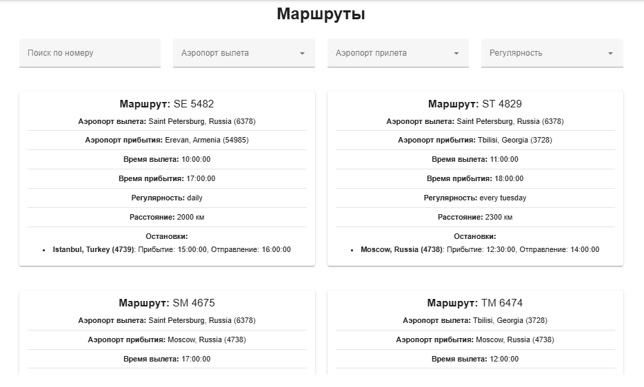
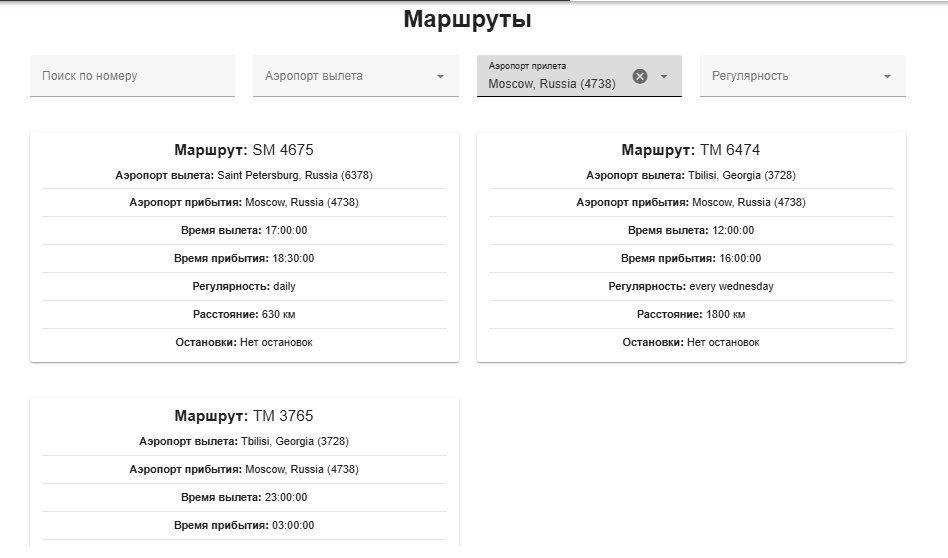
--------------------------------
## Страница “Перелеты”
1. Список всех перелетов авиалинии (номер, дата и время вылета/прибытия, аэропорты вылета/прибытия, транзитные остановки, самолет, количество проданных билетов, статус [“запланирован”, “посадка” и т.д.])
2. Кнопка “Детали” для каждого перелета - переход на страницу "Перелет"
3. Кнопка “Добавить перелет” - открытие модального окна
4. Фильтрация по маршруту (рейсу), статусу, дате
5. Кнопка “Места” - переход на страницу с местами на данный перелет

```
/flights
```

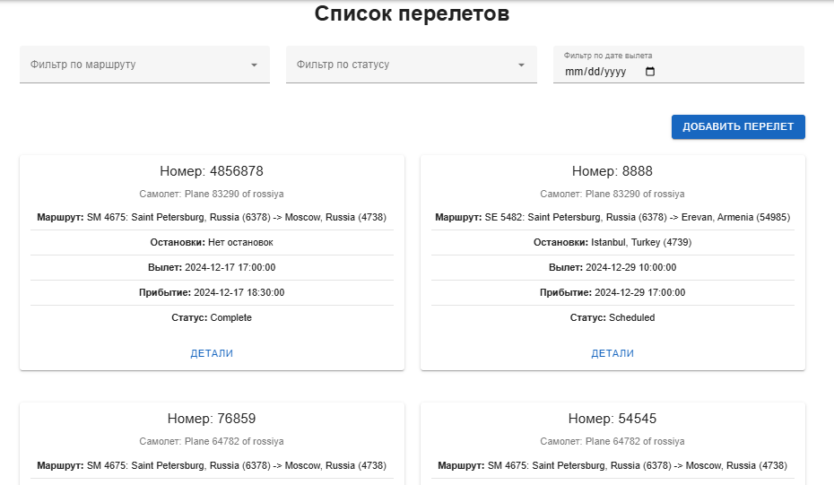
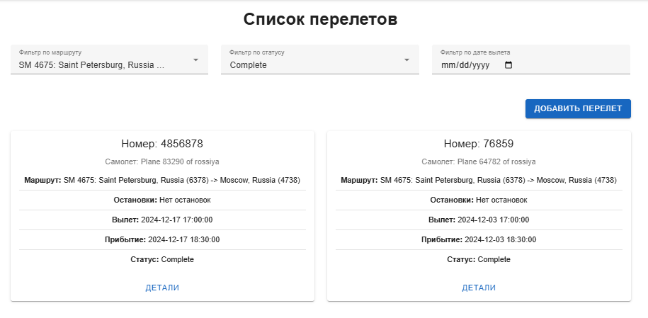
--------------------------------
## Страница “Перелет”
1. Детали перелета (номер, дата и время вылета/прибытия, аэропорты вылета/прибытия, транзитные остановки, самолет, экипаж, количество проданных билетов, статус [“запланирован”, “посадка” и т.д.])
2. Кнопки “Редактировать” (номер, дата, статус) и “Удалить” - открытие модального окна
3. Таблица всех мест на перелет (номер, статус “занято”/”свободно”)
4. Фильтрация и сортировка по статусу места

```
/flights/:flightId
```
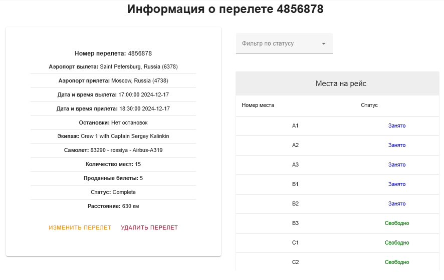

--------------------------------
## Страница “Ремонты”
1. Список всех ремонтов самолетов авиалинии (самолет, дата начала/завершения, описание, статус [“Запланирован”, “В процессе” и т.д.])
2. Кнопки “Редактировать” (даты, описание, статус) и “Удалить” для каждого ремонта - открытие модального окна
3. Кнопка “Добавить ремонт” - открытие модального окна
4. Фильтрация по самолету, дате, статусу

```
/maintenances
```

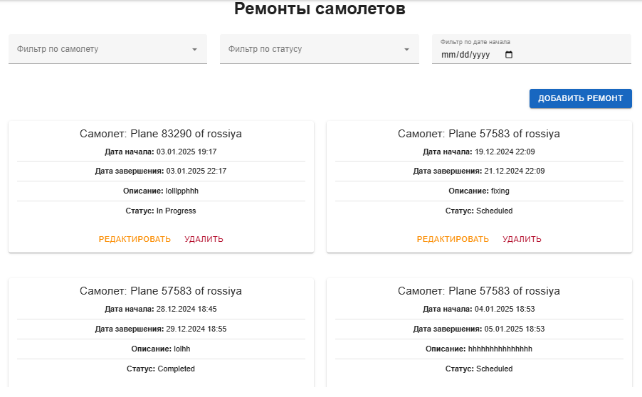
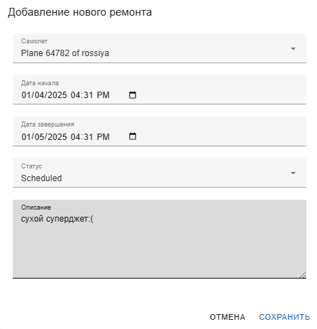
-------------------------------
## Страница “Отчет по бортам”

- Общее количество бортов авиалинии
- По каждой модели самолета: количество бортов, количество посадочных мест, скорость, номера самолетов
```
/planes-stats
```

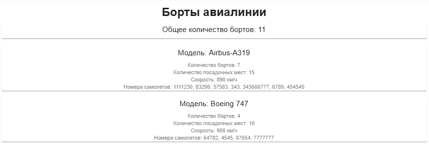

-------------------------------
## Страница “Отчет по маршрутам”
1. Марка самолета, чаще всего летающая по маршруту:
- Поле выбора маршрута из выпадающего списка
- Вывод: Модель самолета (название, вместимость, скорость) и количество её перелетов по этому маршруту
2. Маршруты, по которым летают перелеты, заполненные менее чем на ХХ%:
- Поле ввода значение в процентах (по умолчанию - 50%).
- Вывод: Список маршрутов: маршрут (номер, аэропорты вылета/прибытия, время вылета/прибытия, транзитные остановки, расстояние, регулярность), количество незаполненных на ХХ% перелетов, их процент от общего количества перелетов по этому маршруту

```
/routes-stats
```

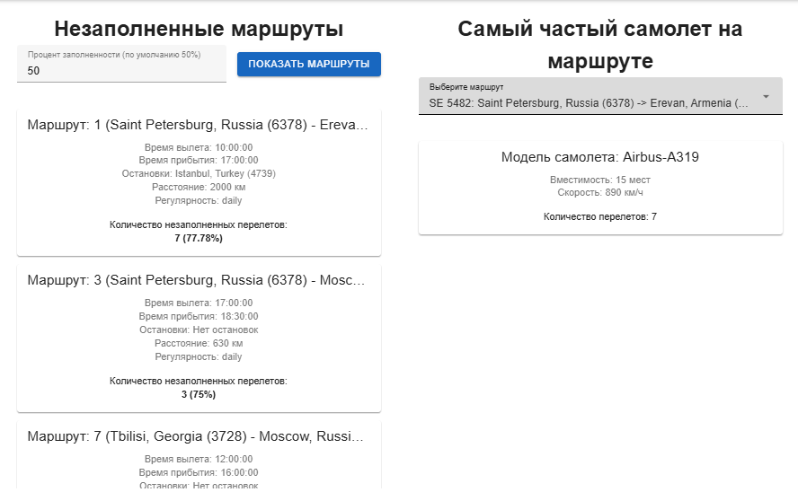

--------------------------------
## Страница “Профиль”
1. Учетные данные пользователя (логин, почта, авиалиния)
2. Кнопка “Изменить пароль” - поля ввода старого и нового пароля
3. Кнопка “Изменить профиль” - поля ввода нового логина и новой почты
4. Кнопка "Логаут" - переход на страницу приветствия

```
/profile
```
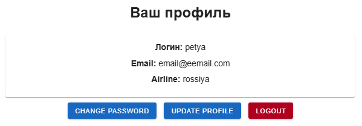

```
/change-password
```

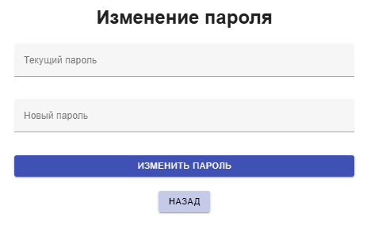

```
/update-profile
```
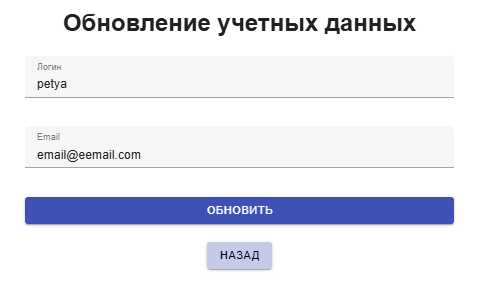
--------------------------------
## Авторизация и регистрация 

Авторизация: ввод логина и пароля.

Регистрация: ввод логина, почты, пароля.

```
/login
```

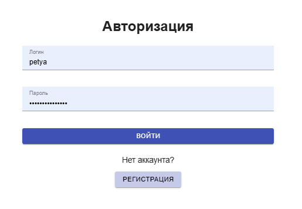

```
/register
```

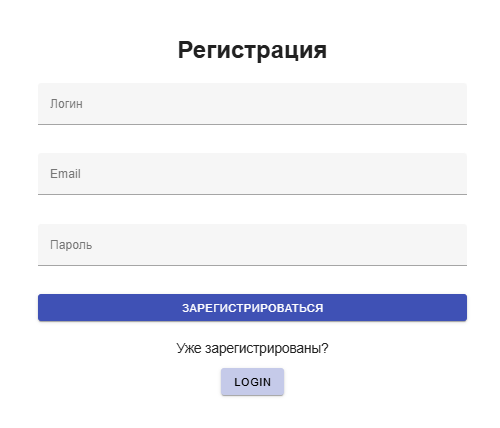