По мотивам прошлой домашней работы архитектурно решение выглядит следующим образом:
- есть фронт сервис
    - все html страницы декомпозированы на views и pages в vue объектах
    - добавлен общий стиль, но где-то он подправлен отдельным css
    - header подгружается динамически на каждую страницу, выделен в отдельный component
- есть бэк сервис
    - выполняет роль авторизации, предоставляет апишку для регистрации через JWT и общается с БД для записи пользователей
-   есть bd
    -   mock-данные 
Все три сервиса запускаются конкурентно и слушают друг друга.

## Условие

Yастроить для серверной части, реализованной в лабораторной работе №3 CORS

## Выполнение 

Настройка получается достаточно тривиальная, достаточно прописать эндпоинты и определить middleware

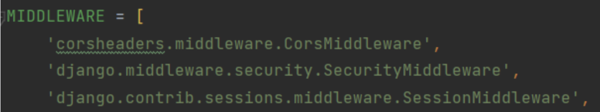
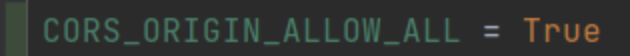

В случае с JS сервером, можно обойтись следующим подходом:

```js
const cors = require('cors')
app.use(cors({ origin: 'http://localhost:8080' }));
```

## Условие

Реализовать интерфейсы авторизации, регистрации и изменения учётных данных и настроить взаимодействие с серверной частью. 

## Выполнение 

Итоговый роутинг всех эндпоинтов эндпоинтов на сторое Vue выглядит следующим образом:

```js
import { createRouter, createWebHistory } from "vue-router";
import IndexPage from "../views/IndexPage.vue";
import AboutPage from "../views/AboutPage.vue";
import ContactPage from "../views/ContactPage.vue";
import SearchPage from "../views/SearchPage.vue";
import PropertyPage from "../views/PropertyPage.vue";
import MessagesPage from "../views/MessagesPage.vue";
import ProfilePage from "../views/ProfilePage.vue";
import AuthPage from "../views/AuthPage.vue";
import PropertySettings from "@/views/PropertySettings.vue";

const routes = [
  { path: "/", name: "Home", component: IndexPage },
  { path: "/about", name: "About", component: AboutPage },
  { path: "/contact", name: "Contact", component: ContactPage },
  { path: "/search", name: "Search", component: SearchPage },
  { path: "/property/:id", name: "Property", component: PropertyPage },
  { path: "/messages", name: "Messages", component: MessagesPage },
  { path: "/profile", name: "Profile", component: ProfilePage },
  { path: "/auth", name: "Auth", component: AuthPage },
  { path: "/propertySettings", name: "PropertySettings", component: PropertySettings }
];

const router = createRouter({
  history: createWebHistory(),
  routes,
});

export default router;
```

Что касается самих эндпоинтов и интерфейсов, то логин/регистрация выполнены через одну форму, которые друг друга сменяют:

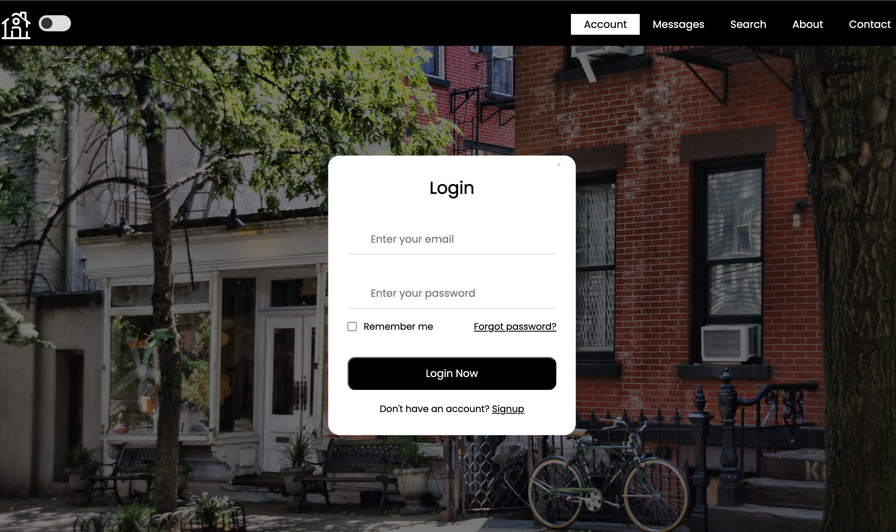
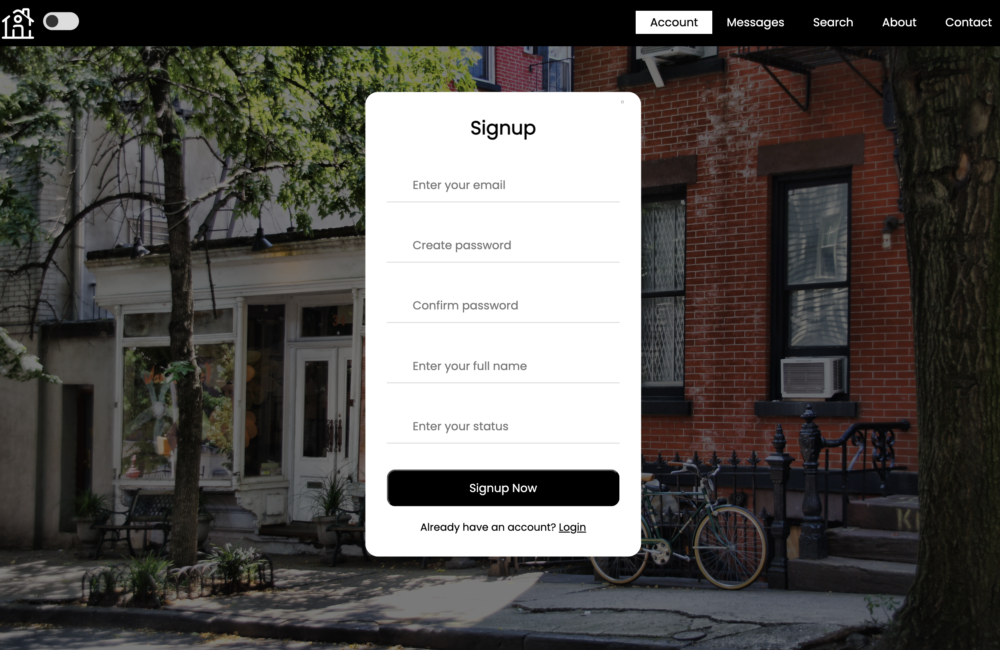

Авторизация происходит через JWT, в БД хранятся только захэшированные пароли => скомпрометировать будет уже сложнее, т.к. хэширование является необратимой операцией. Учетные данные можно менять в своем профиле в отдельной форме. Есть возможность поменять почту, статус и иконку профиля (любой url)

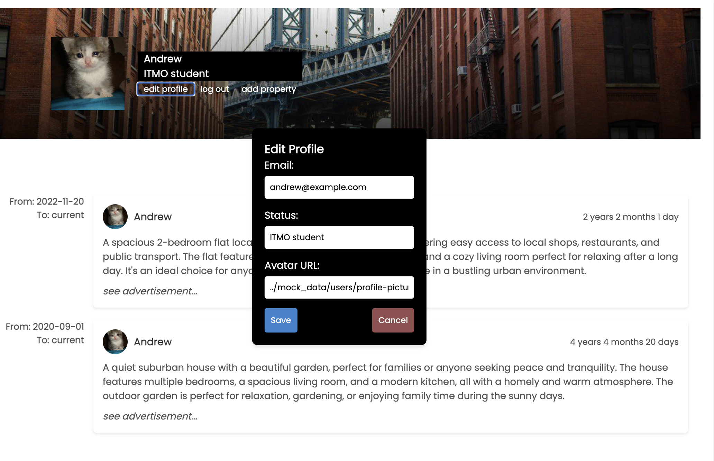

## Условие

Реализовать клиентские интерфейсы и настроить взаимодействие с серверной частью

## Выполнение 

Что касается других интерфейсов, то каждый интерфейс является Vue компонентом. Краткий обзор:

- Главная страница
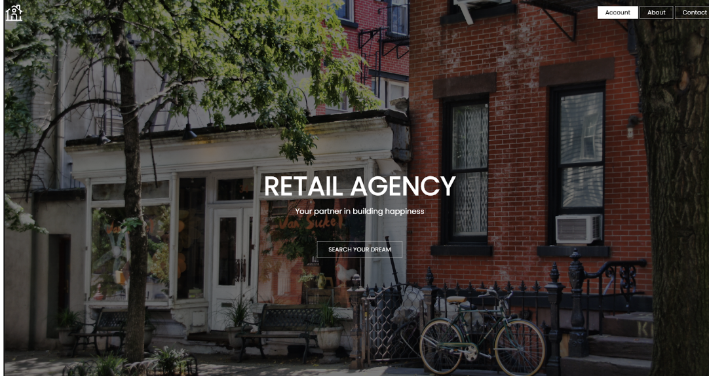

- О компании
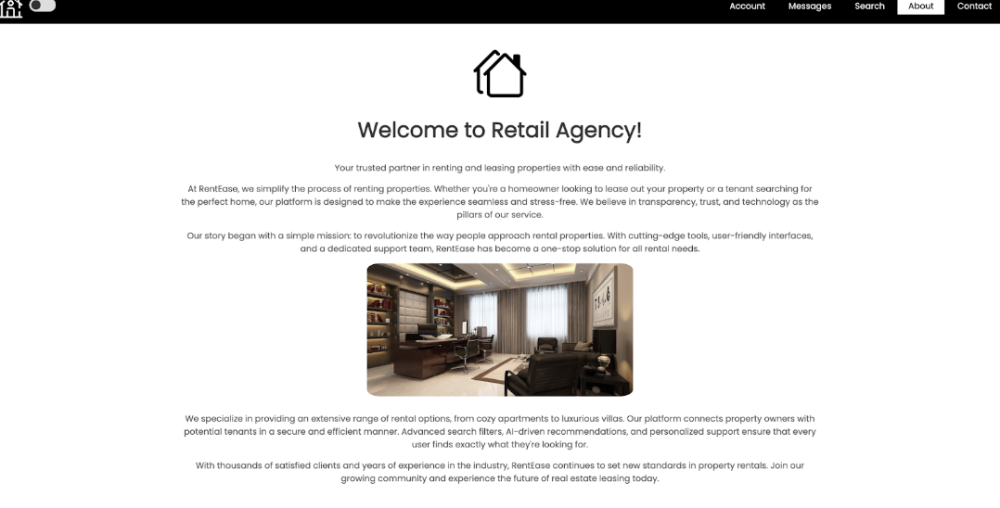

- Контакты
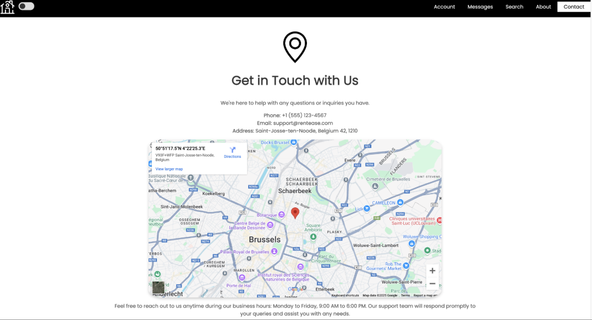

- Поисковик недвижимости с пагинацией
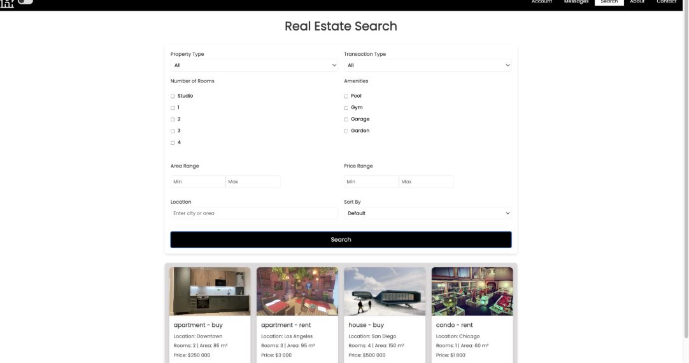

- Сообщения с арендодателями
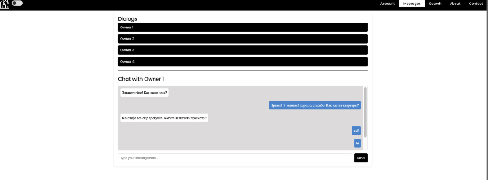

- Личный кабинет
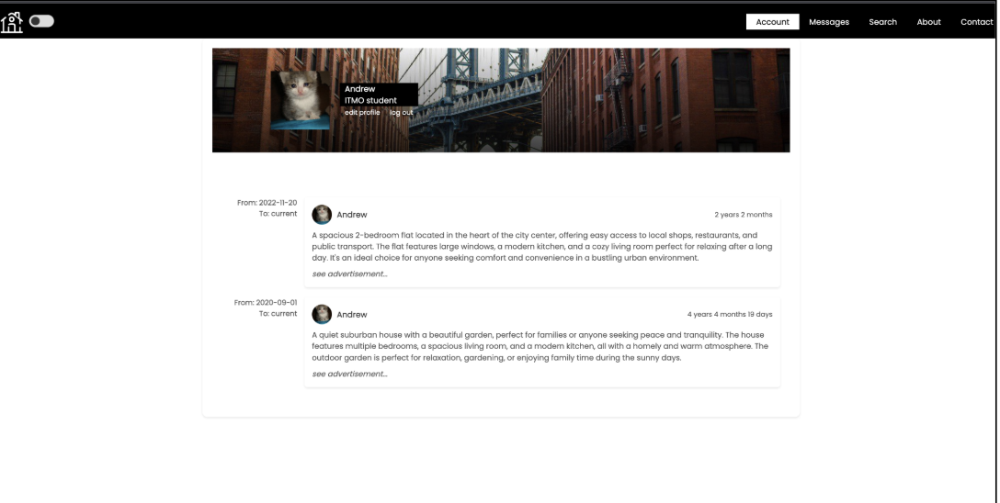

- Длинная страница недвидимости
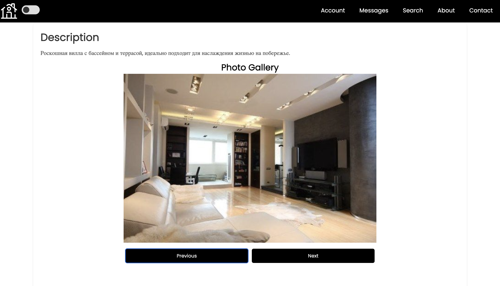
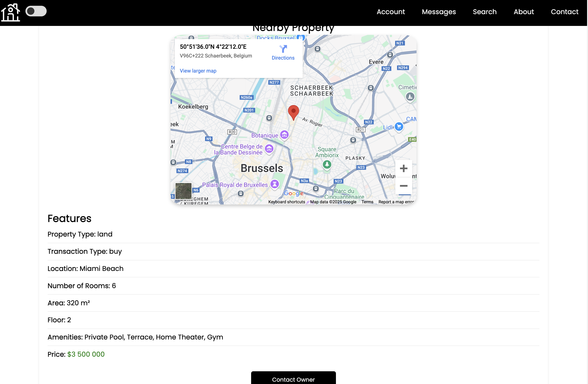

- Форма для публикации новых объявлений
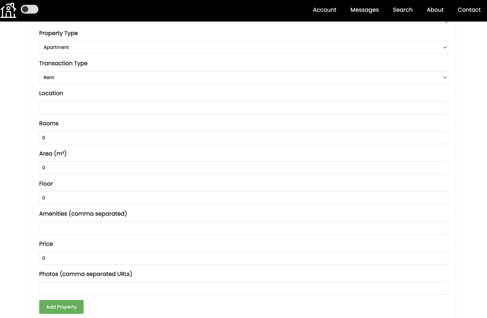

## Итого

В качестве некоторого итога могу сказать, что с vue гораздо приятнее работать, нежели с голым html, а также сам по себе фреймворк хорошо оптимизирован, обеспечивает плавность анимаций и всех переходов, позволяет убрать некоторые предыдущие костыли, когда приходилось выставлять таймаут прогрузки страниц для их удачного парсинга и т.д.

