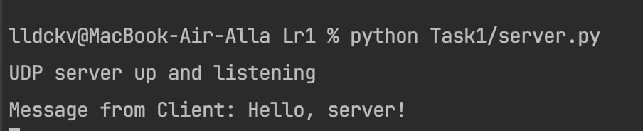
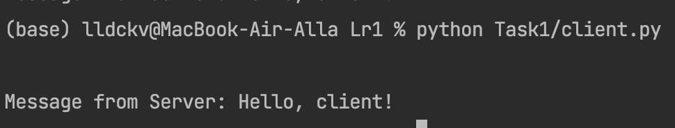

### Условие
Реализовать клиентскую и серверную часть приложения. Клиент отправляет серверу сообщение «Hello, server», и оно должно отобразиться на стороне сервера. В ответ сервер отправляет клиенту сообщение «Hello, client», которое должно отобразиться у клиента.

Реализовать с помощью протокола UDP и используя socket

### 
Пример работы:



Листинг кода, client.py: 
``` py hl_lines="2 3"
import socket


def connect():
    serverIP = "127.0.0.1"
    portNumber = 8080
    bufferSize = 1024

    msgFromClient = "Hello, server!"

    UDPClientSocket = socket.socket(family=socket.AF_INET, type=socket.SOCK_DGRAM)

    UDPClientSocket.sendto(str.encode(msgFromClient), (serverIP, portNumber))
    msgFromServer = UDPClientSocket.recvfrom(bufferSize)
    msg = "Message from Server: {}".format(msgFromServer[0].decode())

    print(msg)


if __name__ == "__main__":
    connect()

```

server.py:
``` py hl_lines="2 3"
import socket

def connect():
    localIP = "127.0.0.1"
    localPort = 8080
    bufferSize = 1024

    msgFromServer = "Hello, client!"
    bytesToSend = str.encode(msgFromServer)

    UDPServerSocket = socket.socket(family=socket.AF_INET, type=socket.SOCK_DGRAM)

    UDPServerSocket.bind((localIP, localPort))
    print("UDP server up and listening")

    while True:
        message, address = UDPServerSocket.recvfrom(bufferSize)
        clientMsg = "Message from Client: {}".format(message.decode())

        print(clientMsg)

        UDPServerSocket.sendto(bytesToSend, address)


if __name__ == "__main__":
    connect()

```