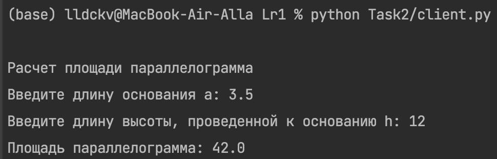
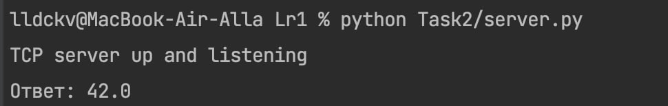

### Условие
Реализовать клиентскую и серверную часть приложения. Клиент запрашивает выполнение математической операции, параметры которой вводятся с клавиатуры. Сервер обрабатывает данные и возвращает результат клиенту.

Варианты операций:

    Теорема Пифагора.
    Решение квадратного уравнения.
    Поиск площади трапеции.
    Поиск площади параллелограмма.

Требования:

    Обязательно использовать библиотеку socket.
    Реализовать с помощью протокола TCP.

Использованный вариант по списку -  поиск площади параллелограмма.
### 
Пример работы:

