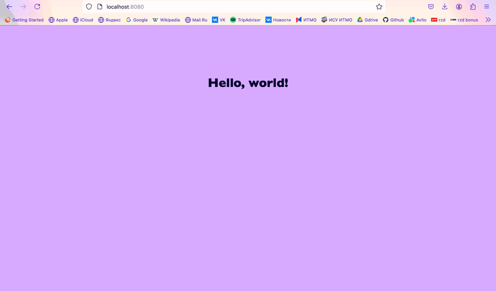

### Условие
Реализовать серверную часть приложения. Клиент подключается к серверу, и в ответ получает HTTP-сообщение, содержащее HTML-страницу, которая сервер подгружает из файла index.html.

Требования:

    Обязательно использовать библиотеку socket.
### 
Пример работы:

