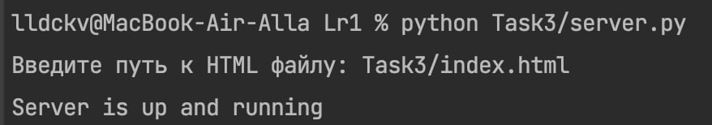

### Условие
Реализовать серверную часть приложения. Клиент подключается к серверу, и в ответ получает HTTP-сообщение, содержащее HTML-страницу, которая сервер подгружает из файла index.html.

Требования:

    Обязательно использовать библиотеку socket.
### 
Пример работы:



Листинг кода, index.html: 
``` py hl_lines="2 3"

<!DOCTYPE html>
<html lang="en">
<head>
    <meta charset="UTF-8">
    <title>Task 3</title>
     <style>
        body {
            padding: 100px;
            font-family: "Gill Sans", sans-serif;
            text-align: center;
            background-color: #D7ABFFFF;
            color: #00032c;
        }
    </style>
</head>
<body>
    <h1>Hello, world!</h1>
</body>
</html>

```

server.py:
``` py hl_lines="2 3"
import socket


def connect(file_loc: str = 'index.html'):
    host = '127.0.0.1'
    port = 8080

    server_socket = socket.socket(socket.AF_INET, socket.SOCK_STREAM)
    server_socket.bind((host, port))
    server_socket.listen(1)

    print(f"Server is up and running: http://localhost:{port}")

    while True:
        client_conn, client_addr = server_socket.accept()

        with open(file_loc, 'r') as f:
            content = f.read()

        response = f"HTTP/1.1 200 OK\nContent-Type: text/html\nContent-Length: {len(content)}\n\n{content}"
        client_conn.sendall(response.encode())

        client_conn.close()


if __name__ == "__main__":
    html_file_path = input("Введите путь к HTML файлу: ")
    connect(html_file_path)


```