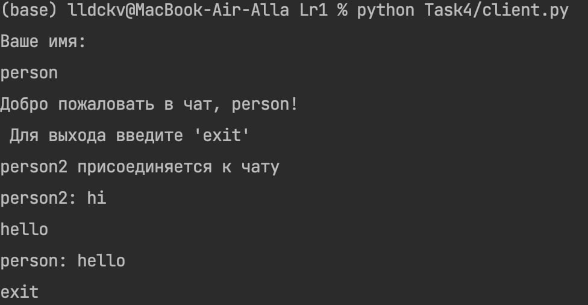
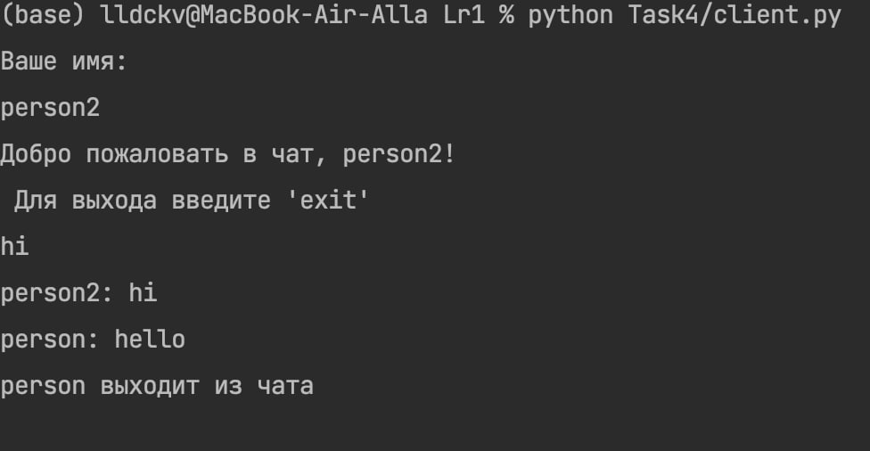

### Условие
Реализовать двухпользовательский или многопользовательский чат. Для максимального количества баллов реализуйте многопользовательский чат.

Требования:

    Обязательно использовать библиотеку socket.
    Для многопользовательского чата необходимо использовать библиотеку threading.

Вариант выполнен для многопользовательского чата.
### 
Пример работы:



Листинг кода, client.py: 
``` py hl_lines="2 3"
import socket
import threading

HOST = '127.0.0.1'
PORT = 8080
buffersize = 1024


def receive_message(target_socket):
    while True:
        try:
            message = target_socket.recv(buffersize)
            if not message:
                break
            print(message.decode())
        except:
            break


def connect():
    client_socket = socket.socket(socket.AF_INET, socket.SOCK_STREAM)
    client_socket.connect((HOST, PORT))
    threading.Thread(target=receive_message, args=(client_socket,)).start()
    while True:
        message = input()
        if message == 'exit':
            client_socket.close()
            break
        client_socket.send(message.encode())


if __name__ == "__main__":
    connect()


```

server.py:
``` py hl_lines="2 3"

import socket
import threading

HOST = '127.0.0.1'
PORT = 8080
buffersize = 1024

clients = {}
addresses = {}


def handle_client(client_socket, client_address):
    name = client_socket.recv(buffersize).decode()
    welcome_message = f"Добро пожаловать в чат, {name}! \n Для выхода введите 'exit'"
    client_socket.send(bytes(welcome_message, "utf-8"))
    message = f"{name} присоединяется к чату "
    broadcast(bytes(message, "utf-8"))
    clients[client_socket] = name
    addresses[client_socket] = client_address

    while True:
        try:
            message = client_socket.recv(buffersize)
            if message:
                broadcast(message, name+": ")
            else:
                remove_client(client_socket)
        except:
            continue


def broadcast(message, prefix=""):
    for sock in clients:
        sock.send(bytes(prefix, "utf-8")+message)


def remove_client(client_socket):
    name = clients[client_socket]
    del clients[client_socket]
    del addresses[client_socket]
    message = f"{name} выходит из чата"
    broadcast(bytes(message, "utf-8"))


def connect():
    with socket.socket(socket.AF_INET, socket.SOCK_STREAM) as server_socket:
        server_socket.bind((HOST, PORT))
        server_socket.listen()
        print("Server is up and running")

        while True:
            client_socket, client_address = server_socket.accept()
            print(f"Добавлен клиент c адресом {client_address[0]}, порт {client_address[1]}")
            client_socket.send(bytes("Ваше имя: ", "utf-8"))
            addresses[client_socket] = client_address
            threading.Thread(target=handle_client, args=(client_socket, client_address)).start()


if __name__ == "__main__":
    connect()


```