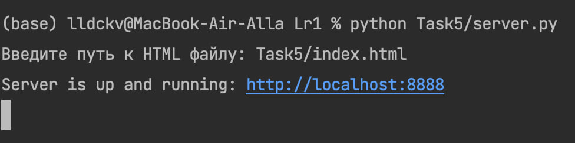
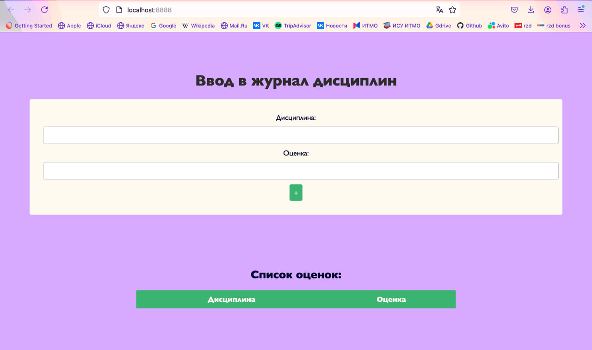
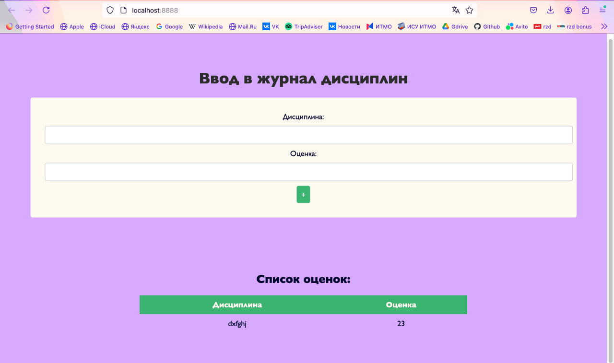

### Условие
Написать простой веб-сервер для обработки GET и POST HTTP-запросов с помощью библиотеки socket в Python.

Задание:

    Сервер должен:
        Принять и записать информацию о дисциплине и оценке по дисциплине.
        Отдать информацию обо всех оценках по дисциплинам в виде HTML-страницы.
### 
Пример работы:




Листинг кода, index.html: 
``` py hl_lines="2 3"
<!DOCTYPE html>
<html lang="ru">
<head>
    <meta charset="UTF-8">
    <title>Журнал оценок</title>
    <style>
        body {
            font-family:  "Gill Sans", sans-serif;
            background-color: #D7ABFFFF;
            margin: 0;
            padding: 5%;
            text-align: center;
            color: #00032c;
        }
        h1 {
            color: #2c2c2c;
        }
        form {
            background: floralwhite;
            padding: 30px;
            border-radius: 4px;
            margin-bottom: 10%;
        }
        input[type="text"] {
            width: 100%;
            padding: 10px;
            margin: 10px 0;
            border: 1px solid #ccc;
            border-radius: 4px;
        }
        input[type="submit"] {
            background-color: mediumseagreen;
            color: white;
            padding: 10px;
            border: none;
            border-radius: 4px;
            cursor: pointer;
        }
        input[type="submit"]:hover {
            background-color: springgreen;
        }
        table {
            width: 60%;
            margin: 0 auto;
            border-collapse: collapse;
        }
        th, td {
            padding: 10px;
            text-align: center;

        }
        th {
            background-color: mediumseagreen;
            color: floralwhite;
        }
    </style>
</head>
<body>
    <h1>Ввод в журнал дисциплин</h1>
    <form method="POST" action="/">
        Дисциплина: <input type="text" name="subject" required><br>
        Оценка: <input type="text" name="grade" required><br>
        <input type="submit" value="+">
    </form>

    <h2>Список оценок:</h2>
    <table>
        <tr>
            <th>Дисциплина</th>
            <th>Оценка</th>
            <!-- Таблица -->
        </tr>
    </table>
</body>
</html>


```

server.py:
``` py hl_lines="2 3"
import socket
from urllib.parse import parse_qs, unquote

grades = {}
buffersize = 1024

def read_html(file_path: str) -> str:
    try:
        with open(file_path, 'r', encoding='utf-8') as file:
            return file.read()
    except FileNotFoundError:
        return "<h1>HTML файл не найден</h1>"

def generate_html(file_loc: str) -> str:
    html = read_html(file_loc)

    table_rows = ""
    if grades:
        for subject, grade_list in grades.items():
            grades_str = ', '.join(grade_list)  # объединяем список оценок в строку
            table_rows += f"<tr><td>{subject}</td><td>{grades_str}</td></tr>"

    html = html.replace("<!-- Таблица -->", table_rows)  # вставляем данные таблицы на месте маркера в шаблоне
    return html

def parse_post_data(data: str) -> dict:
    params = {}
    try:
        body = data.split('\r\n\r\n', 1)[1]  # отделяем тело запроса
        parsed_data = parse_qs(body)
        for key, value in parsed_data.items():
            params[key] = unquote(value[0])
    except IndexError:
        pass
    return params

def start_server(file_loc: str = 'index.html') -> None:
    host = '127.0.0.1'
    port = 8888

    server_socket = socket.socket(socket.AF_INET, socket.SOCK_STREAM)
    server_socket.bind((host, port))
    server_socket.listen(1)
    print(f"Server is up and running: http://{host}:{port}")

    while True:
        client_socket, addr = server_socket.accept()  # новое подключение
        request = client_socket.recv(buffersize).decode()

        request_line = request.splitlines()[0]
        method, path, _ = request_line.split()  # выделяем метод запроса

        if method == 'GET':
            response_body = generate_html(file_loc)  # генерим шаблон
            response = 'HTTP/1.1 200 OK\nContent-Type: text/html; charset=utf-8\n\n' + response_body

        elif method == 'POST':
            params = parse_post_data(request)  # парсим полученные данные
            subject = params.get('subject', '')
            grade = params.get('grade', '')

            if subject and grade:
                if subject not in grades:
                    grades[subject] = []  # создаем список оценок для нового предмета
                grades[subject].append(grade)  # добавляем оценку для предмета
            response = 'HTTP/1.1 303 See Other\nLocation: /\n\n'  # редирект на главную страницу

        else:
            response = 'HTTP/1.1 405 Method Not Allowed\n\n'

        client_socket.sendall(response.encode('utf-8'))
        client_socket.close()

if __name__ == "__main__":
    html_file_path = input("Введите путь к HTML файлу: ")
    start_server(html_file_path)


```