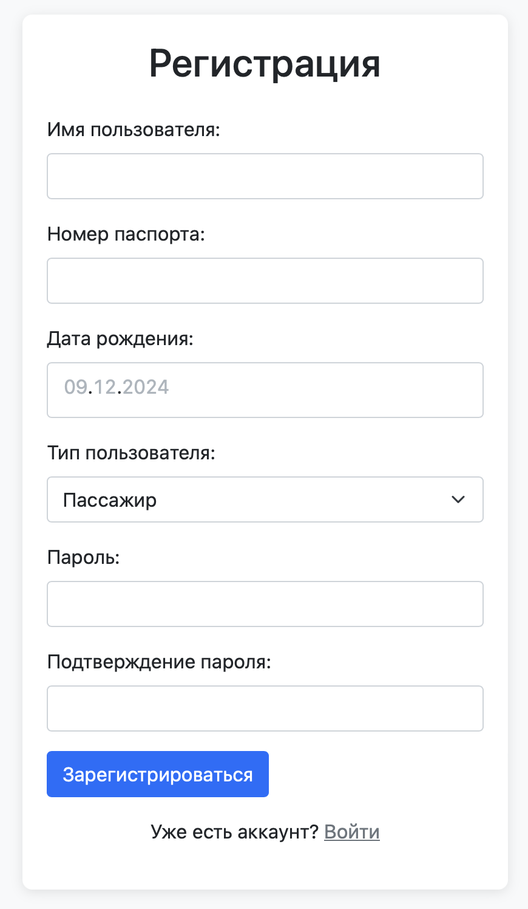
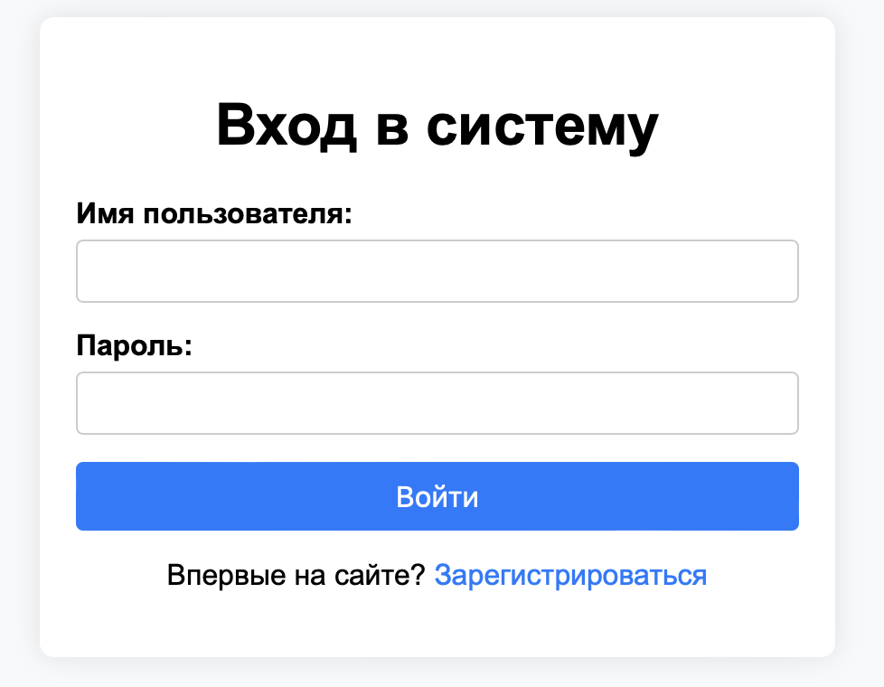
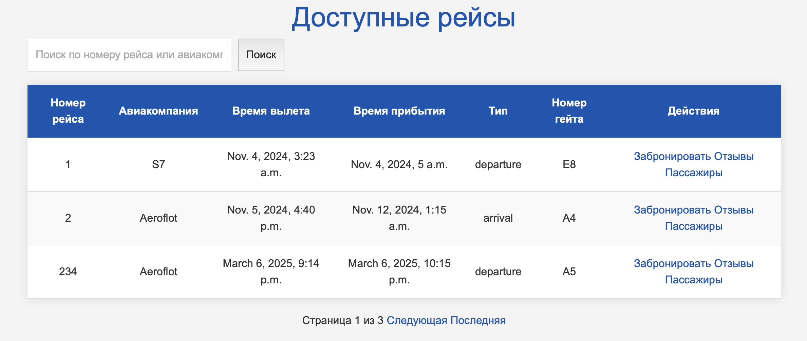
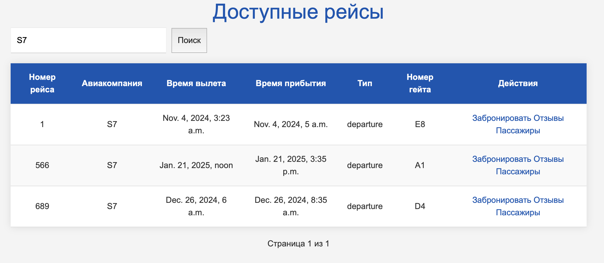
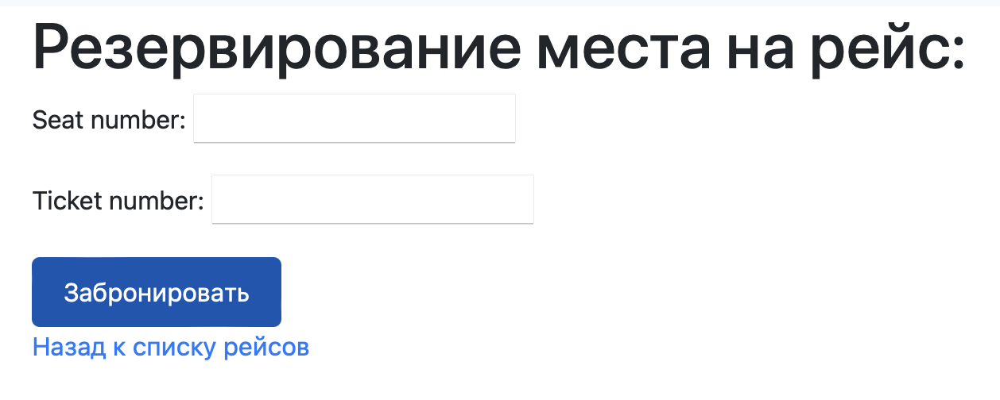
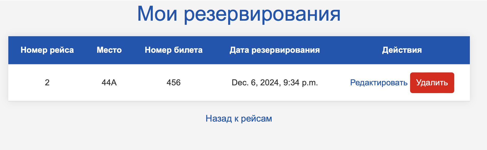
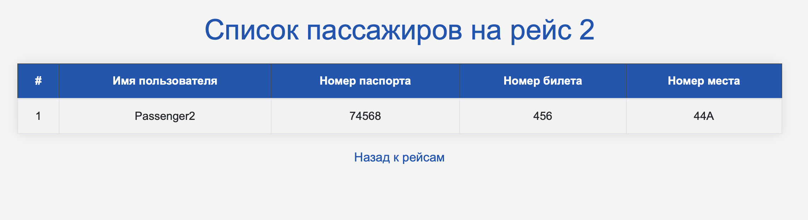

# Табло отображения информации об авиаперелетах.

Цель: овладеть практическими навыками и умениями реализации web-сервисов
средствами Django 2.2.

Оборудование: компьютерный класс.

Программное обеспечение: Python 3.6+, Django 3, PostgreSQL *.

Практическое задание: Реализовать сайт используя фреймворк Django 3 и СУБД PostgreSQL *, в
соответствии с вариантом задания лабораторной работы.

## Текст задания

- Хранится информация о номере рейса, авиакомпании, отлете, прилете, типе
(прилет, отлет), номере гейта.
- Регистрация новых пользователей.
- Просмотр и резервирование мест на рейсах. Пользователь должен иметь
возможность редактирования и удаления своих резервирований.
- Администратор должен иметь возможность зарегистрировать на рейс
пассажира и вписать в систему номер его билета средствами Django-admin.
- В клиентской части должна формироваться таблица, отображающая всех
пассажиров рейса.
- Написание отзывов к рейсам. При добавлении комментариев, должны
сохраняться дата рейса, текст комментария, рейтинг (1-10), информация о
комментаторе.

## Реализация функционала

### Регистрация новых пользователей 

Реализована регистрация пользователей через форму с использованием модели User (расширение AbstractUser). Форма регистрации (UserForm) позволяет пользователю указать логин, пароль, паспорт, дату рождения и роль (Администратор или Пассажир). После регистрации пользователь может войти на сайт.



```python
class UserForm(UserCreationForm):
    passport = forms.CharField(max_length=20, required=False, label='Номер паспорта')
    birth_date = forms.DateField(
        required=False,
        label='Дата рождения',
        widget=forms.SelectDateWidget(years=range(1900, 2025))
    )
    user_type = forms.ChoiceField(
        choices=User.USER_TYPE_CHOICES,
        required=True,
        label='Тип пользователя',
        widget=forms.Select
    )

    class Meta(UserCreationForm.Meta):
        model = User
        fields = ('username', 'first_name', 'last_name', 'passport', 'birth_date', 'user_type')

    def save(self, commit=True):
        user = super().save(commit=False)
        user.passport = self.cleaned_data.get('passport')
        user.birth_date = self.cleaned_data.get('birth_date')
        user.user_type = self.cleaned_data.get('user_type')
        if commit:
            user.save()
```     

### Вход

<http://127.0.0.1:8000/login/>

Вход происходит по имени пользователю и паролю.



### Хранение информации о рейсах

На главной странице находится таблица с информацей о рейсах, где можно увидеть номер рейса, название авиакомпании, дату и время вылета, дату и время прилета, тип рейса (прилет/отлет) и номер гейта.



```python
class Flight(models.Model):
    flight_number = models.CharField(max_length=10, unique=True) 
    airline = models.CharField(max_length=50) 
    departure_time = models.DateTimeField()  
    arrival_time = models.DateTimeField() 
    flight_type = models.CharField(max_length=10, choices=[('departure', 'Отлет'), ('arrival', 'Прилет')]) 
    gate_number = models.CharField(max_length=10)   
```

Реализована возможность поиска рейса по номеру или авиакомпании



```html
    <form method="get" action="" class="search-form">
        <input type="text" name="search" placeholder="Поиск по номеру рейса или авиакомпании" 
               value="{{ search_query }}" style="padding: 10px; width: 300px;">
        <button type="submit" style="padding: 10px;">Поиск</button>
    </form>   
```

```python
def flight_list(request):
    search_query = request.GET.get('search', '')

    flights = Flight.objects.all().order_by('departure_time')

    if search_query:
        flights = flights.filter(
            Q(flight_number__icontains=search_query) |
            Q(airline__icontains=search_query)
        )

    paginator = Paginator(flights, 3) 
    page_number = request.GET.get('page')
    page_obj = paginator.get_page(page_number)

    return render(request, 'flights.html', {
        'page_obj': page_obj, 
        'search_query': search_query 
    }) 
```

И пагинация

```html
     <div class="pagination">
        <span class="step-links">
            
                <a href="?search={{ request.GET.search }}&grade={{ request.GET.grade }}&page=1">Первая</a>
                <a href="?search={{ request.GET.search }}&grade={{ request.GET.grade }}&page={{ page_obj.previous_page_number }}">Предыдущая</a>
            

            <span class="current">
                Страница {{ page_obj.number }} из {{ page_obj.paginator.num_pages }}
            </span>

            
                <a href="?search={{ request.GET.search }}&grade={{ request.GET.grade }}&page={{ page_obj.next_page_number }}">Следующая</a>
                <a href="?search={{ request.GET.search }}&grade={{ request.GET.grade }}&page={{ page_obj.paginator.num_pages }}">Последняя</a>
            
        </span>
    </div>
```


### Функционал пассажира

#### Регистрация на рейс

Для регистрации выбирает необходим рейс, вводит номер билета и номер места. Все регистрации пользователя можно посмотреть на отдельной странице. Регистрацию можно отменить или отредактировать.




#### Отзыв на рейс

Пользователи могут оставлять отзывы к рейсам. Каждый отзыв включает: дату рейса, текст комментария, рейтинг от 1 до 10, информацию о комментаторе.

```python
class ReviewForm(forms.ModelForm):
    class Meta:
        model = Review
        fields = ['text', 'rating'] 
        widgets = {
            'text': forms.Textarea(attrs={'placeholder': 'Введите ваш отзыв'}),
            'rating': forms.Select(choices=[(i, str(i)) for i in range(1, 11)]), 
        }
```
### Функционал администратора 

#### Просмотр списка пассажиров на рейс

Администратор может просмотреть полный список пассажиров на каждый из ресйсов. Выдается информация: имя, номер паспорта, номер билета и места. 



```python
def passenger_list(request, flight_id):
    flight = Flight.objects.get(id=flight_id) 

    passengers = Reservation.objects.filter(flight=flight).select_related('user')

    return render(request, 'passenger_list.html', {
        'passengers': passengers,
        'flight': flight
    })        
```