# Задача 503. Next Greater Element II

## Условие:
```
Given a circular integer array nums (i.e., the next element of nums[nums.length - 1] is nums[0]), return the next greater number for every element in nums.

The next greater number of a number x is the first greater number to its traversing-order next in the array, which means you could search circularly to find its next greater number. If it doesn't exist, return -1 for this number.

 

Example 1:

Input: nums = [1,2,1]
Output: [2,-1,2]
Explanation: The first 1's next greater number is 2; 
The number 2 can't find next greater number. 
The second 1's next greater number needs to search circularly, which is also 2.
Example 2:

Input: nums = [1,2,3,4,3]
Output: [2,3,4,-1,4]
 

Constraints:

1 <= nums.length <= 104
-109 <= nums[i] <= 109
```

## Код:

```python
class Solution:
    def nextGreaterElements(self, nums):
        n = len(nums)
        res = [-1] * n
        
        for i in range(n):
            for j in range(1, n):
                if nums[(i + j) % n] > nums[i]:
                    res[i] = nums[(i + j) % n]
                    break
        
        return res
```
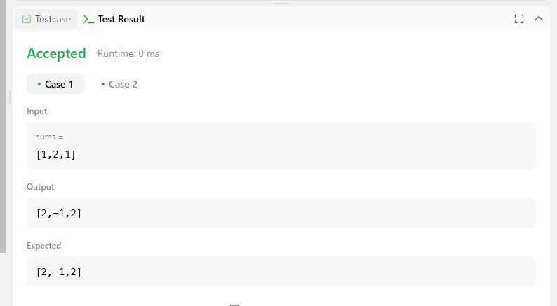
---

# Задача 498. Diagonal Traverse

## Условие:
```
Given an m x n matrix mat, return an array of all the elements of the array in a diagonal order.

 

Example 1:


Input: mat = [[1,2,3],[4,5,6],[7,8,9]]
Output: [1,2,4,7,5,3,6,8,9]
Example 2:

Input: mat = [[1,2],[3,4]]
Output: [1,2,3,4]
 

Constraints:

m == mat.length
n == mat[i].length
1 <= m, n <= 104
1 <= m * n <= 104
-105 <= mat[i][j] <= 105
```

## Код:

```python
class Solution:
    def findDiagonalOrder(self, mat):
        if not mat or not mat[0]:
            return []
        
        N, M = len(mat), len(mat[0])
        result = []
        
        for d in range(N + M - 1):
            intermediate = []
            r = 0 if d < M else d - M + 1
            c = d if d < M else M - 1
            
            while r < N and c > -1:
                intermediate.append(mat[r][c])
                r += 1
                c -= 1
            
            if d % 2 == 0:
                result.extend(intermediate[::-1])
            else:
                result.extend(intermediate)
        
        return result
```
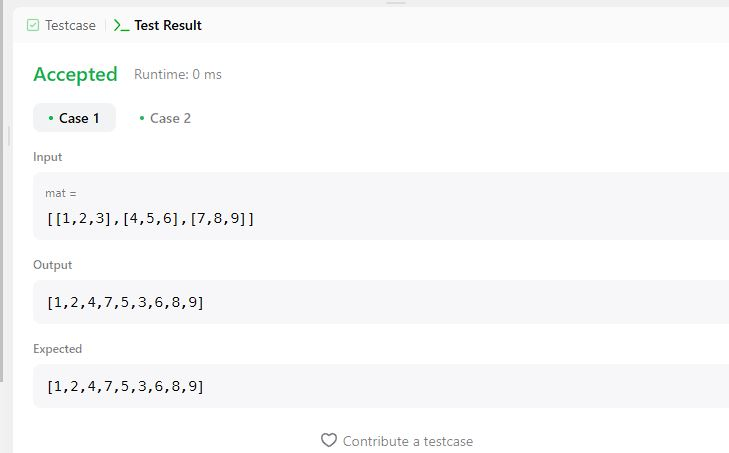
---

# Задача 722. Remove Comments

## Условие:
```
Given a C++ program, remove comments from it. The program source is an array of strings source where source[i] is the ith line of the source code. This represents the result of splitting the original source code string by the newline character '\n'.

In C++, there are two types of comments, line comments, and block comments.

The string "//" denotes a line comment, which represents that it and the rest of the characters to the right of it in the same line should be ignored.
The string "/*" denotes a block comment, which represents that all characters until the next (non-overlapping) occurrence of "*/" should be ignored. (Here, occurrences happen in reading order: line by line from left to right.) To be clear, the string "/*/" does not yet end the block comment, as the ending would be overlapping the beginning.
The first effective comment takes precedence over others.

For example, if the string "//" occurs in a block comment, it is ignored.
Similarly, if the string "/*" occurs in a line or block comment, it is also ignored.
If a certain line of code is empty after removing comments, you must not output that line: each string in the answer list will be non-empty.

There will be no control characters, single quote, or double quote characters.

For example, source = "string s = "/* Not a comment. */";" will not be a test case.
Also, nothing else such as defines or macros will interfere with the comments.

It is guaranteed that every open block comment will eventually be closed, so "/*" outside of a line or block comment always starts a new comment.

Finally, implicit newline characters can be deleted by block comments. Please see the examples below for details.

After removing the comments from the source code, return the source code in the same format.

 

Example 1:

Input: source = ["/*Test program */", "int main()", "{ ", "  // variable declaration ", "int a, b, c;", "/* This is a test", "   multiline  ", "   comment for ", "   testing */", "a = b + c;", "}"]
Output: ["int main()","{ ","  ","int a, b, c;","a = b + c;","}"]
Explanation: The line by line code is visualized as below:
/*Test program */
int main()
{ 
  // variable declaration 
int a, b, c;
/* This is a test
   multiline  
   comment for 
   testing */
a = b + c;
}
The string /* denotes a block comment, including line 1 and lines 6-9. The string // denotes line 4 as comments.
The line by line output code is visualized as below:
int main()
{ 
  
int a, b, c;
a = b + c;
}
Example 2:

Input: source = ["a/*comment", "line", "more_comment*/b"]
Output: ["ab"]
Explanation: The original source string is "a/*comment\nline\nmore_comment*/b", where we have bolded the newline characters.  After deletion, the implicit newline characters are deleted, leaving the string "ab", which when delimited by newline characters becomes ["ab"].
 

Constraints:

1 <= source.length <= 100
0 <= source[i].length <= 80
source[i] consists of printable ASCII characters.
Every open block comment is eventually closed.
There are no single-quote or double-quote in the input.
```

## Код:

```python
class Solution(object):
    def removeComments(self, source):
        inBlock = False
        buffer = []
        result = []
        for line in source:
            i = 0
            if not inBlock:
                buffer = []
            while i < len(line):
                if not inBlock and i + 1 < len(line) and line[i:i+2] == "/*":
                    inBlock = True
                    i += 1
                elif inBlock and i + 1 < len(line) and line[i:i+2] == "*/":
                    inBlock = False
                    i += 1
                elif not inBlock and i + 1 < len(line) and line[i:i+2] == "//":
                    break
                elif not inBlock:
                    buffer.append(line[i])
                i += 1
            if buffer and not inBlock:
                result.append("".join(buffer))
        return result
```
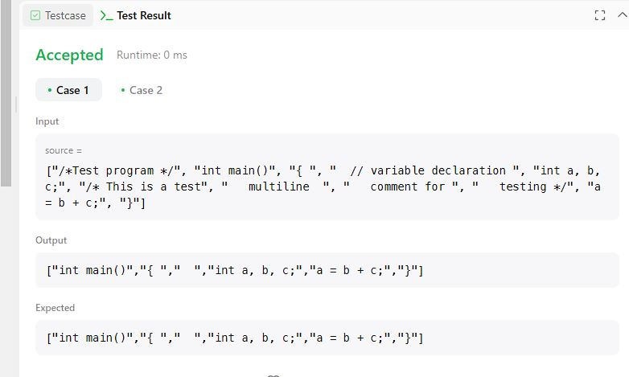
---

# Задача 491. Non-decreasing Subsequences

## Условие:
```
Given an integer array nums, return all the different possible non-decreasing subsequences of the given array with at least two elements. You may return the answer in any order.

 

Example 1:

Input: nums = [4,6,7,7]
Output: [[4,6],[4,6,7],[4,6,7,7],[4,7],[4,7,7],[6,7],[6,7,7],[7,7]]
Example 2:

Input: nums = [4,4,3,2,1]
Output: [[4,4]]
 

Constraints:

1 <= nums.length <= 15
-100 <= nums[i] <= 100
```

## Код:

```python
class Solution:
    def findSubsequences(self, nums):
        result = set()
        sequence = []
        self.backtrack(nums, 0, sequence, result)
        return list(result)

    def backtrack(self, nums, index, sequence, result):
        if index == len(nums):
            if len(sequence) >= 2:
                result.add(tuple(sequence))
            return
        if not sequence or sequence[-1] <= nums[index]:
            sequence.append(nums[index])
            self.backtrack(nums, index + 1, sequence, result)
            sequence.pop()
        self.backtrack(nums, index + 1, sequence, result)
```
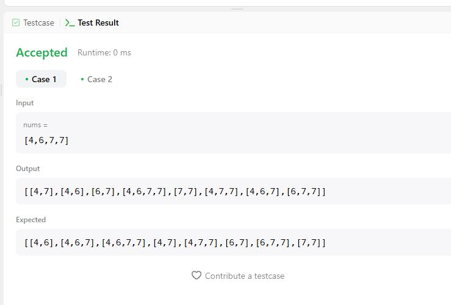
---

# Задача 720. Longest Word in Dictionary

## Условие:
```
Given an array of strings words representing an English Dictionary, return the longest word in words that can be built one character at a time by other words in words.

If there is more than one possible answer, return the longest word with the smallest lexicographical order. If there is no answer, return the empty string.

Note that the word should be built from left to right with each additional character being added to the end of a previous word. 

 

Example 1:

Input: words = ["w","wo","wor","worl","world"]
Output: "world"
Explanation: The word "world" can be built one character at a time by "w", "wo", "wor", and "worl".
Example 2:

Input: words = ["a","banana","app","appl","ap","apply","apple"]
Output: "apple"
Explanation: Both "apply" and "apple" can be built from other words in the dictionary. However, "apple" is lexicographically smaller than "apply".
 

Constraints:

1 <= words.length <= 1000
1 <= words[i].length <= 30
words[i] consists of lowercase English letters.
```

## Код:

```python
class Solution(object):
    def longestWord(self, words):
        words.sort()
        valid_words = {""}
        longest = ""
        for word in words:
            if word[:-1] in valid_words:
                valid_words.add(word)
                if len(word) > len(longest):
                    longest = word
        return longest
```
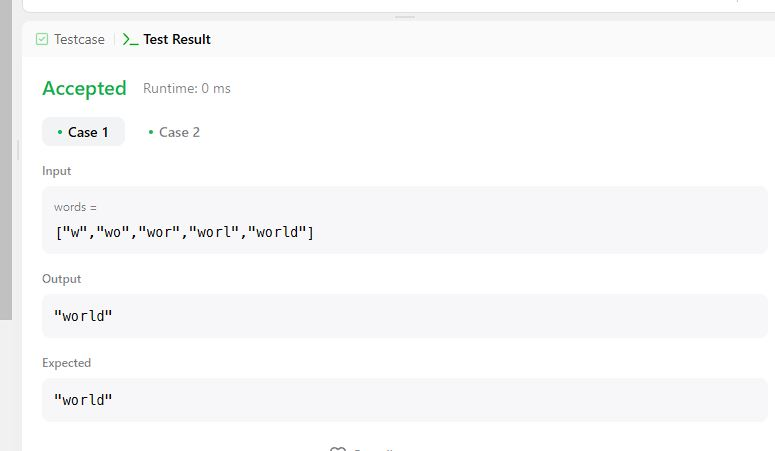
---

# Задача 718. Maximum Length of Repeated Subarray

## Условие:
```
Given two integer arrays nums1 and nums2, return the maximum length of a subarray that appears in both arrays.

 

Example 1:

Input: nums1 = [1,2,3,2,1], nums2 = [3,2,1,4,7]
Output: 3
Explanation: The repeated subarray with maximum length is [3,2,1].
Example 2:

Input: nums1 = [0,0,0,0,0], nums2 = [0,0,0,0,0]
Output: 5
Explanation: The repeated subarray with maximum length is [0,0,0,0,0].
 

Constraints:

1 <= nums1.length, nums2.length <= 1000
0 <= nums1[i], nums2[i] <= 100
```

## Код:

```python
class Solution(object):
    def findLength(self, nums1, nums2):
        dp = [[0] * (len(nums2) + 1) for _ in range(len(nums1) + 1)]
        max_len = 0
        for i in range(len(nums1) - 1, -1, -1):
            for j in range(len(nums2) - 1, -1, -1):
                if nums1[i] == nums2[j]:
                    dp[i][j] = dp[i + 1][j + 1] + 1
                    max_len = max(max_len, dp[i][j])
        return max_len
```
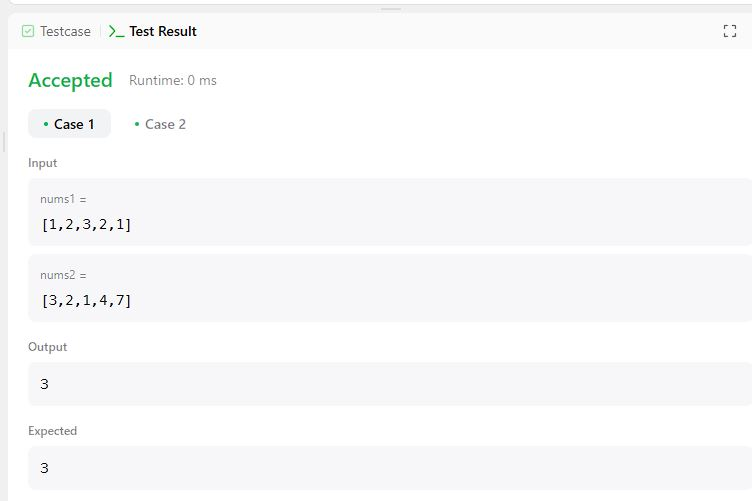
---

# Задача 771. Jewels and Stones

## Условие:
```
You're given strings jewels representing the types of stones that are jewels, and stones representing the stones you have. Each character in stones is a type of stone you have. You want to know how many of the stones you have are also jewels.

Letters are case sensitive, so "a" is considered a different type of stone from "A".

 

Example 1:

Input: jewels = "aA", stones = "aAAbbbb"
Output: 3
Example 2:

Input: jewels = "z", stones = "ZZ"
Output: 0
 

Constraints:

1 <= jewels.length, stones.length <= 50
jewels and stones consist of only English letters.
All the characters of jewels are unique.
```

## Код:

```python
class Solution:
    def numJewelsInStones(self, J, S):
        ans = 0
        for s in S:
            for j in J:
                if j == s:
                    ans += 1
                    break
        return ans
```
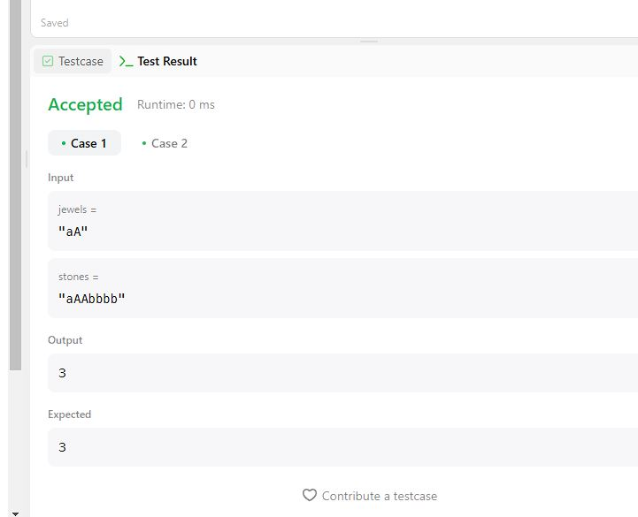
---

# Задача 714. Best Time to Buy and Sell Stock with Transaction Fee

## Условие:
```
You are given an array prices where prices[i] is the price of a given stock on the ith day, and an integer fee representing a transaction fee.

Find the maximum profit you can achieve. You may complete as many transactions as you like, but you need to pay the transaction fee for each transaction.

Note:

You may not engage in multiple transactions simultaneously (i.e., you must sell the stock before you buy again).
The transaction fee is only charged once for each stock purchase and sale.
 

Example 1:

Input: prices = [1,3,2,8,4,9], fee = 2
Output: 8
Explanation: The maximum profit can be achieved by:
- Buying at prices[0] = 1
- Selling at prices[3] = 8
- Buying at prices[4] = 4
- Selling at prices[5] = 9
The total profit is ((8 - 1) - 2) + ((9 - 4) - 2) = 8.
Example 2:

Input: prices = [1,3,7,5,10,3], fee = 3
Output: 6
 

Constraints:

1 <= prices.length <= 5 * 104
1 <= prices[i] < 5 * 104
0 <= fee < 5 * 104
```

## Код:

```python
class Solution(object):
    def maxProfit(self, prices, fee):
        cash, hold = 0, -prices[0]
        for price in prices:
            cash = max(cash, hold + price - fee)
            hold = max(hold, cash - price)
        return cash
```
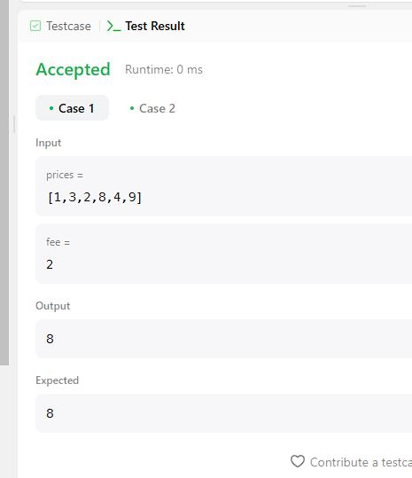
---

# Задача 713. Subarray Product Less Than K

## Условие:
```
Given an array of integers nums and an integer k, return the number of contiguous subarrays where the product of all the elements in the subarray is strictly less than k.

 

Example 1:

Input: nums = [10,5,2,6], k = 100
Output: 8
Explanation: The 8 subarrays that have product less than 100 are:
[10], [5], [2], [6], [10, 5], [5, 2], [2, 6], [5, 2, 6]
Note that [10, 5, 2] is not included as the product of 100 is not strictly less than k.
Example 2:

Input: nums = [1,2,3], k = 0
Output: 0
 

Constraints:

1 <= nums.length <= 3 * 104
1 <= nums[i] <= 1000
0 <= k <= 106
```

## Код:

```python
class Solution(object):
    def numSubarrayProductLessThanK(self, nums, k):
        if k <= 1:
            return 0
        product = 1
        count = 0
        left = 0
        for right in range(len(nums)):
            product *= nums[right]
            while product >= k:
                product //= nums[left]
                left += 1
            count += right - left + 1
        return count
```
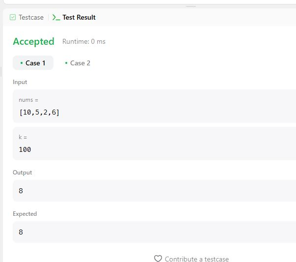
---

# Задача 443. String Compression

## Условие:
```
Given an array of characters chars, compress it using the following algorithm:

Begin with an empty string s. For each group of consecutive repeating characters in chars:

If the group's length is 1, append the character to s.
Otherwise, append the character followed by the group's length.
The compressed string s should not be returned separately, but instead, be stored in the input character array chars. Note that group lengths that are 10 or longer will be split into multiple characters in chars.

After you are done modifying the input array, return the new length of the array.

You must write an algorithm that uses only constant extra space.

 

Example 1:

Input: chars = ["a","a","b","b","c","c","c"]
Output: Return 6, and the first 6 characters of the input array should be: ["a","2","b","2","c","3"]
Explanation: The groups are "aa", "bb", and "ccc". This compresses to "a2b2c3".
Example 2:

Input: chars = ["a"]
Output: Return 1, and the first character of the input array should be: ["a"]
Explanation: The only group is "a", which remains uncompressed since it's a single character.
Example 3:

Input: chars = ["a","b","b","b","b","b","b","b","b","b","b","b","b"]
Output: Return 4, and the first 4 characters of the input array should be: ["a","b","1","2"].
Explanation: The groups are "a" and "bbbbbbbbbbbb". This compresses to "ab12".
 

Constraints:

1 <= chars.length <= 2000
chars[i] is a lowercase English letter, uppercase English letter, digit, or symbol.
```

## Код:

```python
class Solution:
    def compress(self, chars):
        i = 0
        res = 0
        while i < len(chars):
            group_length = 1
            while (i + group_length < len(chars) and chars[i + group_length] == chars[i]):
                group_length += 1
            chars[res] = chars[i]
            res += 1
            if group_length > 1:
                str_repr = str(group_length)
                chars[res:res+len(str_repr)] = list(str_repr)
                res += len(str_repr)
            i += group_length
        return res
```
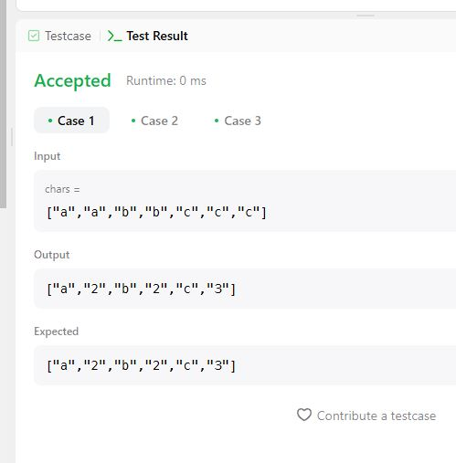
---

# Задача 438. Find All Anagrams in a String

## Условие:
```
Given two strings s and p, return an array of all the start indices of p's anagrams in s. You may return the answer in any order.

 

Example 1:

Input: s = "cbaebabacd", p = "abc"
Output: [0,6]
Explanation:
The substring with start index = 0 is "cba", which is an anagram of "abc".
The substring with start index = 6 is "bac", which is an anagram of "abc".
Example 2:

Input: s = "abab", p = "ab"
Output: [0,1,2]
Explanation:
The substring with start index = 0 is "ab", which is an anagram of "ab".
The substring with start index = 1 is "ba", which is an anagram of "ab".
The substring with start index = 2 is "ab", which is an anagram of "ab".
 

Constraints:

1 <= s.length, p.length <= 3 * 104
s and p consist of lowercase English letters.
```

## Код:

```python
class Solution:
    def findAnagrams(self, s, p):
        ns, np = len(s), len(p)
        if ns < np:
            return []

        pCount = Counter(p)
        sCount = Counter()

        output = []
        for i in range(ns):
            sCount[s[i]] += 1

            if i >= np:
                if sCount[s[i - np]] == 1:
                    del sCount[s[i - np]]
                else:
                    sCount[s[i - np]] -= 1

            if pCount == sCount:
                output.append(i - np + 1)

        return output
```
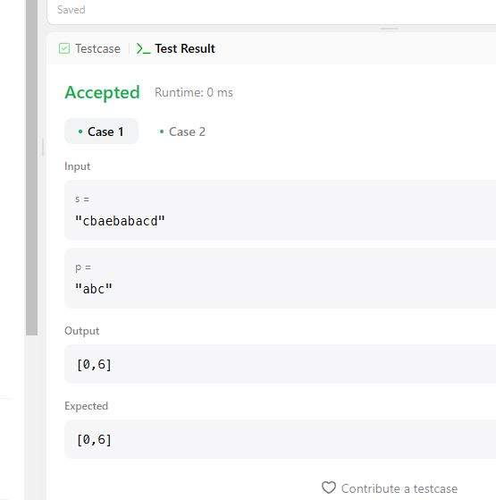
---

# Задача 436. Find Right Interval

## Условие:
```
You are given an array of intervals, where intervals[i] = [starti, endi] and each starti is unique.

The right interval for an interval i is an interval j such that startj >= endi and startj is minimized. Note that i may equal j.

Return an array of right interval indices for each interval i. If no right interval exists for interval i, then put -1 at index i.

 

Example 1:

Input: intervals = [[1,2]]
Output: [-1]
Explanation: There is only one interval in the collection, so it outputs -1.
Example 2:

Input: intervals = [[3,4],[2,3],[1,2]]
Output: [-1,0,1]
Explanation: There is no right interval for [3,4].
The right interval for [2,3] is [3,4] since start0 = 3 is the smallest start that is >= end1 = 3.
The right interval for [1,2] is [2,3] since start1 = 2 is the smallest start that is >= end2 = 2.
Example 3:

Input: intervals = [[1,4],[2,3],[3,4]]
Output: [-1,2,-1]
Explanation: There is no right interval for [1,4] and [3,4].
The right interval for [2,3] is [3,4] since start2 = 3 is the smallest start that is >= end1 = 3.
 

Constraints:

1 <= intervals.length <= 2 * 104
intervals[i].length == 2
-106 <= starti <= endi <= 106
The start point of each interval is unique.
```

## Код:

```python
class Solution:
    def findRightInterval(self, intervals):
        endIntervals = intervals[:]
        hash = {tuple(interval): i for i, interval in enumerate(intervals)}
        intervals.sort(key=lambda x: x[0])
        endIntervals.sort(key=lambda x: x[1])
        j = 0
        res = [-1] * len(intervals)
        for i in range(len(endIntervals)):
            while j < len(intervals) and intervals[j][0] < endIntervals[i][1]:
                j += 1
            res[hash[tuple(endIntervals[i])]] = -1 if j == len(intervals) else hash[tuple(intervals[j])]
        return res
```
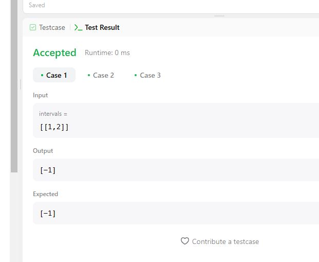
---