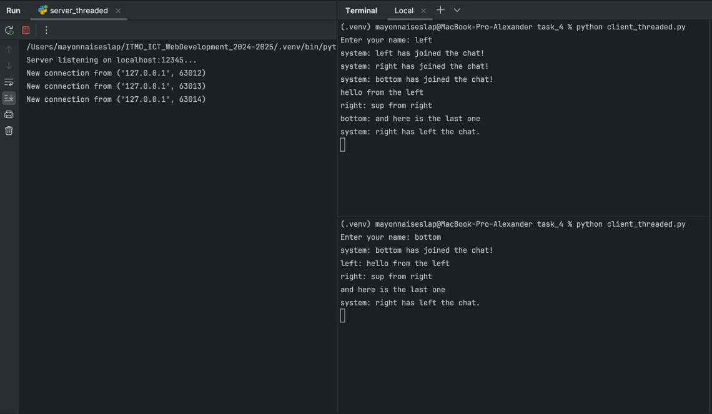

# Задание 4

## Текст задачи

Реализовать двухпользовательский или многопользовательский чат. Реализация
многопользовательского часа позволяет получить максимальное количество
баллов.
Обязательно использовать библиотеку **threading**
Для применения с TCP необходимо запускать клиентские подключения И прием
и отправку сообщений всем юзерам на сервере в потоках. Не забудьте сохранять юзеров,
чтобы потом отправлять им сообщения.

## Листинг кода

### Сервер

```python
import socket
import threading

clients = {}
clients_lock = threading.Lock()


def broadcast(message, current_client):
    for client in clients.keys():
        if current_client is None:
            output = f'system: {message}'
        elif client != current_client:
            output = f'{clients[current_client]}: {message}'
        else:
            continue
        with clients_lock:
            client.send(output.encode())


def handle_client(client_socket):
    name = client_socket.recv(1024).decode()
    with clients_lock:
        clients[client_socket] = name

    welcome_message = f"{name} has joined the chat!"
    broadcast(welcome_message, current_client=None)

    try:
        while True:
            message = client_socket.recv(1024).decode()
            if message:
                broadcast(message, current_client=client_socket)
            else:
                break
    finally:
        with clients_lock:
            del clients[client_socket]
        client_socket.close()
        broadcast(f"{name} has left the chat.", current_client=None)


def start_server(socket_address: tuple[str, int] = ('localhost', 12345)):
    server = socket.socket(socket.AF_INET, socket.SOCK_STREAM)
    server.bind(socket_address)
    server.listen()

    print(f'Server listening on {':'.join(map(str, socket_address))}...')

    while True:
        try:
            client_socket, client_address = server.accept()
            print(f"New connection from {client_address}")

            thread = threading.Thread(target=handle_client, args=(client_socket,))
            thread.start()
        except KeyboardInterrupt:
            server.close()
            break


if __name__ == "__main__":
    start_server()

```

### Клиент

```python
import socket
import threading

is_active = True


def receive_messages(client_socket):
    global is_active

    while is_active:
        try:
            message = client_socket.recv(1024).decode()
            if message:
                print(message)
            else:
                break
        except ConnectionResetError or KeyboardInterrupt:
            is_active = False


def send_messages(client_socket):
    global is_active

    while is_active:
        try:
            message = input()
            if message in ('', 'quit', 'exit'):
                is_active = False
            client_socket.send(message.encode('utf-8'))
        except ConnectionResetError or KeyboardInterrupt:
            is_active = False


def start_client(socket_address: tuple[str, int] = ('localhost', 12345)):
    name = input('Enter your name: ')
    client_socket = socket.socket(socket.AF_INET, socket.SOCK_STREAM)
    client_socket.connect(socket_address)
    client_socket.send(name.encode('utf-8'))

    receive_thread = threading.Thread(target=receive_messages, args=(client_socket,))
    receive_thread.start()

    send_thread = threading.Thread(target=send_messages, args=(client_socket,))
    send_thread.start()

    receive_thread.join()
    send_thread.join()


if __name__ == "__main__":
    try:
        start_client()
    except:
        pass

```

## Детализация

Клиентская сторона работает в 2 потока: на прием и отдачу сообщений. На стороне 
сервера, для каждого клиента создается отдельный поток. Для записи в общую "базу 
данных" (словарь {connection: name}) я испольщовал мютекс lock, чтобы предотвратить 
одновременное использование его двумя и более потоками

## Примеры работы

### 3 пользователя общаются


### 1 пользователь отключился



### Вид для нового пользователя 

