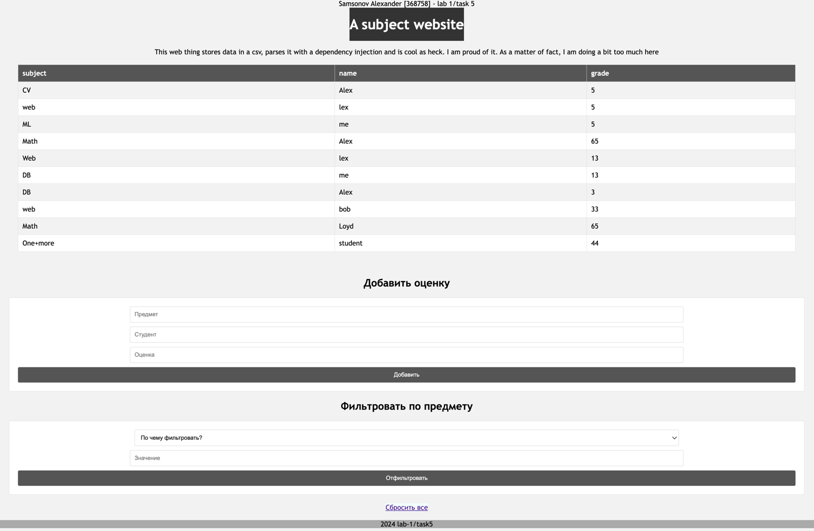
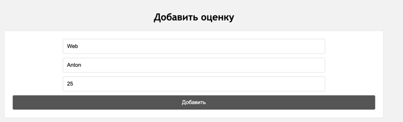
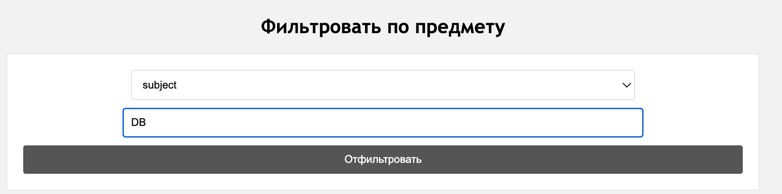
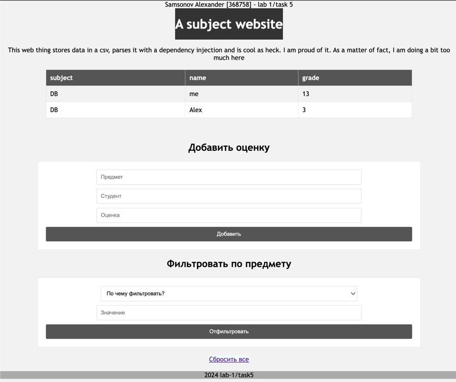

# Задание 5

## Текст задачи

Необходимо написать простой web-сервер для обработки GET и POST http
запросов средствами Python и библиотеки socket.

Задание: сделать сервер, который может:
- Принять и записать информацию о дисциплине и оценке по дисциплине.
- Отдать информацию обо всех оценах по дсициплине в виде html-страницы.

## Детализация

Сервер парсит запрос, формирует html и отдает его обратно. Сервер может:
- показать все оценки
- добавлять новые
- отправлять отфильтрованные оценки

## Примеры работы

### Базовая страница

### Добавление новой оценки

### Фильтрация

