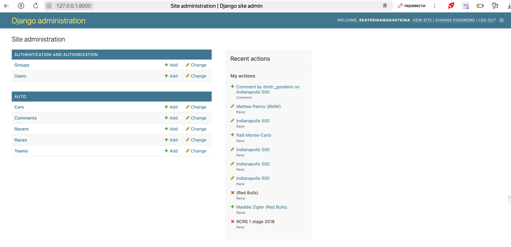
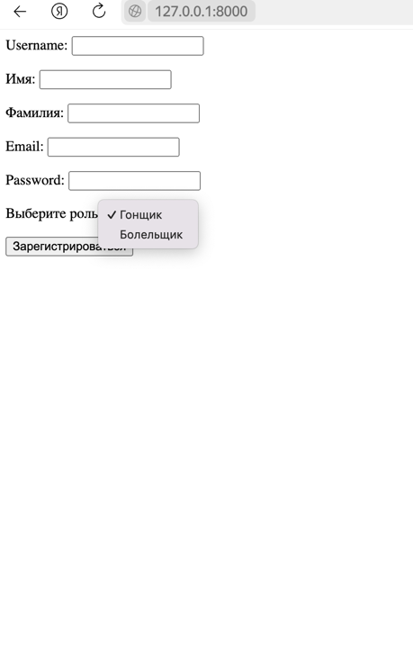
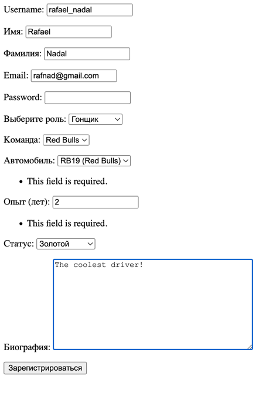
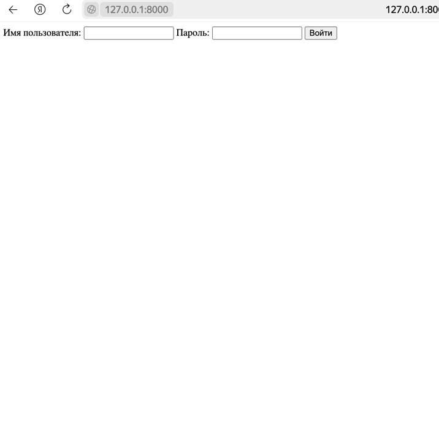
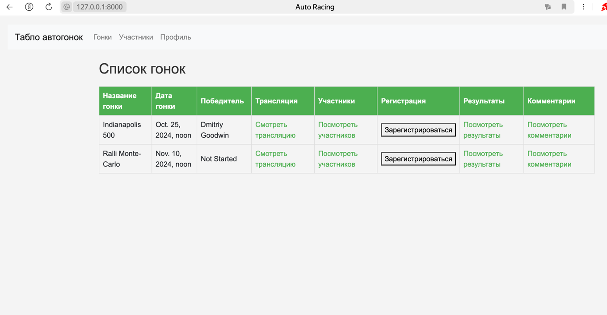
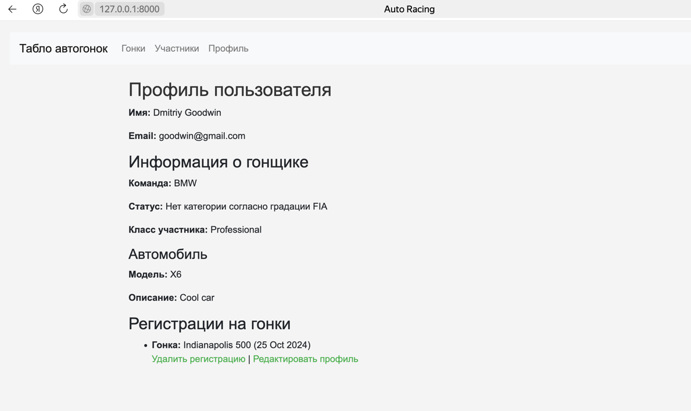
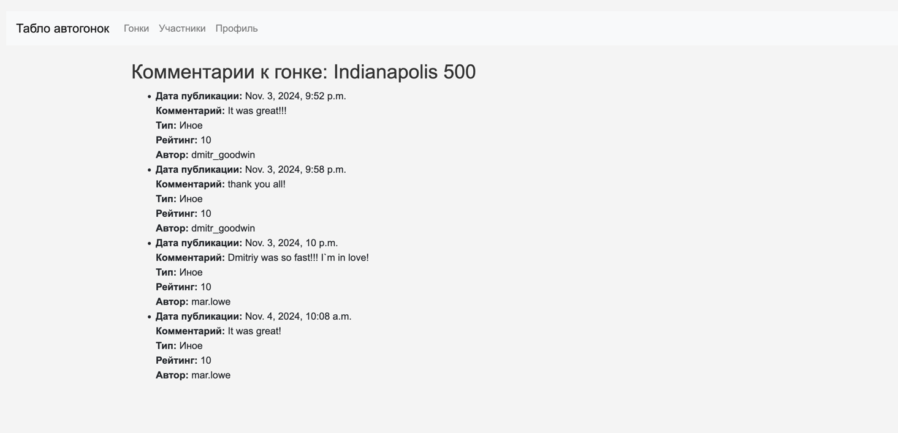
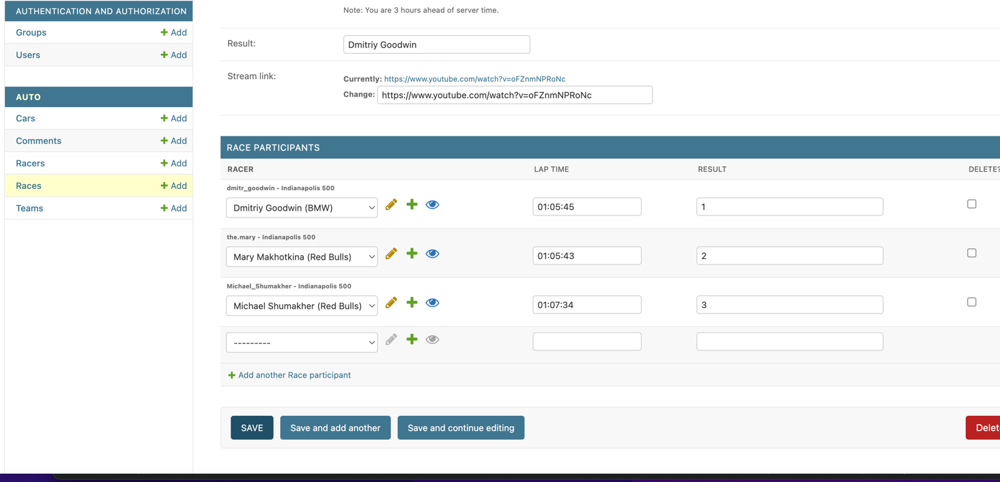
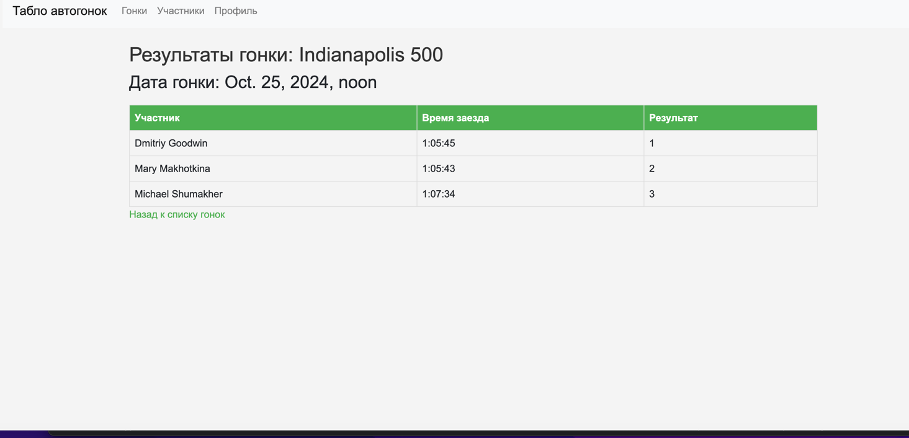
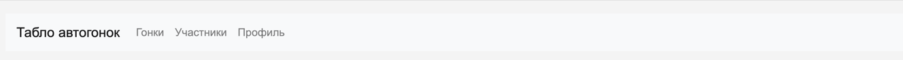

Создала приложение командой 
``` python
python manage.py startapp auto 
```
Создала модель данных в файле models.py со следующими сущностями:
``` python
class Team(models.Model):
class Car(models.Model):
class Racer(models.Model):
class Race(models.Model):
class RaceParticipant(models.Model):
class Fan(models.Model):
class Comment(models.Model):
```
Применила миграции:
``` python
python manage.py makemigrations 
python manage.py migrate
```

Создала админ-панель, супер-пользователя:


Запустить сервер можно командой:
```python
python manage.py runserver
```

Были созданы контроллеры во views.py

Чтобы в конечном итоге все работало на сайте, необходимо было реализовать адоресацию через urls.py, что и было сделано.

Была реализована регистрация пользователей, а также логин: 

В моменте регистрации пользователь выбирает роль гонщика или фаната, соответственно у них разных функционал.










Главная страница гонщика 

Профиль гонщика


Реализована функция просмотра детальной информации о гонщике/гонке/автомобиле.

Реализована функция просмотра гонок, на главной странице предоставлена ссылка на каждую из гонок.

Реализована возможность регистрации на гонку, а также опция редактирования/удаления регистрации. Это доступно только для гонщиков, пользователи, зарегистрированные в категории "Фанаты" не имеют доступа к кнопке регистрации.

Реализована возможность комментирования, оставление оценки и установление типа комментария.


В админ-панели реализована функция фиксирования результатов заездов.


У клиента отображается информация о результатах гонки.



Помимо этого, реализовано меню при помощи bootstrap
