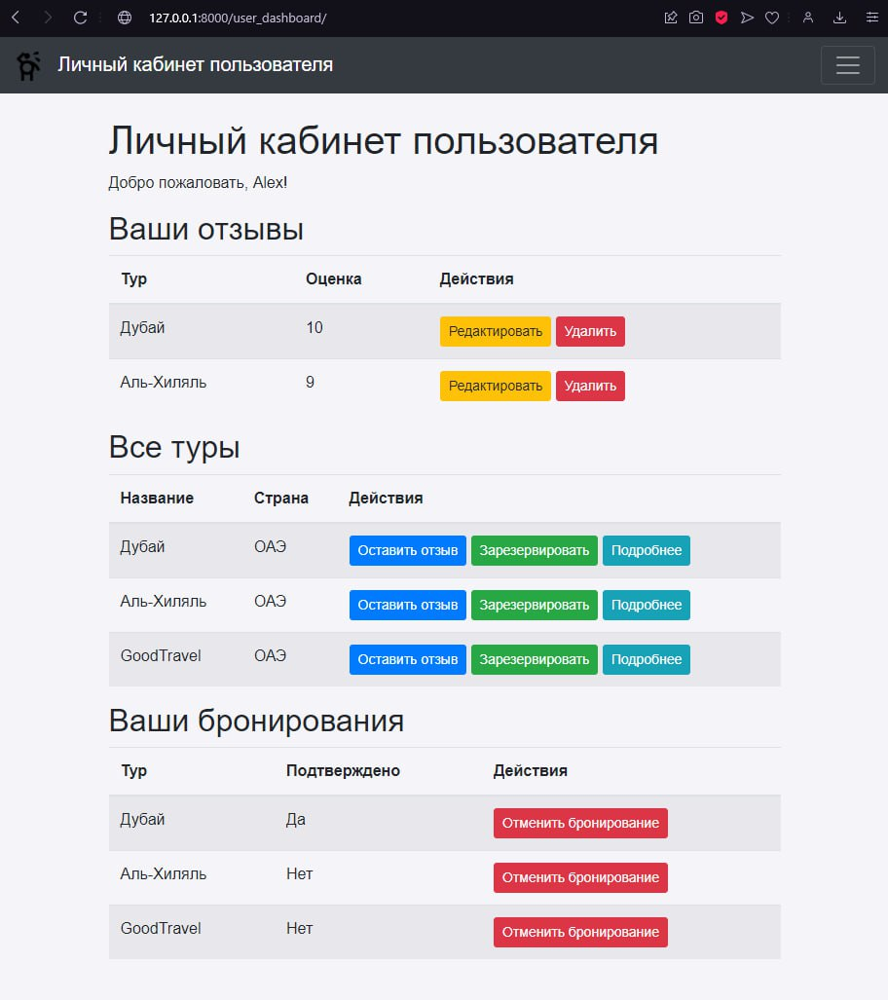
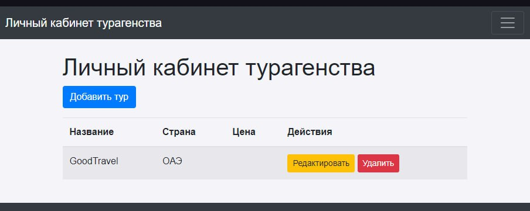
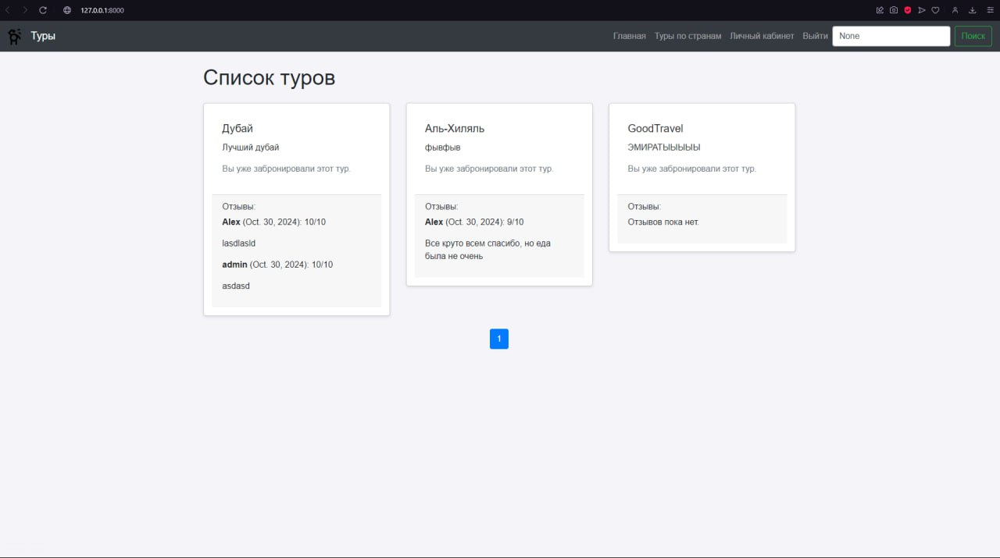
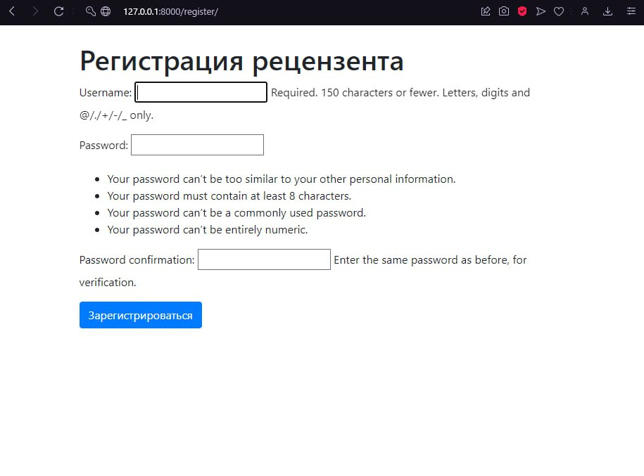

# Лабораторная работа №2

## Задание

1. **Описание задачи**: В этом задании вам необходимо разработать веб-приложение, которое позволяет пользователям
   бронировать туры и оставлять отзывы. Приложение должно включать следующие функции:
    - Регистрация и авторизация пользователей.
    - Просмотр списка доступных туров.
    - Бронирование туров.
    - Оставление отзывов после подтверждения бронирования администратором.

2. **Требования**:
    - Использовать Django для разработки серверной части.
    - Использовать Bootstrap для стилизации интерфейса.
    - Реализовать систему аутентификации и авторизации.
    - Обеспечить проверку подтверждения бронирования перед возможностью оставить отзыв.

## Запуск проекта

В силу того, что использовался Докер для бд самого проекта, то сначала поднимем сам контейнер с бд, а затем запустим
проект.

```bash
   cd students/k3344/Fedorov_Lev/Lr2  # Переходим в папку с проектом
   docker-compose up -d  # Поднимаем контейнер с бд
   python manage.py makemigrations  # Создаем миграции
   python manage.py migrate  # Применяем миграции
   python manage.py runserver  # Запускаем сервер
```

## Немного о проекте

Сделаны ЛК турагента и ревьювера, где турагент может добавлять и редактировать туры, а ревьювер их бронировать,
рецензировать и изменять свои действия. Также реализована логика пагинирования и фильтрации туров по странам, только
Админ
может подтверждать бронирование из Админ панели.

## Основные шаги разработки

1. **Создание проекта**: Создаем проект Django с помощью команды `django-admin startproject tour-agency`.
2. **Создание приложения**: Создаем приложение Django с помощью команды `python manage.py startapp tours`.
3. **Настройка базы данных**: Настраиваем базу данных в файлах `settings.py & docker-compose.yml`.
4. **Создание моделей**: Создаем модели для туров, пользователей и отзывов, также отдельные модели для бронирования и
   страны.
5. **Создание представлений**: Создаем представления (всю логику функций) для отображения списка туров, бронирования и
   отзывов в файле
   `views.py`.
6. **Создание шаблонов**: Создаем шаблоны для отображения страниц сайта в папке `templates`.
7. **Настройка маршрутизации**: Настраиваем маршрутизацию в файле `urls.py`.
8. **Создание форм**: Создаем формы для регистрации, авторизации, бронирования и отзывов в файле `forms.py`.
9. **Создание административной панели**: Создаем административную панель для управления турами, пользователями и
   отзывами.
10. **Создание дизайна**: Создаем дизайн с помощью Bootstrap и CSS, решил добавить лого нашего сайта - смешного
    человечка.


# Скрины полученных результатов

 - страница ЛК пользователя
 - страница ЛК агенства
 - главная страница с пагинацией и поиском 
 - страница с регистрацией

# Вывод по лабораторной работе:

Мне понравилось делать такой проект, тк по сути создал свой первый сайт с нуля, с элементами бэка и фронта. По началу
было непросто, но потом разобрался и пошло поехало. Но на лабу судя по WakaTime ушло больше 12 часов, но я старался
сделать эту лабу так, чтобы не стыдно было закинуть ее в ГХ в качестве пет-проекта. В общем, я кайфанул делая эту лабу,
всем добра и мира:)

