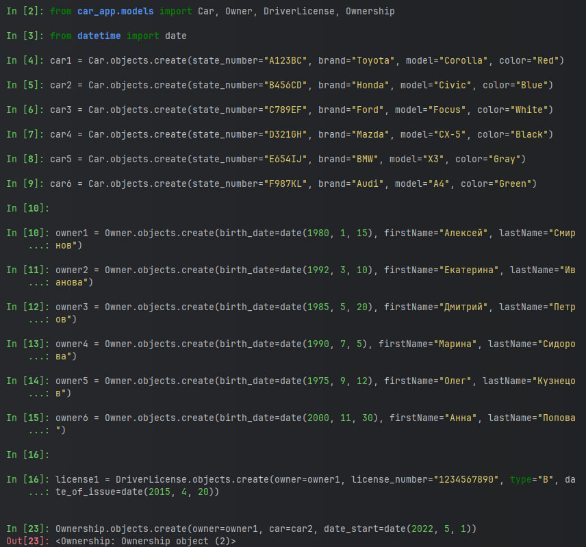
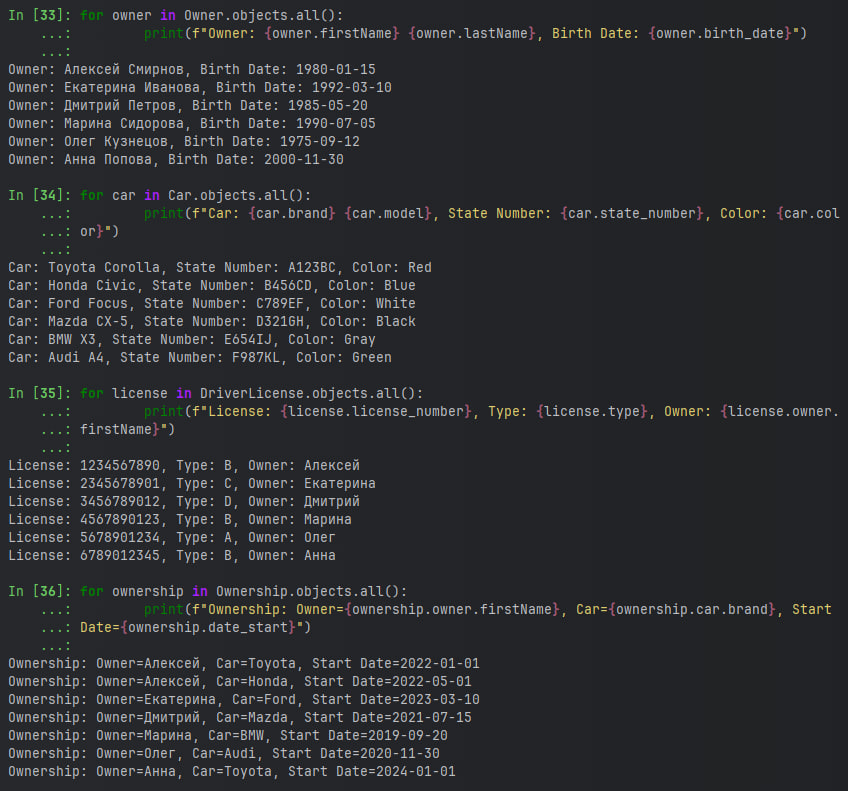
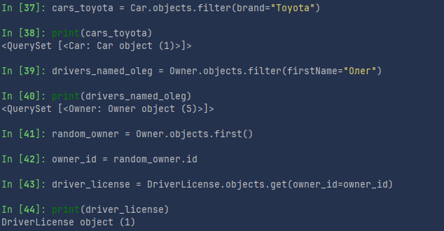
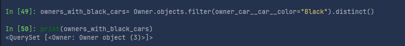
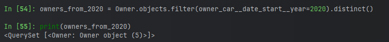
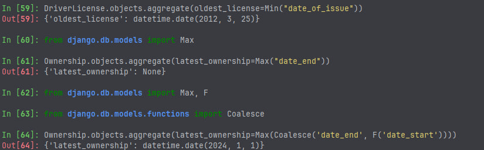
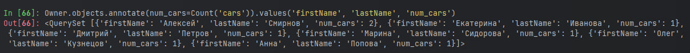
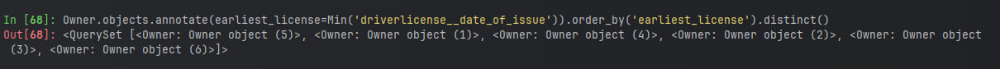

# Практическая работа 3.1

## Задание 1

Напишите запрос на создание 6-7 новых автовладельцев и 5-6 автомобилей, каждому автовладельцу назначьте удостоверение и
от 1 до 3 автомобилей. Задание можете выполнить либо в интерактивном режиме интерпретатора, либо в отдельном
python-файле. Результатом должны стать запросы и отображение созданных объектов.

```bash

car1 = Car.objects.create(state_number="A123BC", brand="Toyota", model="Corolla", color="Red")
car2 = Car.objects.create(state_number="B456CD", brand="Honda", model="Civic", color="Blue")
car3 = Car.objects.create(state_number="C789EF", brand="Ford", model="Focus", color="White")
car4 = Car.objects.create(state_number="D321GH", brand="Mazda", model="CX-5", color="Black")
car5 = Car.objects.create(state_number="E654IJ", brand="BMW", model="X3", color="Gray")
car6 = Car.objects.create(state_number="F987KL", brand="Audi", model="A4", color="Green")


owner1 = Owner.objects.create(birth_date=date(1980, 1, 15), firstName="Алексей", lastName="Смирнов")
owner2 = Owner.objects.create(birth_date=date(1992, 3, 10), firstName="Екатерина", lastName="Иванова")
owner3 = Owner.objects.create(birth_date=date(1985, 5, 20), firstName="Дмитрий", lastName="Петров")
owner4 = Owner.objects.create(birth_date=date(1990, 7, 5), firstName="Марина", lastName="Сидорова")
owner5 = Owner.objects.create(birth_date=date(1975, 9, 12), firstName="Олег", lastName="Кузнецов")
owner6 = Owner.objects.create(birth_date=date(2000, 11, 30), firstName="Анна", lastName="Попова")


license1 = DriverLicense.objects.create(owner=owner1, license_number="1234567890", type="B", date_of_issue=date(2015, 4, 20))
license2 = DriverLicense.objects.create(owner=owner2, license_number="2345678901", type="C", date_of_issue=date(2018, 6, 10))
license3 = DriverLicense.objects.create(owner=owner3, license_number="3456789012", type="D", date_of_issue=date(2020, 8, 15))
license4 = DriverLicense.objects.create(owner=owner4, license_number="4567890123", type="B", date_of_issue=date(2017, 9, 5))
license5 = DriverLicense.objects.create(owner=owner5, license_number="5678901234", type="A", date_of_issue=date(2012, 3, 25))
license6 = DriverLicense.objects.create(owner=owner6, license_number="6789012345", type="B", date_of_issue=date(2021, 5, 18))

Ownership.objects.create(owner=owner1, car=car1, date_start=date(2022, 1, 1))
Ownership.objects.create(owner=owner1, car=car2, date_start=date(2022, 5, 1))
Ownership.objects.create(owner=owner2, car=car3, date_start=date(2023, 3, 10))
Ownership.objects.create(owner=owner3, car=car4, date_start=date(2021, 7, 15))
Ownership.objects.create(owner=owner4, car=car5, date_start=date(2019, 9, 20))
Ownership.objects.create(owner=owner5, car=car6, date_start=date(2020, 11, 30))
Ownership.objects.create(owner=owner6, car=car1, date_start=date(2024, 1, 1))
```
 - результат выполнения запросов

Посмотрим что находится в базе данных:

 - результаты заполнения бд

## Задание 2
Задание 2
По созданным в пр.1 данным написать следующие запросы на фильтрацию:

Где это необходимо, добавьте related_name к полям модели
Выведете все машины марки “Toyota” (или любой другой марки, которая у вас есть)
Найти всех водителей с именем “Олег” (или любым другим именем на ваше усмотрение)
Взяв любого случайного владельца получить его id, и по этому id получить экземпляр удостоверения в виде объекта модели (можно в 2 запроса)
Вывести всех владельцев красных машин (или любого другого цвета, который у вас присутствует)
Найти всех владельцев, чей год владения машиной начинается с 2010 (или любой другой год, который присутствует у вас в базе)





## Задание 3
Вывод даты выдачи самого старшего водительского удостоверения
Укажите самую позднюю дату владения машиной, имеющую какую-то из существующих моделей в вашей базе
Выведите количество машин для каждого водителя
Подсчитайте количество машин каждой марки
Отсортируйте всех автовладельцев по дате выдачи удостоверения



