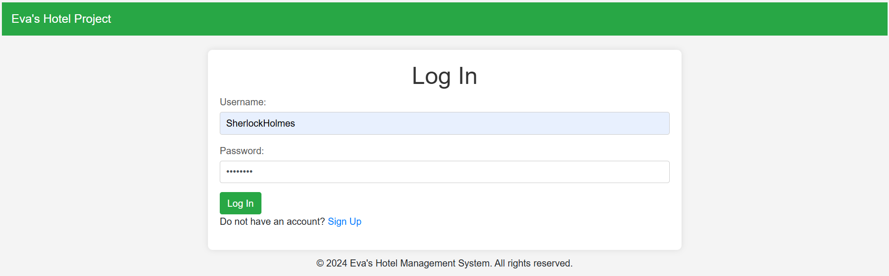
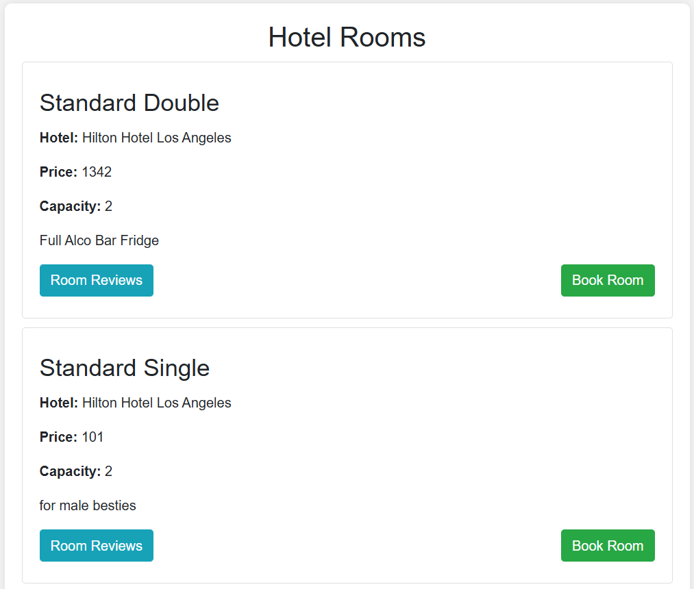
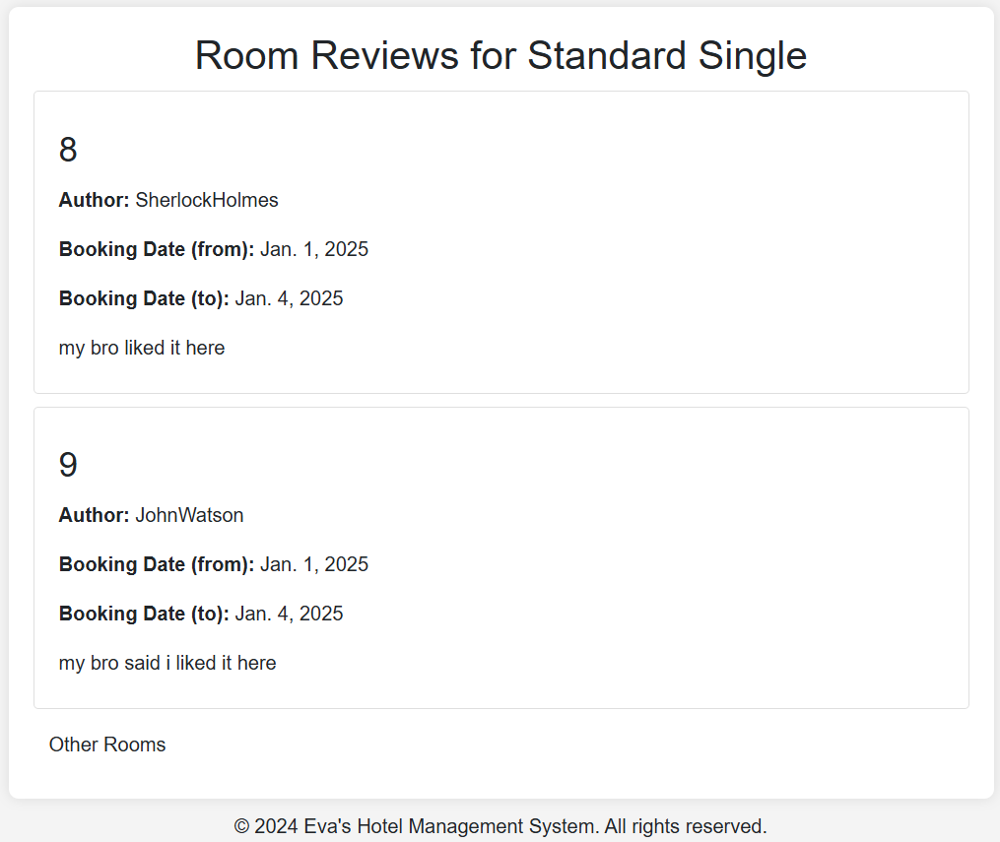
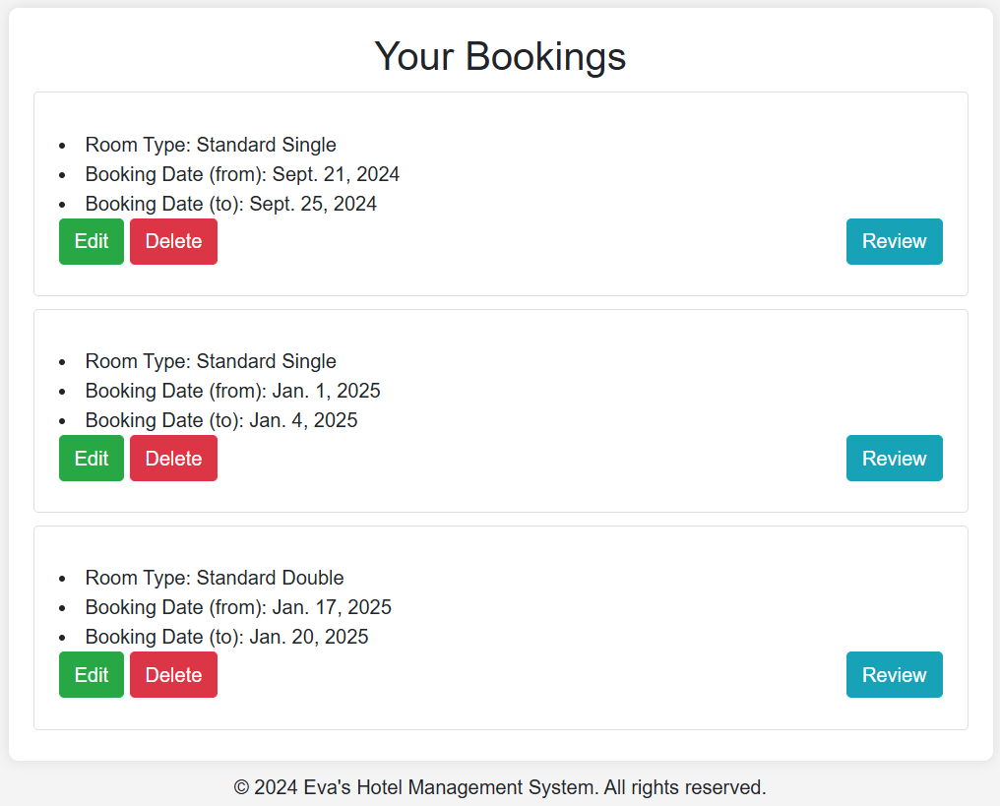

# Сайт Список Отелей (фреймворк Django)

## Описание

Приложение Hotel_App умеет регистрировать нового пользователя и позволяет ему зайти в свой 
аккаунт. Во время своего сеанса пользователь может рассматривать список доступных отелей, 
комнаты в этих отелях и отзывы на них. Также юзер способен просматривать свои бронирования, 
создавать новые, изменять и удалять их. Пользователь может свободно выражать свои мысли о 
проживании в разделе отзывов.

## Модели

- Hotel: название, владелец, адрес и описание;
- Room: fk отель, тип комнаты, цена, вместительность, дополнительные атрибуты;
- Booking: fk комната, fk клиента, даты бронирования;
- Review: fk бронирование, рейтинг, отзыв.

Пример структуры модели:
```
class Booking(models.Model):
    user = models.ForeignKey(User, on_delete=models.CASCADE)
    room = models.ForeignKey(Room, on_delete=models.CASCADE)
    start_date = models.DateField()
    end_date = models.DateField()
```

## Функции

- Регистрация и авторизация пользователя

- Просмотр списка отелей (классовое представление)

    ```
    class HotelListView(ListView):
        model = Hotel
        context_object_name = 'hotels'
        template_name = 'hotel/hotels_list.html'
    ```

- Для каждого отеля просмотр доступных комнат



- Для каждой комнаты возможность посмотреть отзывы и совершить бронирование

    ```
    @login_required(login_url='/login/')
    def book_room(request, hotel_id, room_id):
        room = Room.objects.get(id=room_id)
        user = request.user
        context = {}
        form = BookingCreateForm(request.POST or None)
        if form.is_valid():
            booking = form.save(commit=False)
            booking.user = user
            booking.room = room
            form.save()
            return redirect("bookings")
        context['form'] = form
        return render(request, "booking/book_room.html", context)
    ```
- Просмотр списка личных бронирований пользователя (функциональное представление)

    ```
    def user_bookings(request):
        bookings = Booking.objects.filter(user_id=request.user)
        return render(request, "booking/user_bookings.html", {"bookings": bookings})
    ```
  
- Для каждого бронирования можно изменить даты посещения и написать свой отзыв

- Для работника отеля доступна страница просмотра клиентов отелей за последний месяц.

## Начало работы

Для работы приложения воспользоваться командой:
`python manage.py runserver`

Ссылка на рабочий проект:
http://127.0.0.1:8000/hotels/
