# Отчёт по выполнению практических работ из Лабораторной работы 3

## Задание 3.1.1

#### Напишите запрос на создание 6-7 новых автовладельцев и 5-6 автомобилей, каждому автовладельцу назначьте удостоверение и от 1 до 3 автомобилей.

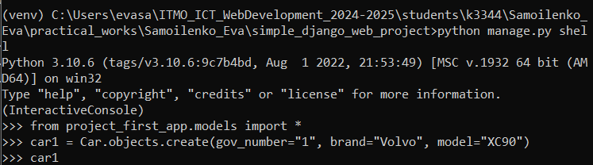

Работа выполнялась в интерактивной консоли виртуального окружения venv через Командную строку 
Windows. Объекты добавлялись с 
помощью команд var = Model.objects.create(), var.save()

Создание 6 автомобилей:

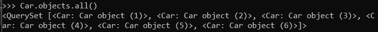 

Добавление 6 новый автовладельцев:

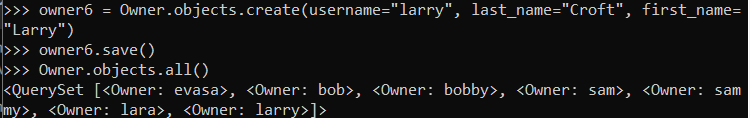

Создание сущностей зависимости машины и владельца - Ownership:

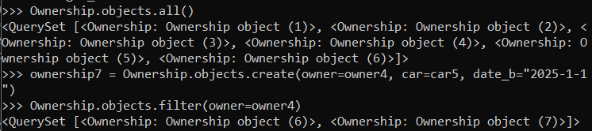

## Задание 3.1.2

- Где это необходимо, добавьте related_name к полям модели:

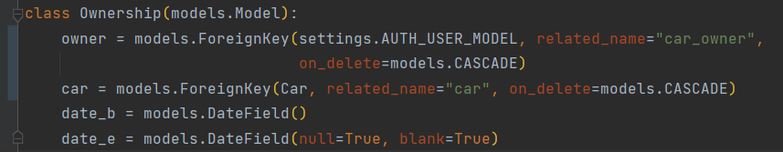

- Выведите все машины марки “Toyota”:

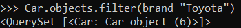

- Найти всех водителей с именем “Sam” :

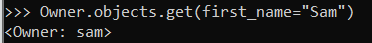

- Взяв любого случайного владельца, получить его id, и по этому id получить экземпляр 
  удостоверения в виде объекта модели:

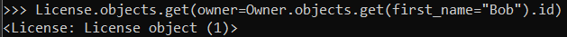

- Вывести всех владельцев красных машин:

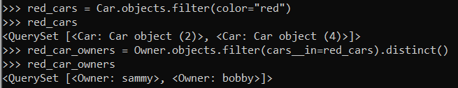

- Найти всех владельцев, чей год владения машиной начинается с 2025:

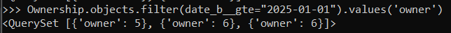

## Задание 3.1.3

- Вывод даты выдачи самого старшего водительского удостоверения:

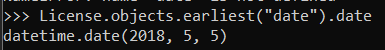

- Укажите самую позднюю дату владения машиной, имеющую какую-то из существующих моделей в вашей 
  базе:

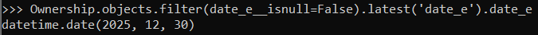

- Выведите количество машин для каждого водителя:

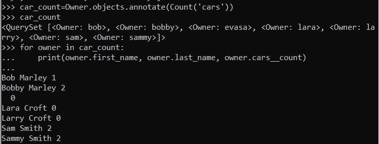

- Подсчитайте количество машин каждой марки:

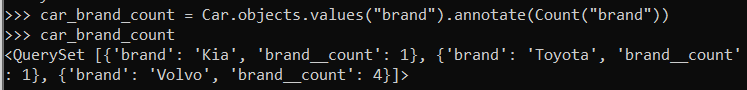

- Отсортируйте всех автовладельцев по дате выдачи удостоверения:

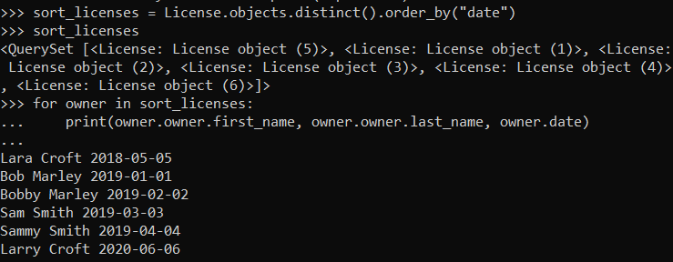
