# Администрирование отеля (Django Rest Framework)

---

## **Описание основных endpoint-ов**

Получить информацию о всех комнатах отеля с возможностью добавления новой 

`GET, POST /hotel/rooms/`

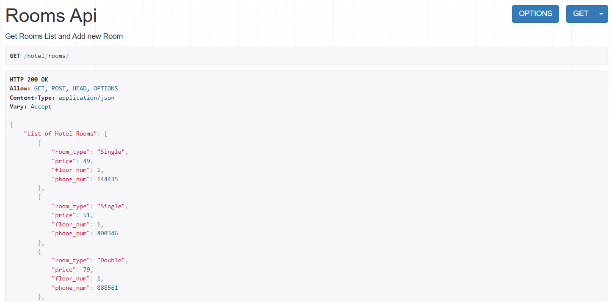

Получить информацию об одной комнате с возможностью изменения и удаления объекта 

`GET, PATCH, DELETE /hotel/rooms/<room_id>/`

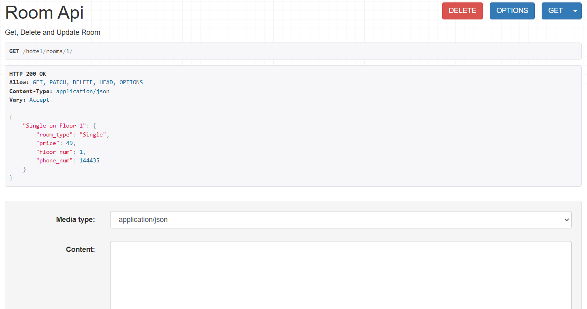

Получить информацию о всех клиентах отеля с возможностью добавления нового 

`GET, POST /hotel/clients/`

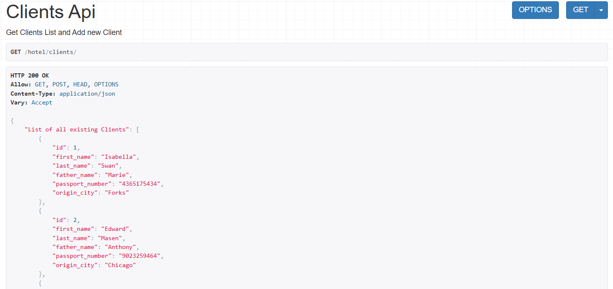

Получить информацию об одном клиенте с возможностью изменения и удаления объекта 

`GET, PATCH, DELETE /hotel/clients/<client_id>/`

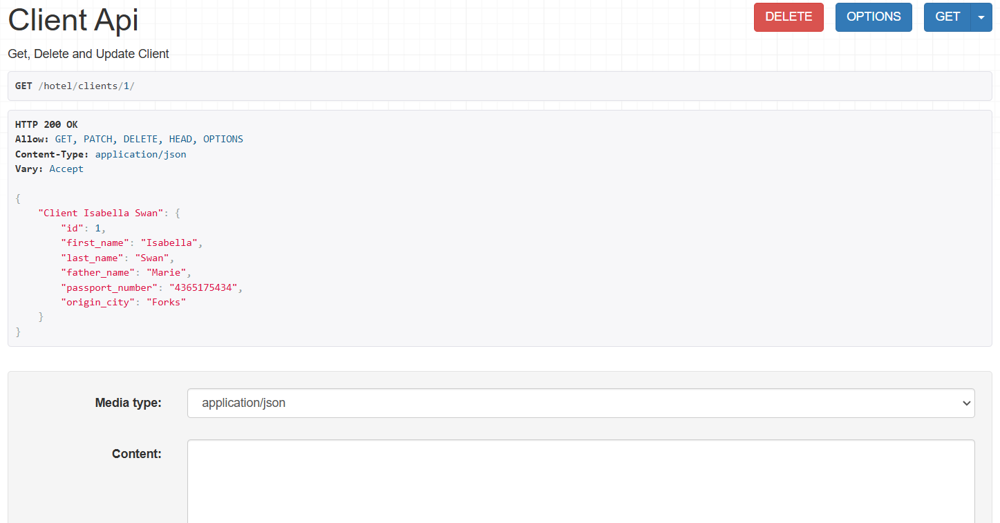

Получить информацию о всех работниках отеля с возможностью добавления нового 

`GET, POST /hotel/employees/`

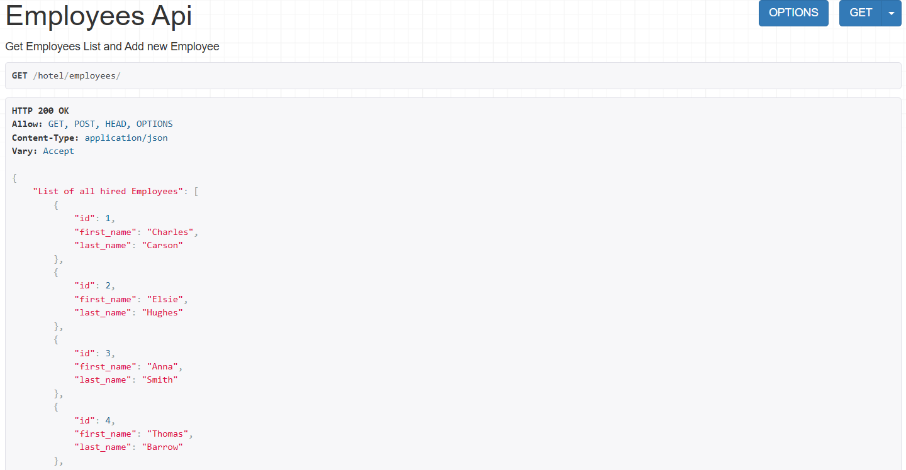

Получить информацию об одном работнике с возможностью изменения и удаления объекта 

`GET, PATCH, DELETE /hotel/employees/<employee_id>/`

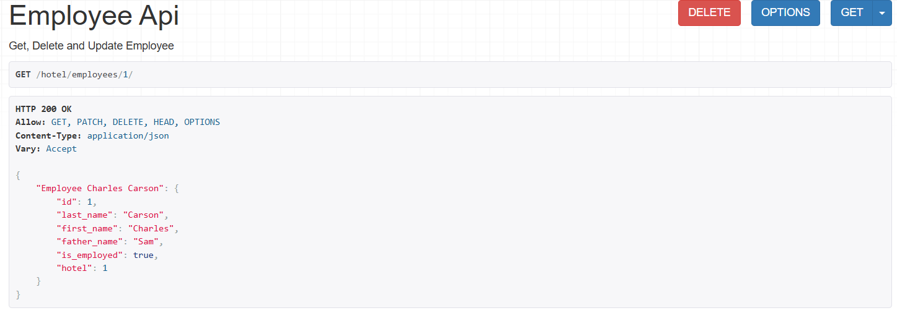

Получить информацию о всех бронированиях в отеле с возможностью добавления нового 

`GET, POST /hotel/bookings/`

Получить информацию об одном бронировании с возможностью изменения и удаления объекта 

`GET, PATCH, DELETE /hotel/bookings/<booking_id>/`

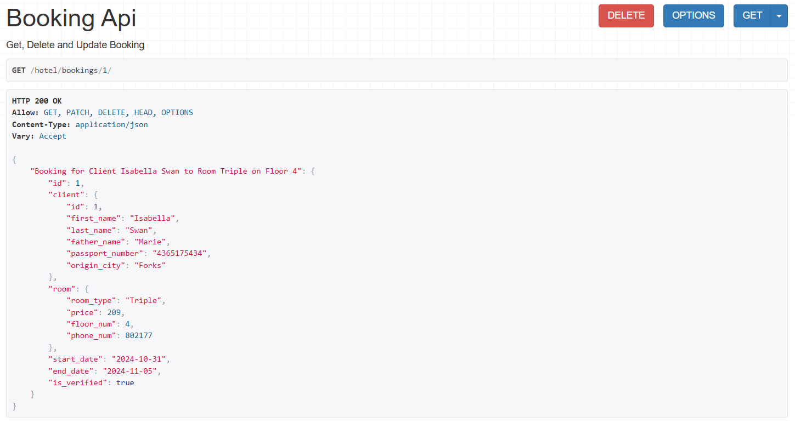

Получить информацию о всех уборках комнат с возможностью добавления нового 

`GET, POST /hotel/cleanings/`

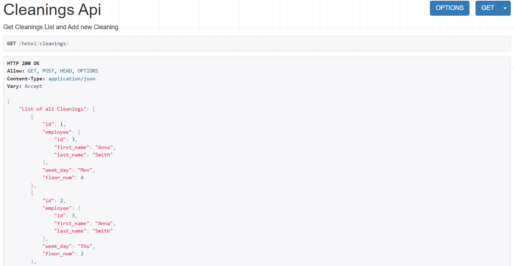

Получить информацию об одной уборки комнат с возможностью изменения и удаления объекта 

`GET, PATCH, DELETE /hotel/cleanings/<cleaning_id>/`

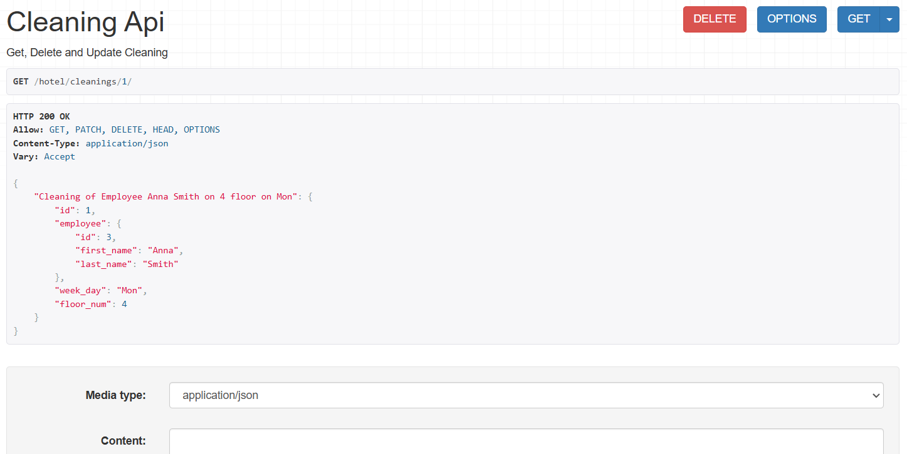

## **Описание дополнительных endpoint-ов**

Получение информации:

- о клиентах, проживавших в заданном номере, в заданный период времени

`GET /hotel/clients-in-room/<room_id>/<start_date>/<end_date>/`

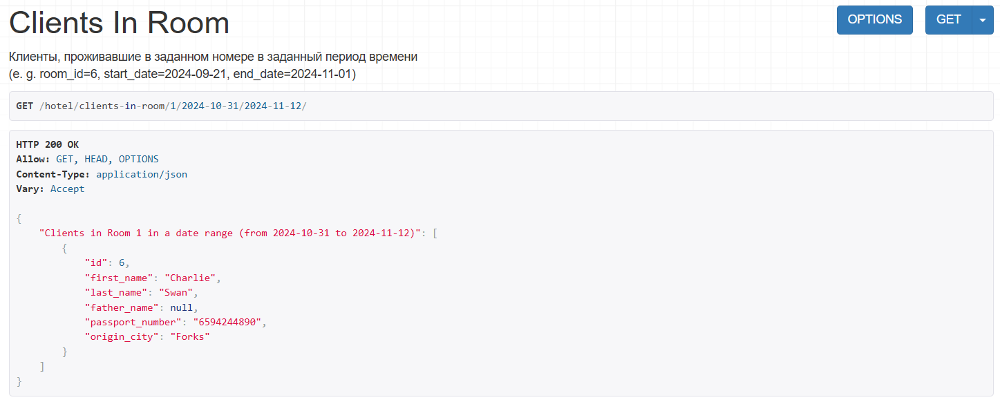

- о количестве клиентов, прибывших из заданного города

`GET /hotel/clients-from-city/<origin_city>/`

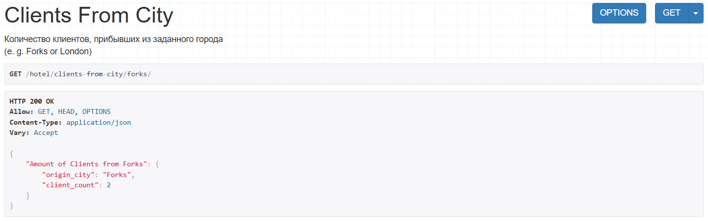

- о том, кто из служащих убирал номер указанного клиента в заданный день недели

`GET /hotel/cleaning-employees/<client_id>/<week_day>/`

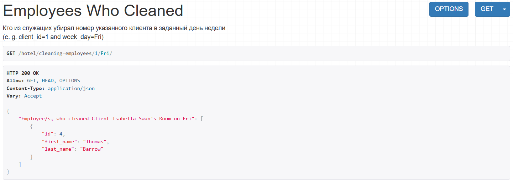

- о количестве в гостинице свободных номеров

`GET /hotel/free-rooms/<start_date>/<end_date>/`

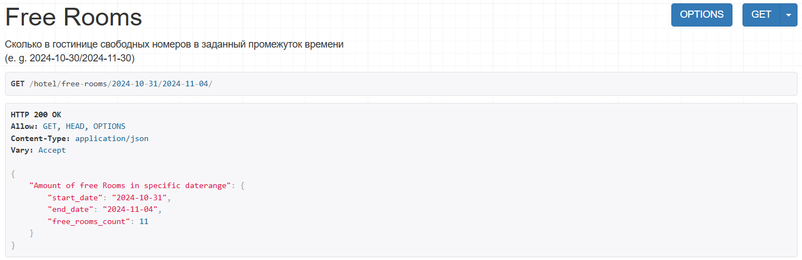

- о списке клиентов с указанием места жительства, которые проживали в те же дни,
что и заданный клиент

`GET /hotel/clients-while-client/<request_client_id>/`

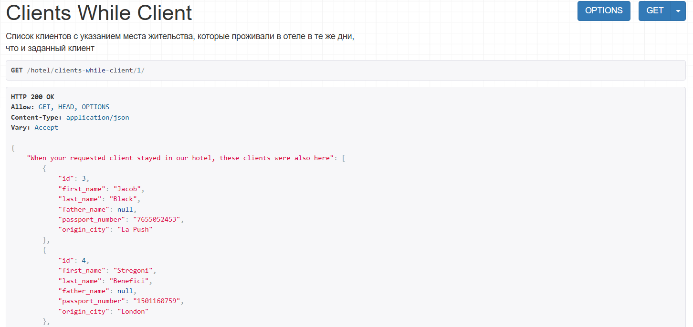

### Выдача отчёта за запрашиваемый квартал

Отчёт содержит следующие данные:

- число клиентов за указанный период в каждом номере;
- количество номеров на каждом этаже;
- общая сумма дохода за каждый номер;
- суммарный доход по всей гостинице.

`GET /hotel/report/<requested_quarter>/`

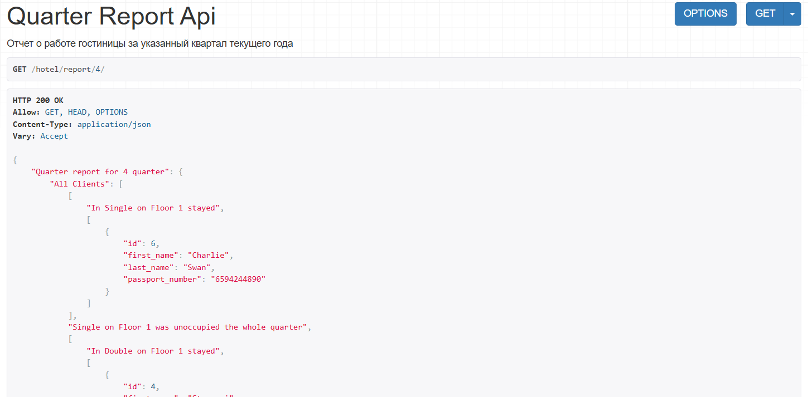
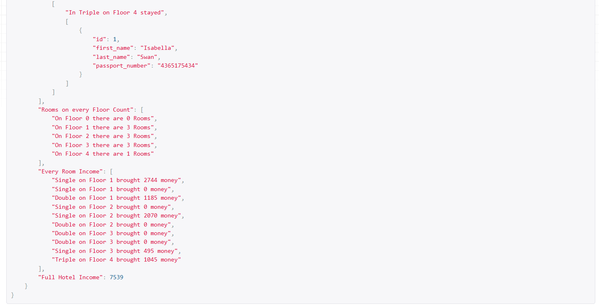

## Добавление Djoser в проект

Регистрация нового пользователя
`POST http://127.0.0.1:8000/auth/users/`

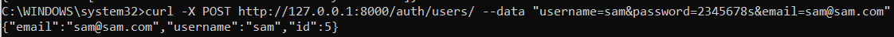

Авторизация пользователя -> получение токена
`POST http://127.0.0.1:8000/auth/token/login/`

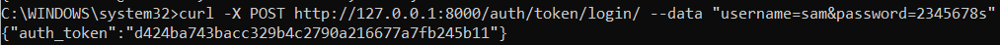

Запрос информации о пользователе с использованием личного токена
`GET http://127.0.0.1:8000/auth/users/me/`

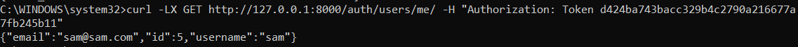