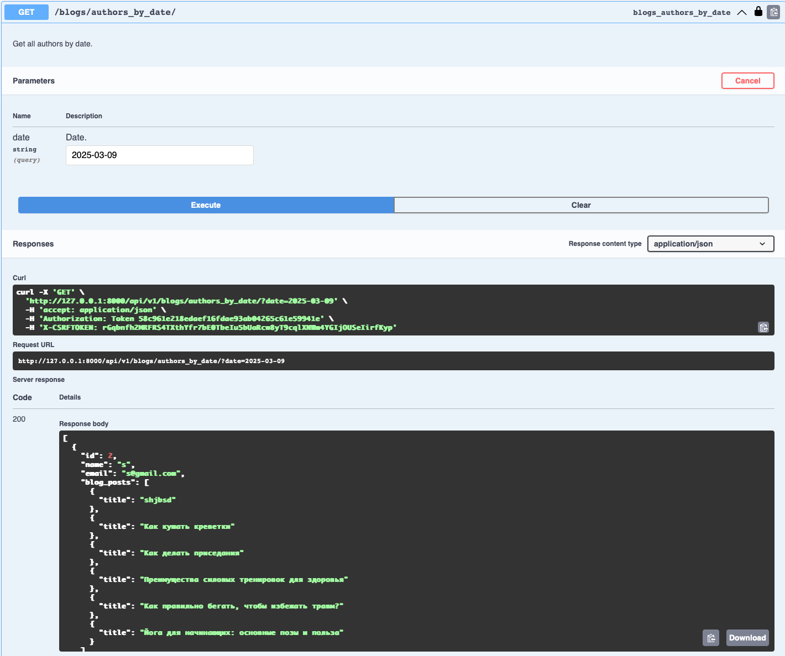
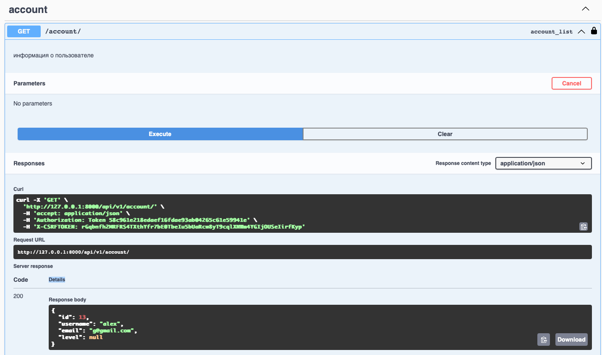

## Условие

Реализовать модель базы данных средствами DjangoORM 

## Выполнение 

Для начала реализуем БД. В качестве доменно й области был выбран вариант с курса Фронтенд разработки - Фитнесс приложение

В БД реализованы следующие сущности:
1. Пользователь (User)
2. Тренировка (Workout)
3. Пользовательская тренировка (UserWorkout)
4. Статья блога (BlogPost)

Пример сущности UserWorkout:
```python
class UserWorkout(models.Model):
    user = models.ForeignKey(
        settings.AUTH_USER_MODEL,
        on_delete=models.CASCADE,
        related_name='user_workouts'
    )
    workout = models.ForeignKey(
        Workout,
        on_delete=models.CASCADE,
        related_name='user_completions'
    )
    started_at = models.DateTimeField()
    completed_at = models.DateTimeField(blank=True, null=True)
    favourite = models.BooleanField(default=False)

    class Meta:
        unique_together = ['user', 'workout']
```
## Условие

Реализовать логику работу API средствами Django REST Framework (используя методы сериализации)

## Выполнение 

Для этого пункта необходимо сделать следующие шаги:

- реализовать сериализаторы для удобного JSON представления данных в repsonse-ах
- добавить views с базовым CRUD циклом операций для всех объектов
  - продумать удаление сущностей со связью parent -> child
  - продумать несколько более сложных интересных запросов
- добавить соответствующие эндпоинты
- подключить SWAGGER

SWAGGER доступен при локальном поднятии по эндпоинту
`api/swagger`. Для его настройки необходимо просто прокинуть несколько доп.полей в `settings.py` и сформировать шаблон в `urls.py`
следующим образом:

```python
schema_view = get_schema_view(
    openapi.Info(
        title="Your API",
        default_version='v1',
        description="API documentation",
        contact=openapi.Contact(email="contact@yourapi.com"),
    ),
    public=True,
    permission_classes=(permissions.AllowAny,),
    patterns=[path('api/', include(router.urls))],
)


urlpatterns = [
    path('', include(router.urls)),
    path('swagger/', schema_view.with_ui('swagger', cache_timeout=0), name='schema-swagger-ui'),
]
```

Подобный подход включит в SWAGGER только те маршруты, которые были прописаны и зарегистрированы в соответствующем разделе месте кода, 
что позволяет избежать излишней документации. 

CRUD же достигается за счет оперирования достаточно стандартными сериализаторами и представлениями. Например, в самом наивном варианте `views.py`:
```python
class AccountViewSet(viewsets.ViewSet):
    permission_classes = [IsAuthenticated]

    def list(self, request):
        """информация о пользователе"""
        serializer = CustomUserSerializer(request.user)
        return Response(serializer.data)

    def update(self, request):
        """обновить информацию о пользователе"""
        user = request.user
        serializer = CustomUserSerializer(
            user,
            data=request.data,
            context={'request': request},
            partial=True
        )
        if serializer.is_valid():
            serializer.save()
            return Response(serializer.data)
        return Response(serializer.errors, status=status.HTTP_400_BAD_REQUEST)
```
Иногда требуется усложнение тех же сериализаторов, чтобы в удобном видеть смотреть на вложенные сущности. При этом SWAGGER автоматически генерирует всю документацию
и нотацию к запросам, но для некоторой более сложной логики это можно сделать самостоятельно через декораторы:
```python
@swagger_auto_schema(
        operation_description="Get all authors by date.",
        responses={200: BlogPostSerializerByDateAuthors},
        manual_parameters=[
            openapi.Parameter(
                'date', openapi.IN_QUERY,
                description="Date.",
                type=openapi.TYPE_STRING,
            ),
        ]
    )
    @action(detail=False, methods=['get'], url_path='authors_by_date')
    def authors_by_date(self, request):
        """Показывает всех авторов, чьи статьи были опубликованы в указанную дату"""
        date_param = request.query_params.get('date')

        if not date_param:
            return Response({"error": "Параметр 'date' обязателен."}, status=status.HTTP_400_BAD_REQUEST)

        try:
            date = datetime.strptime(date_param, '%Y-%m-%d').date()
        except ValueError:
            return Response({"error": "Неверный формат даты. Используйте формат YYYY-MM-DD."},
                            status=status.HTTP_400_BAD_REQUEST)

        # Фильтруем статьи, опубликованные в указанную дату
        blogs = BlogPost.objects.filter(created_at__date=date)

        # Вытаскиваем авторов, чьи статьи были опубликованы в эту дату
        authors = set(blogs.values_list('author', flat=True))

        # Загружаем данные пользователей (авторов), при этом добавляем информацию о статьях каждого автора
        author_data = User.objects.filter(id__in=authors)

        # Сериализуем авторов и их посты
        serializer = BlogPostSerializerByDateAuthors(author_data, many=True)
        return Response(serializer.data)

```

## Условие 

Подключить регистрацию / авторизацию по токенам / вывод информации о текущем пользователе средствами Djoser.

## Выполнение

Авторизация с JWT подключается через доп. пакет. Здесь тоже достаточно прописать пару базовым общих настроек и немного доработать
SWAGGER для более приятного интерактивного использования следующим образам: 

```python
SWAGGER_SETTINGS = {
    'SECURITY_DEFINITIONS': {
        'api_key': {
            'type': 'apiKey',
            'in': 'header',
            'name': 'Authorization'
        }
    },
}
```

Это позволить заранее задать хэдер авторизации с токеном ко всем запросам в SWAGGER, чтобы не прописывать его каждый раз. 
Для простоты работы добавлены парочка `Makefile` команд с циклом получения и обновления токена:
```makefile
login:
	curl -X POST -d "username=${USERNAME}&password=${PASSWORD}&email=${EMAIL}&re_password=${REPASSWORD}" http://localhost:8000/auth/users/

get-token:
	curl -X POST -d "username=${USERNAME}&password=${PASSWORD}" http://localhost:8000/auth/token/login

```
Примеры запросов:


