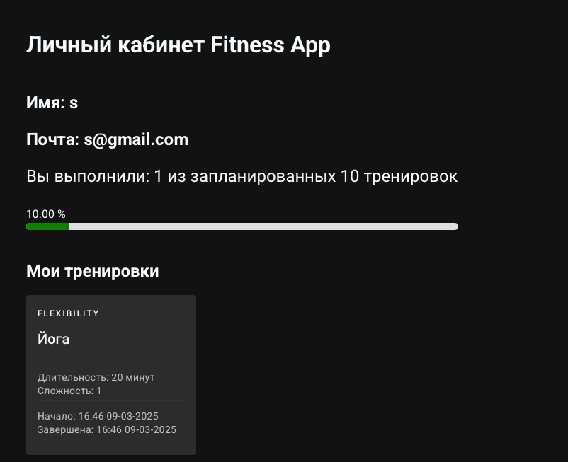
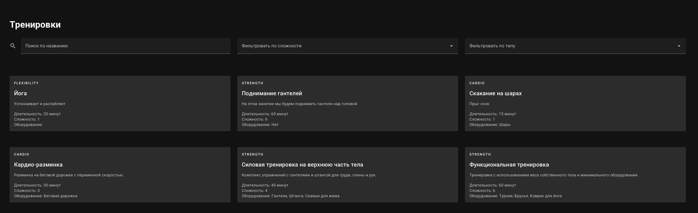
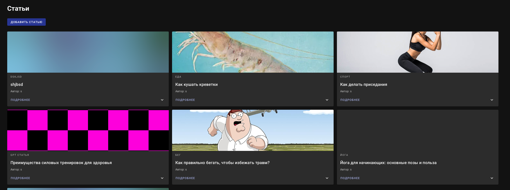
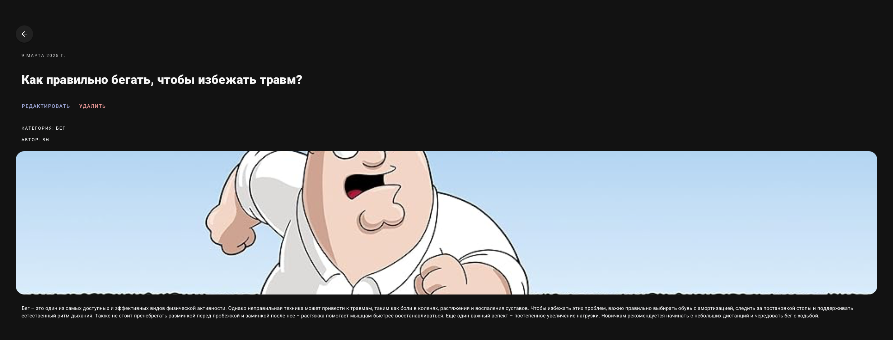

На основе прошлой работы был реализовано фронт приложение на Vue. Архитектурно проект выглядит следующим образом:
 - На бэке происходит общение с БД, авторизация и регистрация
 - На фронте 
   - Файлы разделены на компоненты, страницы
   - Бизнес логика находится в app.js
   - Добавлены стили для каждого элемента, зависящие от темы
   
## Условие
Реализовать интерфейсы авторизации, регистрации и изменения учётных данных и настроить взаимодействие с серверной частью.
## Выполенение
Итоговый роутинг всех эндпоинтов эндпоинтов на стороне Vue выглядит следующим образом:
```js
import { createRouter, createWebHistory } from 'vue-router/auto'
import { setupLayouts } from 'virtual:generated-layouts'
import { routes } from 'vue-router/auto-routes'

const router = createRouter({
  history: createWebHistory(import.meta.env.BASE_URL),
  routes: setupLayouts(routes),
})

router.onError((err, to) => {
  if (err?.message?.includes?.('Failed to fetch dynamically imported module')) {
    if (!localStorage.getItem('vuetify:dynamic-reload')) {
      console.log('Reloading page to fix dynamic import error')
      localStorage.setItem('vuetify:dynamic-reload', 'true')
      location.assign(to.fullPath)
    } else {
      console.error('Dynamic import error, reloading page did not fix it', err)
    }
  } else {
    console.error(err)
  }
})

router.isReady().then(() => {
  localStorage.removeItem('vuetify:dynamic-reload')
})

export default router

```
В интерефейсе логин выглядит следующим образом:

Авторизация происходит через JWT, в БД хранятся только захэшированные пароли => скомпрометировать будет уже сложнее, т.к. хэширование является необратимой операцией.

## Условие
Реализовать клиентские интерфейсы и настроить взаимодействие с серверной частью
## Выполенение
Каждый интерфейс выделен в отдельный комопнент, вот список некоторых:

 - Профиль пользователя, где он видит выполненные тренировки, свой прогресс

 - Страница тренировок, поддерживающая фильтрацию объектов. Каджую тренировку можно добавить в свой профиль

 - Список статей, написанными пользователями

 - Детальный вид конкрентной статьи
